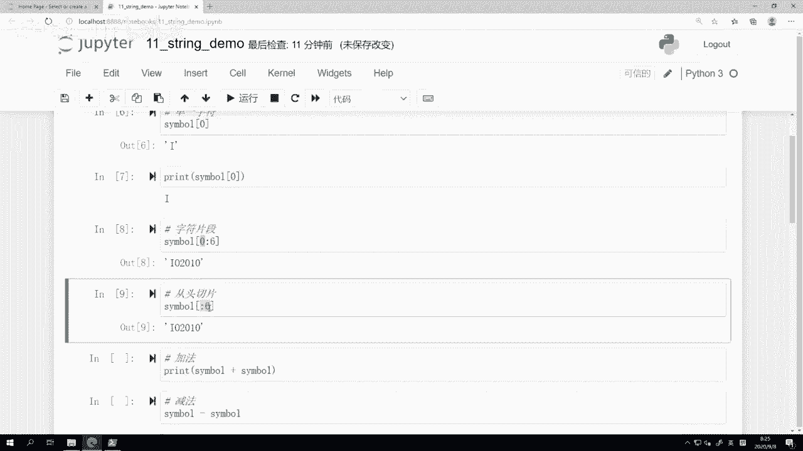
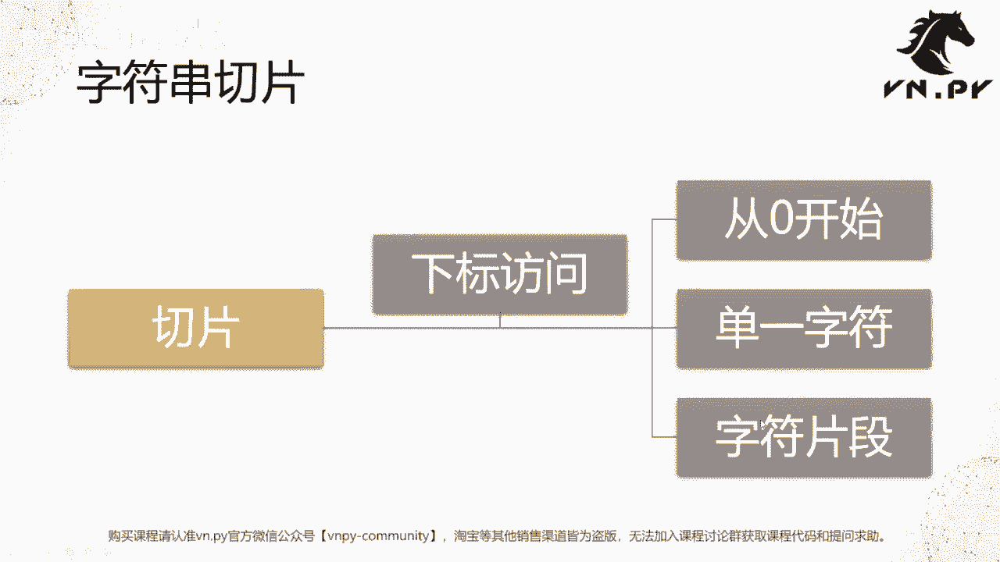
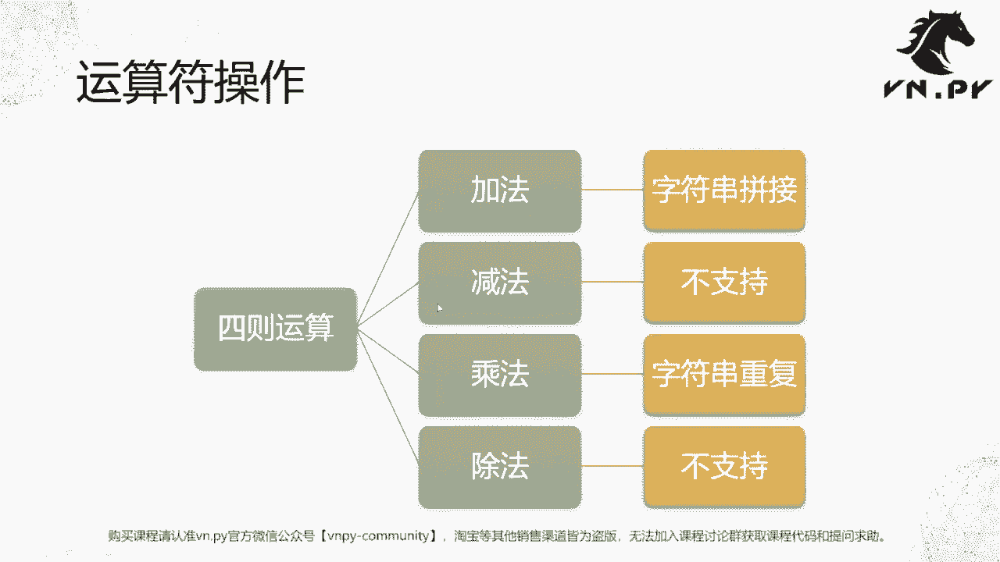
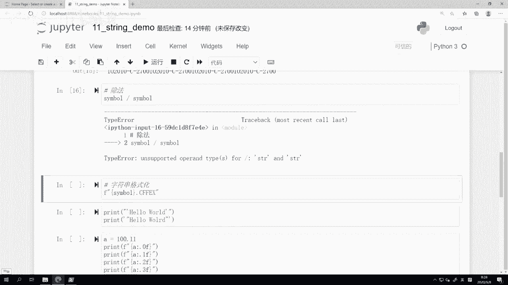
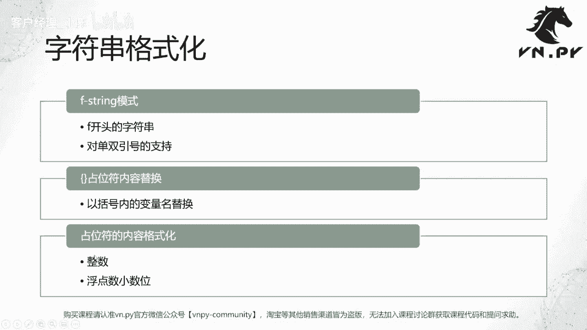
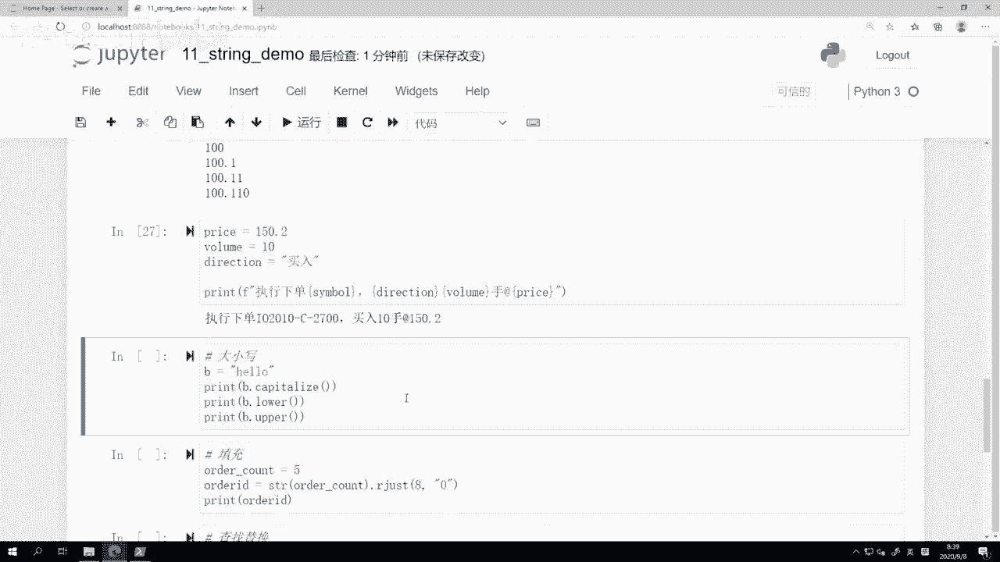
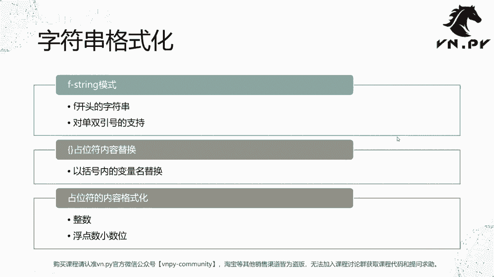
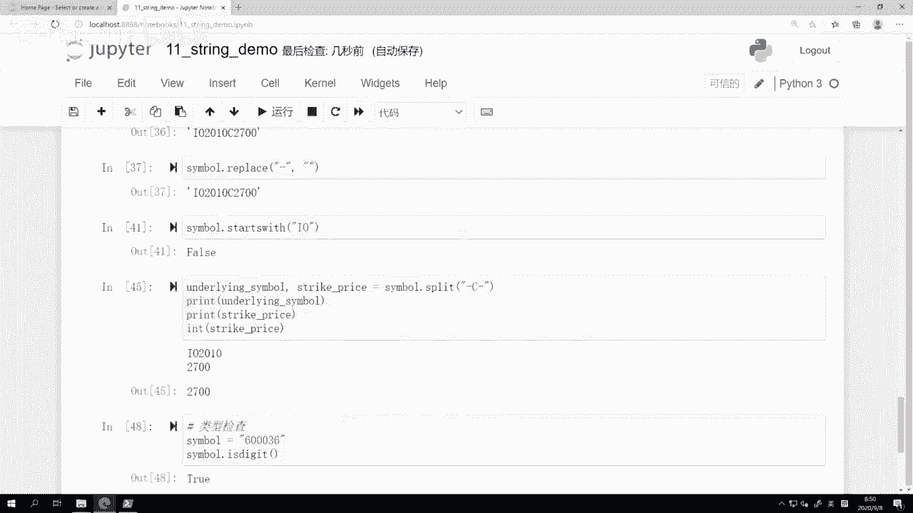
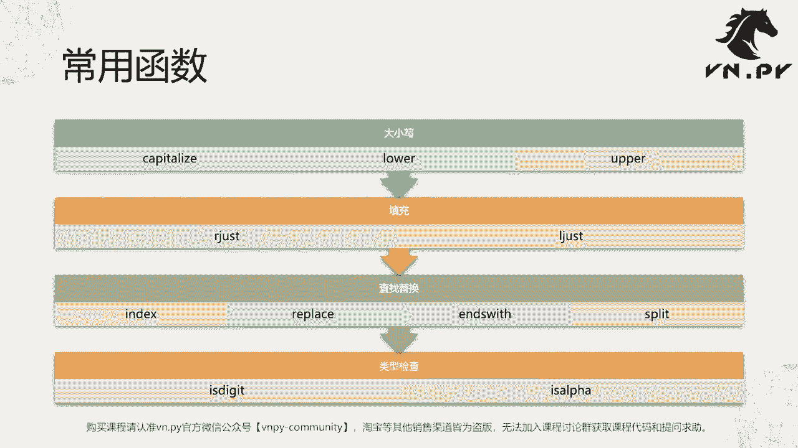

# VNPY30天解锁Python期货量化开发：课时11：字符串深入处理

在本节课中，我们将深入学习Python中字符串类型的更多高级操作。我们将从字符串的切片开始，然后探讨字符串的运算符，接着学习如何格式化字符串，最后了解一些常用的字符串内置方法。这些知识对于处理交易数据、合约代码和生成日志信息至关重要。


## 字符串切片

上一节我们介绍了循环语句，本节中我们来看看如何精确地访问和截取字符串中的特定部分，这被称为“切片”。

字符串可以看作是由一个个字符组成的序列。例如，字符串 `"Hello world"` 由多个字符组合而成。如果我们想获取其中的一部分，比如前五个字符或最后一个字符，就需要使用切片技术。

切片依赖于“下标访问”，这是在Python乃至所有编程语言中都非常重要的数据访问方式。

### 下标访问基础

在编程语言中，字符串中字符的位置（下标）是从0开始计数的，这与我们日常从1开始计数的习惯不同。

**代码示例：**
```python
symbol = "IO2010-C-2700"
print(symbol[0])  # 输出第一个字符 'I'
print(symbol[1])  # 输出第二个字符 'O'
print(symbol[2])  # 输出第三个字符 '2'
```
*   下标 `0` 对应字符串的第一个字符。
*   下标 `1` 对应字符串的第二个字符，依此类推。

### 字符片段切片





如果我们想获取字符串中的一段连续字符，而不仅仅是单个字符，可以使用片段切片。



片段切片的语法是在方括号中使用 `[起始下标:结束下标]`。需要注意的是，切片的结果是“含头不含尾”的，即包含起始下标的字符，但不包含结束下标的字符。

**代码示例：**
```python
symbol = "IO2010-C-2700"
# 获取下标0到5（不含）的字符，即前6个字符
print(symbol[0:6])  # 输出 'IO2010'
# 简写形式：起始下标为0时可以省略
print(symbol[:6])   # 同样输出 'IO2010'
```
*   `symbol[0:6]` 获取从下标0（‘I’）开始，到下标6（第一个‘-’）之前的所有字符。
*   `symbol[:6]` 是 `symbol[0:6]` 的简写形式，更推荐使用。

## 字符串运算符

了解了如何获取字符串的局部后，我们来看看字符串支持哪些基本的数学运算符。



字符串支持加法和乘法运算，但不支持减法和除法。

**代码示例：**
```python
symbol = "IO2010-C-2700"
# 加法：字符串拼接
print(symbol + symbol)  # 输出 'IO2010-C-2700IO2010-C-2700'
# 乘法：字符串重复
print(symbol * 3)       # 输出 'IO2010-C-2700IO2010-C-2700IO2010-C-2700'
# 减法：会引发 TypeError 错误
# print(symbol - symbol)
# 除法：会引发 TypeError 错误
# print(symbol / symbol)
```
*   **加法 (`+`)**：将两个字符串连接成一个新的字符串。
*   **乘法 (`*`)**：将字符串重复指定次数（整数）后拼接。
*   减法和除法对字符串没有定义的意义，因此Python不支持。



## 字符串格式化

在量化交易中，我们经常需要将变量（如合约代码、价格、数量）嵌入到一段完整的语句中，以便记录日志或显示信息。字符串格式化正是为此而生。

我们将重点学习一种现代且易用的格式化方法：f-string。

### f-string 基础

f-string 通过在字符串前加前缀 `f` 或 `F` 来创建。在字符串内部，使用花括号 `{}` 作为占位符，花括号内可以直接写入变量名或表达式。

**代码示例：**
```python
symbol = "IO2010-C-2700"
exchange = "CFFEX"
# 使用 f-string 格式化
vt_symbol = f"{symbol}.{exchange}"
print(vt_symbol)  # 输出 'IO2010-C-2700.CFFEX'
```

### 字符串中的引号处理

有时我们需要在字符串本身中包含引号。

**规则：**
*   如果外层用双引号定义字符串，内层可以使用单引号。
*   如果外层用单引号定义字符串，内层可以使用双引号。
*   如果需要在同种引号内再使用该引号，需要使用反斜杠 `\` 进行转义。

**代码示例：**
```python
# 外层双引号，内层单引号
str1 = "He said, 'Hello.'"
print(str1)
# 外层单引号，内层双引号
str2 = 'She said, "Hi."'
print(str2)
# 使用转义符在同种引号内包含引号
str3 = "It\'s a string with an apostrophe."
print(str3)
```

### 数字格式化

在 f-string 的占位符中，我们可以使用格式说明符来控制数字的显示方式，例如保留小数位数。

**代码示例：**
```python
price = 150.2
volume = 10
direction = "买入"
# 在 f-string 中对数字进行格式化
log_message = f"{direction} {volume} 手合约 {symbol} 于价格 {price:.0f}"
print(log_message)  # 输出 ‘买入 10 手合约 IO2010-C-2700 于价格 150’
```
*   `{price:.0f}` 表示将变量 `price` 格式化为不保留小数的浮点数（`.0f`）。
*   其他格式如 `.2f`（保留两位小数）、`.1e`（科学计数法保留一位小数）等可根据需要选用。



## 常用字符串方法



字符串在Python中是“对象”，它自带了许多有用的方法（函数）。以下是量化开发中常用的一些字符串方法。


以下是字符串常用方法的分类介绍和示例。

### 大小写转换

这些方法用于改变字符串中英文字母的大小写。

**代码示例：**
```python
s = "heLLo"
print(s.capitalize())  # 输出 'Hello'，首字母大写
print(s.lower())       # 输出 'hello'，全部转为小写
print(s.upper())       # 输出 'HELLO'，全部转为大写
```

### 填充对齐

当需要生成固定长度的字符串时（如某些交易接口要求的委托号），填充方法非常有用。

**代码示例：**
```python
order_count = 5
# 生成8位数字字符串，不足位在左侧用‘0’填充
order_id = str(order_count).rjust(8, '0')
print(order_id)  # 输出 '00000005'
# ljust 则在右侧填充
print(str(500).ljust(8, '0'))  # 输出 '50000000'
```

### 查找与替换

在数据处理中，经常需要查找特定字符的位置或替换部分内容。

**代码示例：**
```python
symbol = "IO2010-C-2700"
# 查找子串位置
print(symbol.index("-C-"))  # 输出 6，即第一个‘-’的位置
# 替换子串
print(symbol.replace("-", ""))   # 输出 'IO2010C2700'，移除所有减号
print(symbol.replace("-C-", "C")) # 输出 'IO2010C2700'，替换特定部分
# 检查开头/结尾
print(symbol.startswith("IO"))   # 输出 True
print(symbol.endswith("2700"))   # 输出 True
```

### 分割字符串

`split` 方法可以根据指定的分隔符将字符串拆分成多个部分，返回一个列表。

**代码示例：**
```python
symbol = "IO2010-C-2700"
# 以‘-’为分隔符进行拆分
parts = symbol.split("-")
print(parts)  # 输出 ['IO2010', 'C', '2700']
# 可以方便地提取各部分
product_code = parts[0]
strike_price = int(parts[2])  # 将字符串转为整数
print(f"标的物：{product_code}, 行权价：{strike_price}")
```

### 类型检查

这些方法用于检查字符串内容是否全部由特定类型的字符组成。



**代码示例：**
```python
code1 = "600036"
code2 = "ES"
print(code1.isdigit())  # 输出 True，全部是数字
print("123A".isdigit()) # 输出 False，包含非数字
print(code2.isalpha())  # 输出 True，全部是字母
print("ES1”.isalpha())  # 输出 False，包含数字
```



本节课中我们一起学习了Python字符串的深入操作。我们从字符串切片开始，掌握了如何精确访问字符串的片段。然后探讨了字符串的运算符，了解了拼接和重复操作。接着，我们重点学习了强大的f-string格式化技术，它能优雅地将变量嵌入字符串。最后，我们介绍了一系列实用的字符串方法，包括大小写转换、填充对齐、查找替换、分割和类型检查，这些方法在清洗和处理交易数据时非常有用。请务必通过练习来巩固这些知识，它们是你进行量化开发的坚实基础。