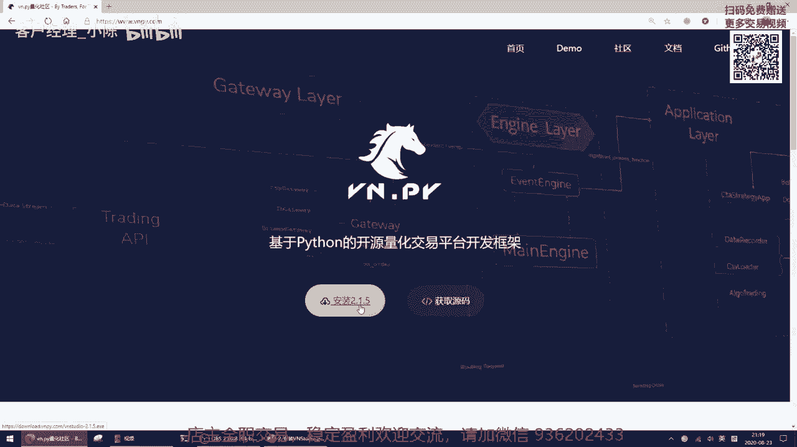
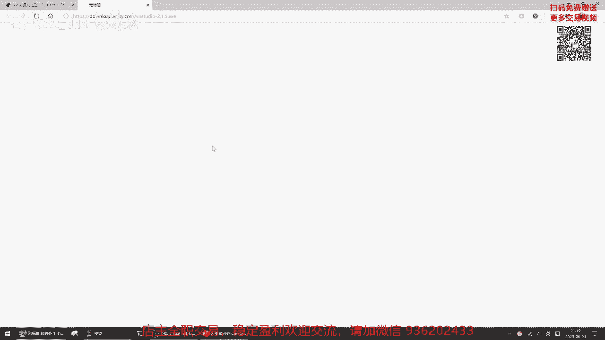
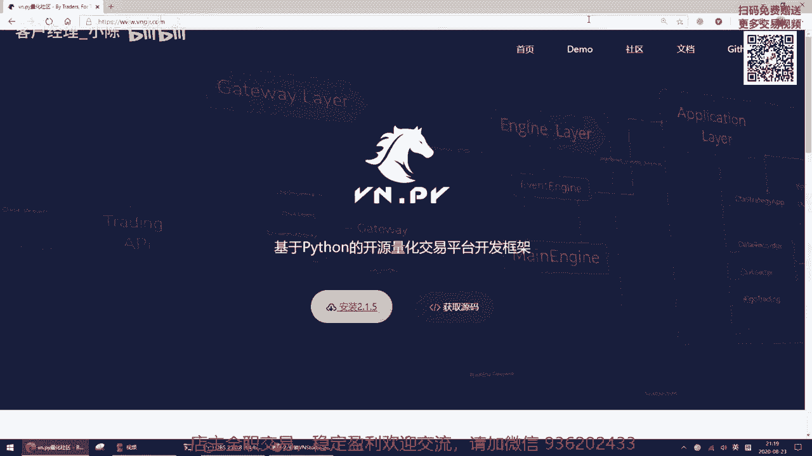
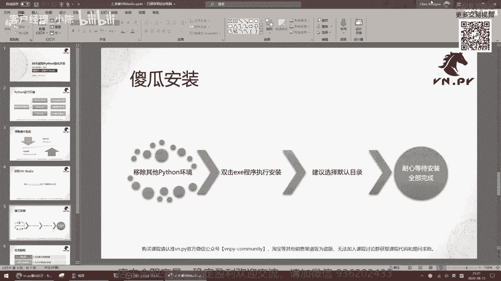
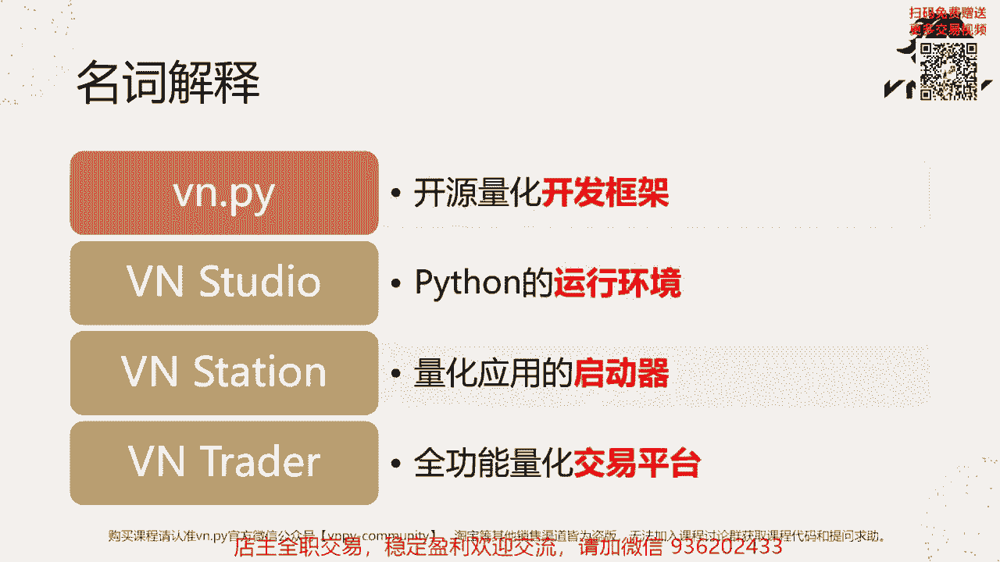

# VNPY30天解锁Python期货量化开发：课时02：安装VN Studio 💻

在本节课中，我们将学习如何安装Python量化开发的运行环境——VN Studio。上一节我们初步认识了Python语言，本节我们将动手搭建一个专为量化交易设计的Python环境。

## 什么是Python运行环境？🤔

Python运行环境的英文是Python distribution，也可直译为Python发行版。它包含了运行Python程序所需的核心组件。

以下是三个不同领域经典的Python发行版例子：

*   **Official Python**：这是由Python基金会开发和维护的官方版本。它只包含Python解释器和内置库。如果用它进行数据运算或分析，会缺乏许多必要的工具包（如上节课提到的NumPy、Pandas），手动安装这些包对新手来说容易遇到各种困难。
*   **Anaconda**：这是由美国Anaconda公司专门为科学计算打包的Python发行版。它在官方Python的基础上，额外集成了大量用于科学计算的库。
*   **VN Studio**：这是我们团队（VNPY官方）针对量化交易应用打包的Python发行版。与Anaconda相比，它除了包含用于策略研究的库（如NumPy、Pandas），还额外打包了量化交易专用的库，例如：
    *   **`vnpy`**：量化交易开发框架。
    *   各类底层交易接口。
    *   **`ta-lib`**：技术指标运算库。
    *   **`fix-engine`**：用于对接FIX交易服务器的库。

由于本课程是针对量化交易的Python入门课程，后续我们将全部基于VN Studio进行讲解。

## 准备操作系统 🖥️

在安装VN Studio之前，需要准备一个合适的操作系统。我们将其分为两类：

*   **桌面环境**：指您日常使用的个人电脑（笔记本或台式机）。我们推荐使用**Windows 10**。虽然老版本的Windows 7/8理论上也可运行，但为避免因系统依赖问题导致的兼容性错误，升级到Windows 10是最简单、性价比最高的方案。
*   **云服务器**：得益于阿里云、腾讯云、AWS等服务的普及，远程使用云服务器也很方便。对于云服务器，我们统一推荐使用**Windows Server 2019**。其内核与Windows 10接近，且是VNPY官方使用的测试环境，能保证VN Studio的稳定运行。

## 下载VN Studio ⬇️

操作系统准备好后，即可下载VN Studio。

1.  访问VNPY官方网站：`www.vnpy.com`。
2.  在主页上找到黄色的“安装”按钮（例如“安装2.1.5”）。该按钮的版本号会随新版本发布而更新，点击它即可下载最新版的VN Studio安装程序。
3.  将下载的安装程序（通常为`.exe`文件）保存到桌面或其他方便的位置。

## 安装VN Studio 🛠️

下载完成后，直接双击运行安装程序即可开始“傻瓜式”安装。但在开始前，有一个非常重要的建议：

**如果您的电脑上安装过其他Python环境（如Anaconda、官方Python），请先将它们完全卸载。**

这是因为多个Python环境共存时，可能因环境变量冲突导致程序无法启动或运行异常。虽然在本课程后期（约30多节课后）我们会学习如何管理多个Python环境，但对于初学者，为了简化学习过程、避免不必要的麻烦，建议暂时只保留VN Studio一个环境。

以下是安装步骤：

1.  **双击运行**下载好的安装程序（`.exe`文件）。
2.  **选择安装目录**：安装程序会提示您选择安装路径。**强烈建议使用默认目录**（通常是`C:\vnstudio`）。后续课程中，当需要修改配置或查找文件时，我们都会以默认目录为例进行讲解。如果您自定义了目录，请务必记住您的选择。
3.  **同意许可协议**：阅读并接受Python官方的许可协议。
4.  **开始安装**：点击“安装”按钮。安装过程中，Windows可能会弹出用户账户控制（UAC）提示，请选择“是”以允许程序进行更改。
5.  **等待完成**：安装程序将解压文件、复制到系统目录并设置环境变量。安装时间取决于电脑性能，通常需要5到30分钟。安装完成后，桌面上会出现名为“VN Station”的启动器图标。

## 核心概念解析 📚

在接触VNPY生态时，您可能会遇到四个名称相似但功能不同的核心组件。以下是它们的定义和区别：

*   **`vnpy`**：这是一个**开源的量化交易开发框架**。本质上，它是一个Python包（库），就像NumPy用于矩阵运算、Pandas用于时间序列分析一样，`vnpy`专门用于构建量化交易应用程序。其核心价值在于提供了一套完整的交易系统组件。
*   **VN Studio**：这是我们本节课安装的**Python运行环境（发行版）**。它集成了Python解释器、标准库以及一系列为量化交易预配置的第三方库（包括`vnpy`框架本身），让您开箱即用。
*   **VN Station**：这是一个**量化交易应用启动器**。安装VN Studio后，桌面上出现的白底黑色码头图标就是它。VN Station本身不提供复杂的交易功能，而是作为一个统一入口，用于启动不同的量化工具，例如：交易程序、研究环境、代码加密工具、官网链接以及一键更新功能。启动后需微信扫码注册登录。
*   **VN Trader**：这是一个**全功能的图形化量化交易平台**。当您通过VN Station启动“实盘交易”时，弹出的独立窗口就是VN Trader。它集成了多种功能：
    *   连接各类交易接口（如CTP期货、OKX数字货币、IB外盘）。
    *   进行CTA策略回测。
    *   实时行情数据录制。
    *   执行实盘交易。

**简单总结**：
*   `vnpy`是用于开发的**框架**（一个Python包）。
*   VN Studio是运行所有程序的**环境**（一套完整的软件集合）。
*   VN Station是管理并启动各种工具的**启动器**（一个桌面应用程序）。
*   VN Trader是进行具体交易和研究的**平台**（另一个功能强大的桌面应用程序）。

随着课程的深入，您将通过实际操作逐步熟悉这些组件，概念会越来越清晰。

## 总结 📝

本节课我们一起学习了量化开发环境的搭建。我们首先了解了Python运行环境（发行版）的概念，并认识了专为量化交易设计的VN Studio。接着，我们准备了推荐的操作系统（Windows 10或Windows Server 2019），完成了VN Studio的下载和安装，并特别强调了在安装前卸载其他Python环境的重要性。最后，我们详细解析了VNPY生态中四个核心组件（`vnpy`、VN Studio、VN Station、VN Trader）的区别与联系，为您后续的学习扫清了概念障碍。

环境已经就绪，从下一节课开始，我们将正式进入Python编程和量化交易的奇妙世界。