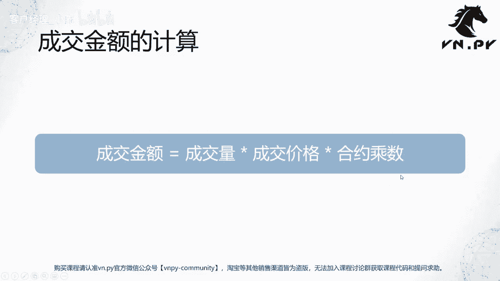
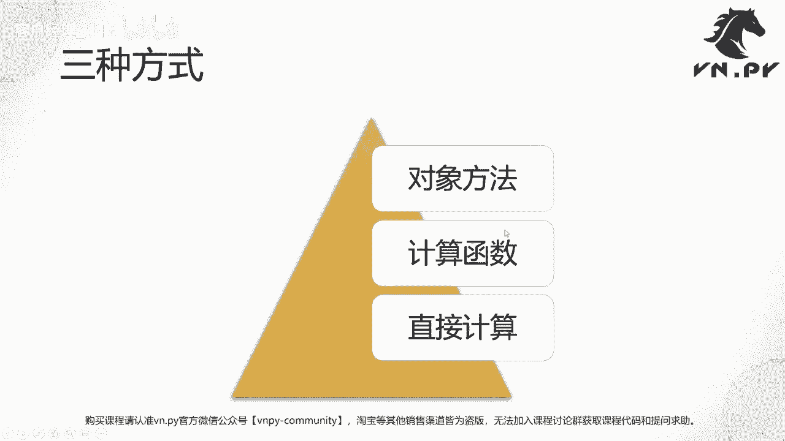
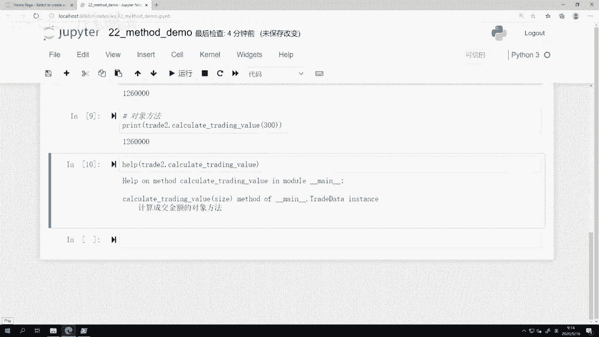
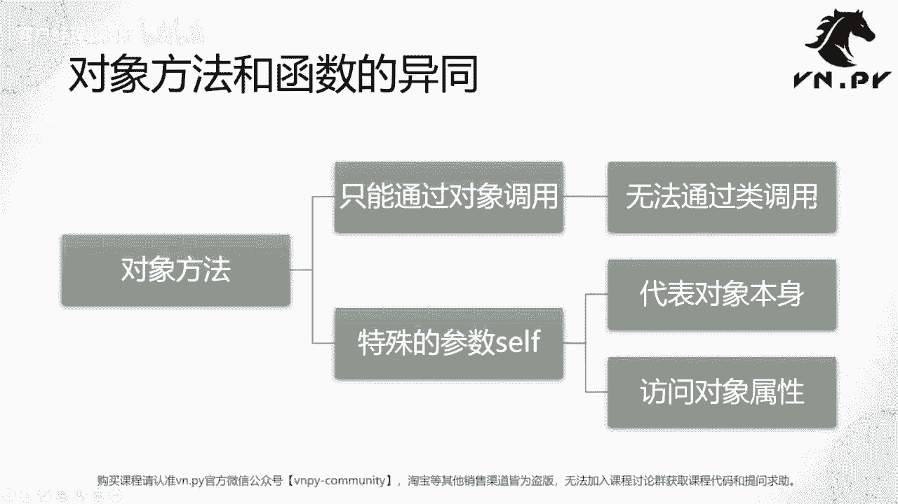
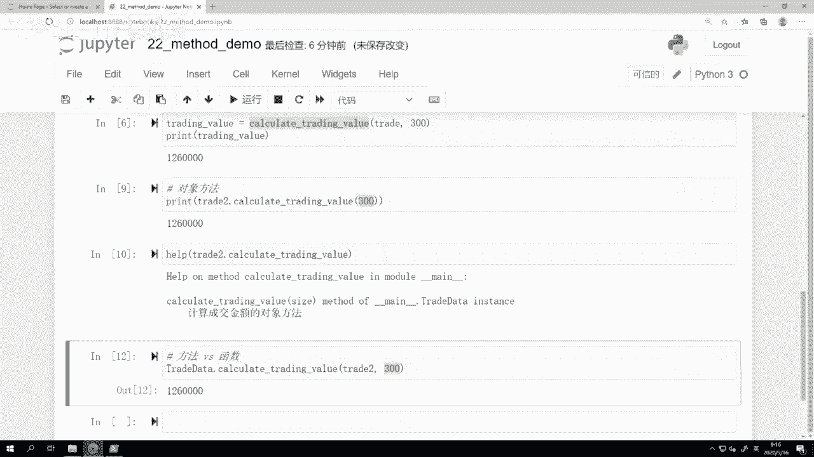
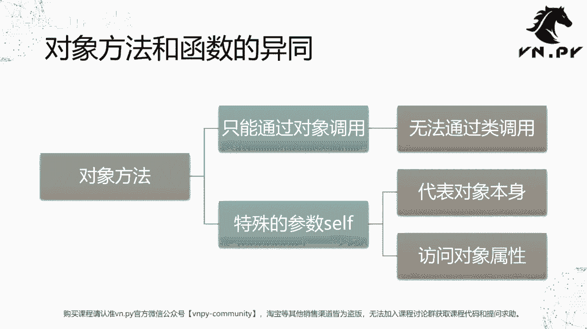
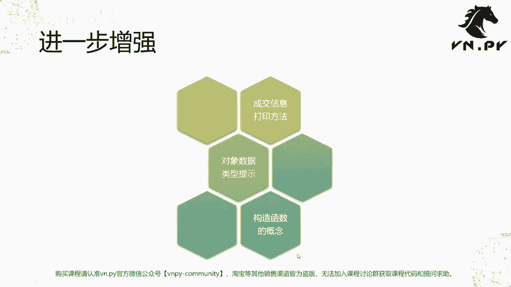
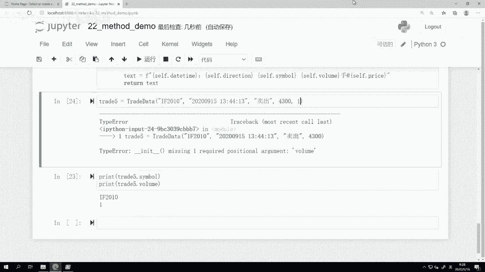

# VNPY30天解锁Python期货量化开发：课时22：对象的方法 🧩



在本节课中，我们将要学习面向对象编程中一个核心概念——对象的方法。我们将探讨如何将功能封装到对象内部，使代码更加结构化、易于重用和维护。



在上一节课中，我们介绍了如何使用对象来存储数据。如果对象仅用于存储数据，其功能与字典并无本质区别。那么，为什么编程语言还需要“对象”这个概念呢？答案就在于对象的方法。

## 计算成交金额的三种方法 💡

上节课最后，我们计算了成交金额，其公式为：
**成交金额 = 成交量 × 成交价格 × 合约乘数**

接下来，我们来看看实现这一计算的三种不同方法。

### 方法一：直接计算法

这是最基础的方法，直接在代码中编写计算公式。

```python
# 假设已有一个 trade 对象，包含 price 和 volume 属性
trading_value = trade.price * trade.volume * 300
print(trading_value)
```

### 方法二：定义外部函数

为了重用计算逻辑，我们可以将其封装成一个独立的函数。

```python
def calculate_trading_value(trade_obj, size):
    """计算成交金额的函数"""
    trading_value = trade_obj.price * trade_obj.volume * size
    return trading_value

# 调用函数
value = calculate_trading_value(trade, 300)
print(value)
```
这种方法的好处是计算逻辑被封装，可以在程序的不同位置重复调用，无需重复编写公式。

### 方法三：定义对象方法（核心）

最好的方法是将这个函数整合到对象所属的类内部，使其成为对象的一个方法。

首先，我们需要在类定义中添加这个方法：

```python
class TradeData:
    # ... (其他属性定义)

    def calculate_trading_value(self, size):
        """计算成交金额的对象方法"""
        value = self.price * self.volume * size
        return value
```



然后，通过对象来调用这个方法：



```python
# 创建一个新的 TradeData 对象 trade2
value = trade2.calculate_trading_value(300)
print(value)
```

在计算功能上，以上三种方法是等价的。但对象方法提供了更好的封装性和便利性。

## 对象方法与函数的异同 🔄

上一节我们介绍了如何定义对象方法，本节中我们来看看它与普通函数的核心区别。



对象方法（Method）与函数（Function）非常相似，但有一个关键区别：**对象方法必须通过对象来调用，并且其第一个参数固定为 `self`**，它代表调用该方法的对象本身。

*   **通过对象调用**：这是标准且推荐的方式。Python会自动将对象本身作为 `self` 参数传入。
    ```python
    trade2.calculate_trading_value(300)  # 只需传入 size 参数
    ```
*   **通过类调用**：虽然技术上可行，但非常不直观。你必须显式地传入代表对象的 `self` 参数。
    ```python
    TradeData.calculate_trading_value(trade2, 300)  # 必须手动传入 trade2 作为 self
    ```



这个 `self` 参数可以看作是一种“语法糖”，它让我们能用更简洁的方式（`obj.method()`）来表达逻辑，而无需每次都手动传递对象。

## 增强对象的功能 🚀



将数据存储和方法结合起来，可以极大地增强面向对象编程的威力。以下是三个进一步的增强示例。

### 1. 添加信息打印方法

我们可以添加一个方法，将对象内部的数据格式化为易于阅读的字符串。

```python
class TradeData:
    # ... (其他属性和方法)

    def to_string(self):
        """将对象信息转化为字符串"""
        text = f"{self.datetime} | {self.direction} | {self.symbol} | {self.volume}手 @ {self.price}"
        return text

# 使用
trade3 = TradeData()
# ... 为 trade3 的属性赋值
print(trade3.to_string())
```
如果不定义此方法，直接 `print(trade3)` 只会输出对象的内存地址，对人而言没有意义。

### 2. 增加类型提示

为了提升代码的可读性和可维护性，我们可以为属性和方法的参数、返回值添加类型提示。

```python
class TradeData:
    symbol: str
    price: float
    volume: float

    def calculate_trading_value(self, size: int) -> float:
        value = self.price * self.volume * size
        return value

    def to_string(self) -> str:
        text = f"{self.datetime} | {self.direction} | {self.symbol} | {self.volume}手 @ {self.price}"
        return text
```
添加类型提示后，配合IDE（如VS Code）和类型检查工具（如`mypy`），可以在运行前帮助发现许多因类型错误导致的bug。

### 3. 使用构造函数

目前我们创建对象后，需要逐行为属性赋值，这既繁琐又容易遗漏。构造函数 `__init__` 可以解决这个问题。

`__init__` 是一个特殊的“魔法方法”，在创建对象时会被自动调用，用于初始化对象的属性。

```python
class TradeData:
    def __init__(self, symbol: str, datetime: str, direction: str, price: float, volume: float):
        """构造函数，在创建对象时必须传入所有必要参数"""
        self.symbol = symbol
        self.datetime = datetime
        self.direction = direction
        self.price = price
        self.volume = volume

    # ... 其他方法

# 创建对象时必须提供所有参数
trade5 = TradeData(symbol="IF2209", datetime="2022-09-15 13:50:44",
                   direction="卖出", price=4300.0, volume=1.0)
print(trade5.symbol, trade5.price)
```
使用构造函数的好处：
*   **强制完整性**：创建对象时必须提供所有必要信息，避免了属性遗漏。
*   **即时报错**：如果参数缺失或错误，Python会在创建对象时立即抛出异常，便于快速定位问题。

## 总结 📝

本节课中我们一起学习了对象的方法。我们从简单的直接计算开始，逐步演进到定义外部函数，最终将函数封装为对象内部的方法。我们探讨了对象方法与普通函数的区别，核心在于 `self` 参数和调用方式。最后，我们通过为对象添加信息打印方法、类型提示和构造函数，显著增强了代码的结构性、安全性和易用性。



掌握对象的方法，是运用面向对象思想进行有效编程的关键一步。它将数据和操作数据的逻辑绑定在一起，使得代码模块更清晰、更独立、更易于管理和扩展。