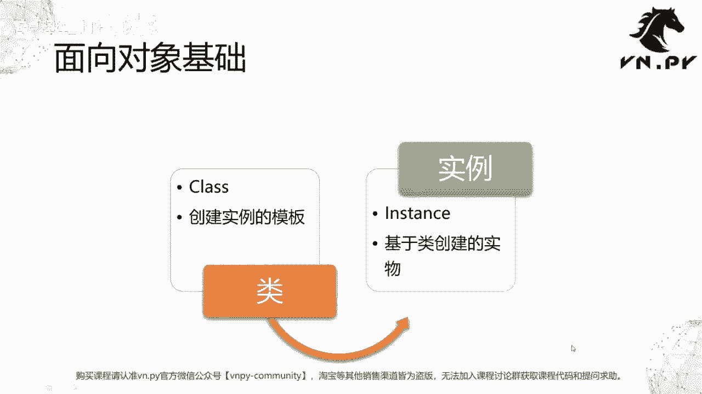
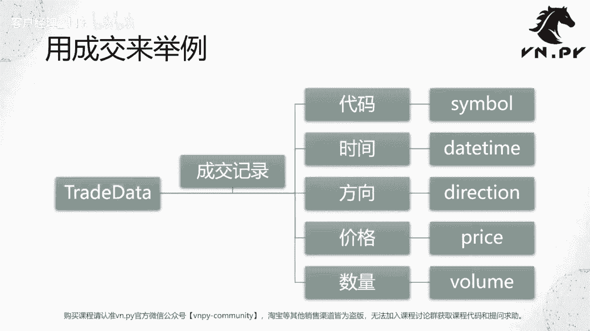
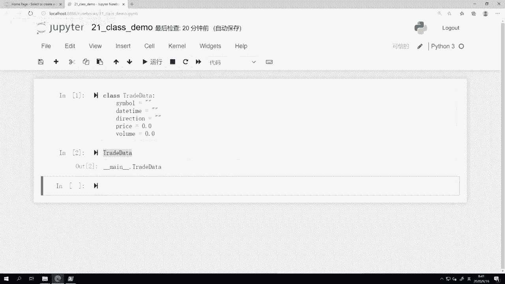
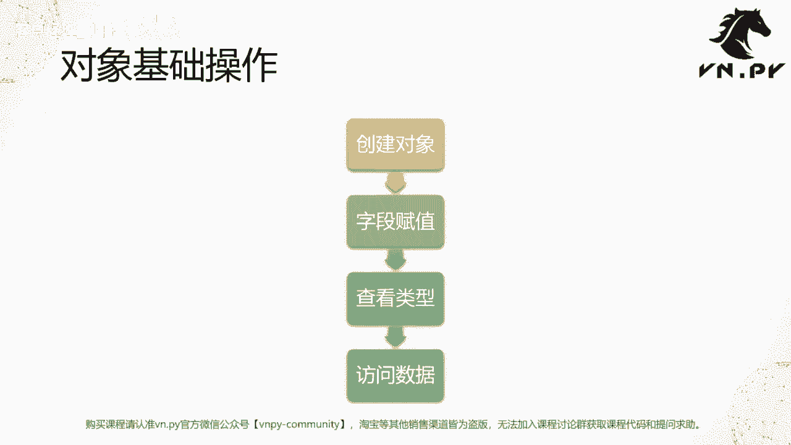
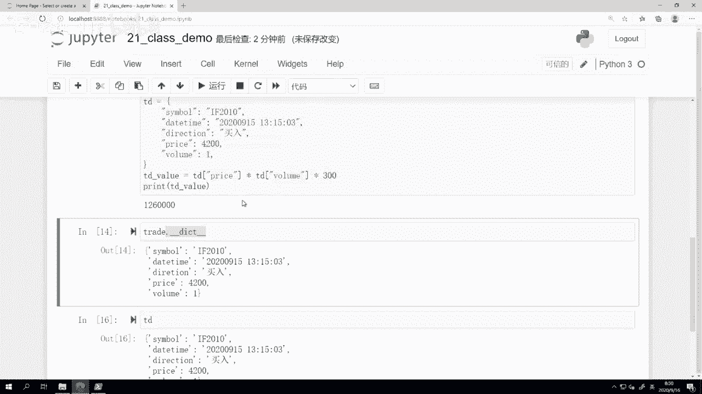
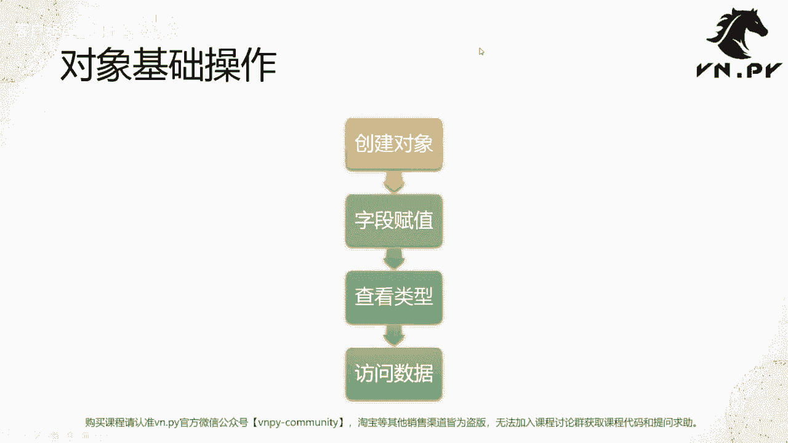

# VNPY30天解锁Python期货量化开发：课时21：开发一个类

## 概述
在本节课中，我们将要学习面向对象编程的基础知识，特别是如何创建和使用一个“类”。我们将通过一个金融交易中“成交记录”的具体例子，来理解类与对象的概念、创建方法以及基本操作。

上一节我们深入探讨了Python函数的种种细节。本节中，我们来看看一个更大的编程主题——面向对象编程。

## 面向对象编程简介
面向对象编程（Object Oriented Programming）的核心哲学是将编程中涉及的各种函数和数据，以一种对人类而言易于理解的方式整合起来。这有助于我们在编写代码时，将思维从底层数据结构中解放出来，专注于更高层次的设计，从而提高生产力。

## 核心概念：类与对象
首先，我们需要理解两个核心概念：类和对象。

*   **类（Class）**：类是创建实例的模板。可以将其理解为制造产品时所依据的图纸。在Python中，使用关键字 `class` 来定义一个类。
*   **对象（Object）/实例（Instance）**：对象是基于类创建出来的具体实物。可以将其理解为根据图纸制造出来的、可供使用的具体产品。



为了更直观地理解，我们以金融交易中的“成交记录”为例，创建一个名为 `TradeData` 的类。一笔成交记录通常包含以下基本信息：
*   代码（Symbol）：标识交易的合约，例如 `F2010`。
*   时间（Datetime）：成交发生的具体日期和时间。
*   方向（Direction）：买入或卖出。
*   价格（Price）：成交价格。
*   数量（Volume）：成交数量。

以下是 `TradeData` 类的定义代码：



```python
class TradeData:
    symbol = ""
    datetime = ""
    direction = ""
    price = 0.0
    volume = 0.0
```

这段代码定义了一个名为 `TradeData` 的类，并为其预设了五个字段（或称属性）及其初始值。

## 对象的基本操作
定义好类之后，我们就可以使用它来创建对象，并进行一系列操作。以下是几个基础操作步骤：

1.  **创建对象**
2.  **字段赋值**
3.  **查看类型**
4.  **访问数据**

接下来，我们一步步进行演示。



### 1. 创建对象
创建对象的方式类似于调用一个无参数的函数。



```python
trade = TradeData()
```
这行代码创建了一个 `TradeData` 类的实例，并将其赋值给变量 `trade`。

### 2. 字段赋值
创建对象后，我们可以为它的各个字段赋予具体的值。

```python
trade.symbol = "F2010"
trade.datetime = "2020-09-15 13:15:03"
trade.direction = "买入"
trade.price = 4200.0
trade.volume = 1.0
```
通过 `对象.字段名 = 值` 的语法，我们可以为对象的属性赋值。

### 3. 查看类型
使用 `type()` 函数可以查看一个对象的类型，即它是由哪个类创建的。

```python
print(type(trade))
# 输出: <class '__main__.TradeData'>
```

### 4. 访问数据
我们可以像访问变量一样，访问对象中存储的数据。

```python
print(trade.symbol)  # 输出: F2010
print(trade.price)   # 输出: 4200.0
```
基于对象的数据，我们可以进行进一步的计算。例如，计算这笔成交的价值（假设合约乘数为300）：
```python
trade_value = trade.price * trade.volume * 300
print(trade_value)  # 输出: 1260000.0
```

## 类与字典的对比
你可能会发现，用类来组织数据，其效果与使用字典（`dict`）有些相似。确实，在Python内部，对象的数据存储很大程度上是基于字典实现的。

我们可以通过访问对象的 `__dict__` 属性来查看其背后的字典结构：

```python
print(trade.__dict__)
# 输出类似: {'symbol': 'F2010', 'datetime': '...', 'direction': '买入', 'price': 4200.0, 'volume': 1.0}
```

那么，为什么还需要类的概念呢？关键在于，类不仅能存储数据，还能将数据和围绕这些数据的操作（函数）封装在一起，使得代码结构更清晰、更易于理解和维护。这部分更深入的内容，我们将在后续课程中详细讲解。





## 总结
本节课中，我们一起学习了面向对象编程的入门知识。我们了解了类与对象的基本概念，并通过 `TradeData` 类的例子，实践了如何定义类、创建对象、为对象属性赋值、查看对象类型以及访问对象数据。我们还简单对比了类与字典的异同，为后续深入学习面向对象编程打下了基础。