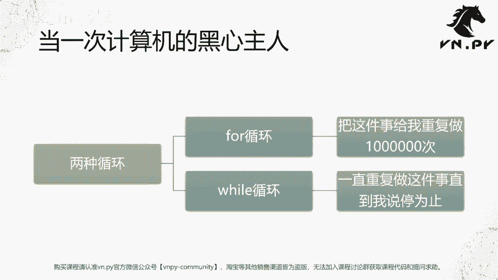
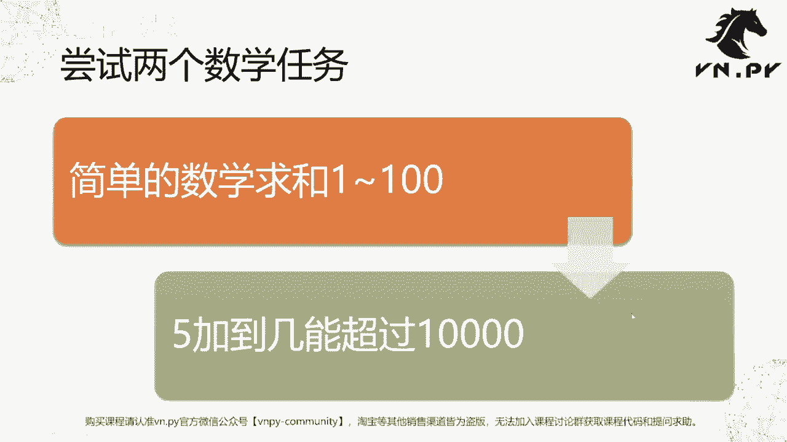
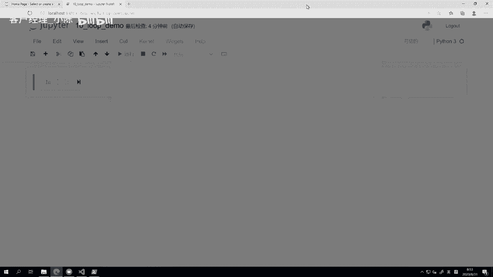
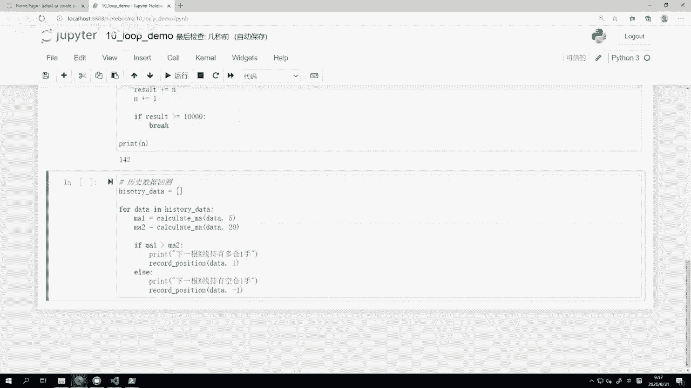

# VNPY30天解锁Python期货量化开发：课时10：循环语句 - P1 🔄

在本节课中，我们将要学习Python编程中一个极其重要的概念——循环语句。循环能让我们命令计算机自动、重复地执行某些任务，从而将我们从枯燥的机械劳动中解放出来。

上一节课我们介绍了条件判断，它让计算机能够根据条件做出选择。本节中我们来看看如何让计算机不知疲倦地重复工作。

## 循环的概念：当一次“黑心”主人



我们可以把计算机想象成一个不知疲倦的工人。上一节的条件判断，是教会计算机观察外部情况并做出决策。而循环语句，则是命令计算机重复执行某些枯燥、机械的任务，从而释放我们的生产力。

Python中有两种主要的循环语句：
*   **`for`循环**：把这件事给我重复地做N次（例如100万次）。
*   **`while`循环**：一直重复做这件事，直到我让你停为止（通常是一个条件不再满足）。





对于计算机而言，执行百万次循环是轻而易举的，这正是其强大计算能力的体现。

## 从数学任务开始理解循环

理论讲完，我们直接通过两个具体的数学问题来理解循环的威力。

### 任务一：计算1到100的和

这是一个经典问题。虽然我们可以用公式 `(1+100)*100/2` 快速得到答案5050，但让计算机机械地从1加到100更能体现循环的价值。

以下是实现代码：
```python
# 初始化结果变量
result = 0

# 使用for循环，让i依次取1到100之间的每一个整数
for i in range(1, 101):
    result += i  # 将当前的i值累加到result上

# 打印最终结果
print(result)  # 输出：5050
```

我们来解析这段代码：
1.  `result = 0`：创建一个变量`result`来存储累加结果，初始值为0。
2.  `for i in range(1, 101):`：这是`for`循环的核心。
    *   `range(1, 101)`是一个生成数字序列的函数。它会生成从**1开始，到101结束（但不包含101）**的整数，即1, 2, 3, ..., 100。
    *   `for i in ...` 表示：依次取出序列中的每个数字，赋值给变量`i`，然后执行一次循环体内的代码。
3.  `result += i`：这是自增运算，等同于 `result = result + i`。每次循环都将当前的`i`值加到`result`上。
4.  循环结束后，打印`result`，就得到了1到100的总和。

为了更直观地理解`range`，可以运行以下代码：
```python
print(list(range(1, 11)))  # 输出：[1, 2, 3, 4, 5, 6, 7, 8, 9, 10]
```
可以看到，`range(1, 11)`生成了1到10的序列，**起始值包含，结束值不包含**，这个规则非常重要。

### 任务二：从5开始累加，加到几总和能超过10000？

这个问题没有简单的公式解法，但用循环可以轻松解决。我们这次使用`while`循环。

```python
# 初始化：从数字5开始，所以当前总和是5，下一个要加的数字是6
result = 5
n = 6

# 当总和 result 还小于或等于10000时，继续循环
while result <= 10000:
    result += n  # 将n加到总和中
    n += 1       # n自增1，准备加下一个数字

# 循环结束后，打印最后一个被加的数字n（注意：此时n已经自增过一次）
print(n)  # 输出：142
```
运行后，程序输出`142`。这意味着从5开始，一直加到142，其总和才超过10000。

解析`while`循环：
1.  `while result <= 10000:`：`while`后面跟一个条件表达式。只要这个条件为`True`（`result`小于等于10000），就会一直执行循环体内的代码。
2.  循环体内，先将当前的`n`加到`result`上，然后让`n`增加1，为下一轮加法做准备。
3.  当某一轮加法使得`result`大于10000时，条件 `result <= 10000` 变为`False`，循环终止。
4.  此时`n`的值是143（因为最后一轮满足条件时`n`是142，加完后`n`自增到了143），但我们想知道的是加到哪个数时超过的，所以应该打印`n-1`，即142。更严谨的写法是在循环内判断。

为了看清过程，可以在循环内添加打印语句（但正式代码通常会注释掉这些调试信息）：
```python
result = 5
n = 6
while result <= 10000:
    result += n
    print(f“加上{n}后，总和变为{result}”)  # 打印过程
    n += 1
```

**课后练习**：你可以用`for`循环验证一下，从5加到142的总和是否大于10000，而从5加到141是否小于10000。

## 循环的控制：`continue`与`break`

有时我们并不想机械地执行完每一次循环，而是希望在某些条件下跳过本轮，或者直接终止整个循环。这就需要用到循环控制语句`continue`和`break`，它们通常与`if`条件判断结合使用。

### 使用`continue`跳过特定循环

假设我们只想计算1到100之间所有偶数的和。

```python
result = 0
for i in range(1, 101):
    # 如果i是奇数（i除以2的余数不为0），则跳过本轮循环
    if i % 2:  # i % 2 的结果是余数，非0值在逻辑判断中视为True
        continue  # 结束本轮循环，直接进入下一轮
    result += i  # 只有偶数才会执行到这行

print(result)  # 输出：2550
```
*   `i % 2`：求余运算符，计算`i`除以2的余数。奇数余数为1（`True`），偶数余数为0（`False`）。
*   `continue`：当条件满足（`i`是奇数）时，执行`continue`，它会**立即结束本轮循环**，循环体内的后续代码（`result += i`）将被跳过，直接开始下一轮循环。

### 使用`break`提前终止循环

我们可以用`break`来改写“加到几超过10000”的任务，这种写法有时更符合直觉。

```python
result = 5
n = 6
while True:  # 创建一个无限循环
    result += n
    # 如果总和已经超过10000，则中断循环
    if result > 10000:
        break  # 中断整个循环
    n += 1

print(n)  # 输出：142
```
*   `while True:`：这是一个无限循环，因为条件`True`永远为真。
*   `if result > 10000:`：在循环体内检查条件。
*   `break`：当条件满足（总和超过10000）时，执行`break`，它会**立即终止整个循环**，无论后面还有多少次迭代。

`break`写法让我们可以正向思考：“一旦超过10000就停止”，而不是反向思考：“当不超过10000时就继续”。

## 循环在量化实践中的应用雏形

现在，我们已经掌握了条件判断和循环。将它们结合起来，已经可以勾勒出量化策略回测的核心骨架。

假设你有一组历史K线数据，想要回测一个简单的“双均线金叉死叉”策略（5日均线上穿20日均线买入，下穿卖出）。其核心逻辑用伪代码表示如下：

```python
# 假设 history_data 是一个列表，包含了按时间排序的历史K线数据
for data in history_data:  # 循环遍历每一根K线
    # 计算当前K线对应的5日和20日均线值（此处是函数，后续课程会讲）
    ma5 = calculate_ma(data, period=5)
    ma20 = calculate_ma(data, period=20)

    # 判断均线关系
    if ma5 > ma20:
        # 记录：当前时间点，应该持有多头仓位
        record_position(time=data.time, side=“long”, volume=1)
    else:
        # 记录：当前时间点，应该持有空头仓位
        record_position(time=data.time, side=“short”, volume=1)

# 循环结束后，根据所有记录的头寸信息计算盈亏
```
**代码解读**：
1.  `for data in history_data:`：这就是一个循环，模拟时间推进，依次处理每一根历史K线。
2.  在每根K线上，计算技术指标（如均线`ma5`, `ma20`）。
3.  使用`if`判断指标条件，决定交易信号。
4.  记录交易决策。
5.  循环结束后，汇总所有记录即可进行绩效分析。

虽然这段代码还不能直接运行（因为缺少数据读取、指标计算、结果记录等具体函数实现），但它清晰地展示了**任何复杂策略回测的本质**：**循环遍历历史数据，在每一个时间点根据规则做出决策，最后统计结果**。这构成了量化开发的基石。

> **重要提示**：上面的伪代码示例存在“未来函数”问题，即用当前K线的收盘价计算指标，并决定当前K线的操作。在实际回测中，必须使用当前及之前的数据计算指标，来决定**下一根**K线的操作，以确保逻辑的严谨性。我们会在后续课程中详细探讨。

---



本节课中我们一起学习了Python循环语句的核心知识。我们掌握了两种循环：**`for`循环**用于遍历序列或重复指定次数；**`while`循环**用于在条件满足时持续运行。我们还学会了用**`continue`**跳过本轮循环，以及用**`break`**提前退出循环。最后，我们看到了如何将条件判断与循环结合，构建出量化策略回测的基本逻辑框架。循环是自动化处理数据的利器，是量化编程中不可或缺的工具。