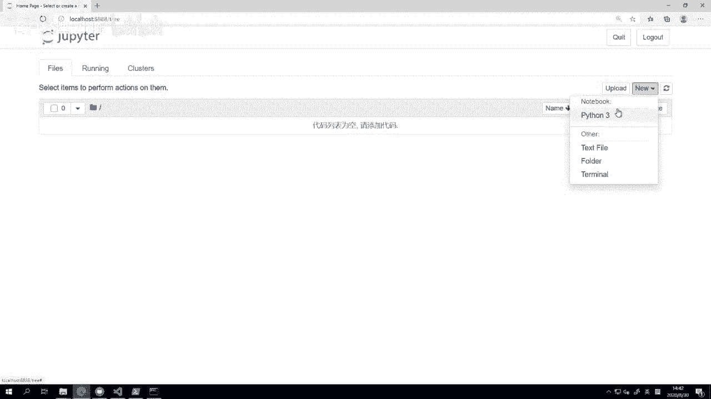
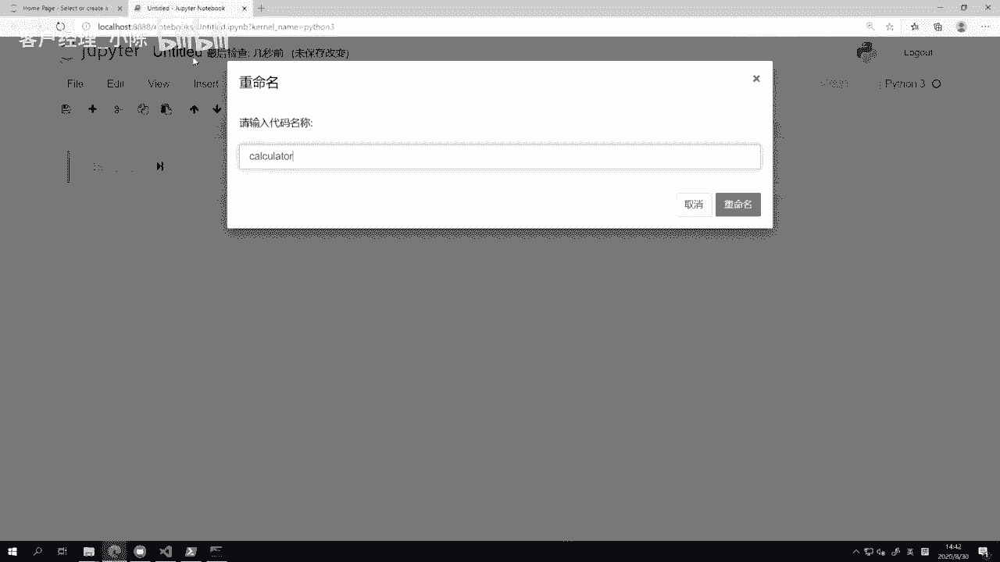

# VNPY30天解锁Python期货量化开发：课时08：数学运算

在本节课中，我们将学习如何使用Python进行各种数学运算。我们将从最基础的四则运算开始，逐步深入到整除、求余、幂运算和自增运算，最后还会介绍逻辑比较运算和计算优先级。掌握这些知识是编写量化策略的基础。





## 变量赋值与四则运算

上一节我们介绍了Python中的变量类型，本节中我们来看看如何使用变量进行基础的数学计算。首先，我们需要为变量赋值。

```python
A = 1
B = 2
```

请注意，在Python中，变量名、运算符和数值之间通常用一个空格隔开，这是一种推荐的代码风格，能让代码更清晰易读。

赋值完成后，我们就可以进行加减乘除四则运算了。为了在Jupyter Notebook中同时看到每一步的结果，我们使用`print`函数来输出。

```python
print(A + B)  # 加法
print(A - B)  # 减法
print(A * B)  # 乘法
print(A / B)  # 除法
```

## 特殊除法：整除与求余

除法运算有时会产生小数，但在编程中，我们有时只需要整数部分或余数。以下是两种特殊的除法运算。

*   **整除运算**：使用两个反斜杠 `//`，它返回除法结果的整数部分。
    ```python
    C = 10
    D = 3
    print(C // D)  # 输出结果为 3
    ```
*   **求余运算**：使用百分号 `%`，它返回除法结果的余数。
    ```python
    print(C % D)   # 输出结果为 1
    ```

## 幂运算（求乘方与开方）

幂运算用于计算一个数的乘方或开方，在Python中使用两个星号 `**` 表示。

以下是幂运算的例子：
```python
print(C ** 2)      # 计算10的平方，结果为 100
print(100 ** 0.5)  # 计算100的开平方，结果为 10.0
print(C ** 0)      # 任何数的0次方都是1，结果为 1
```
需要注意的是，即使开方结果是整数（如10），Python也会将其作为浮点数（如10.0）返回。

## 自增运算

在量化策略中，我们经常需要计数，例如统计自下单以来收到了多少个行情数据（Tick）。这时可以使用自增运算来简化代码。

自增运算将计算和赋值合并为一步。最常见的操作是每次加一。
```python
count = 0
count += 1  # 等价于 count = count + 1
print(count)  # 输出 1
```
每执行一次 `count += 1`，变量 `count` 的值就会增加1。这种写法不仅简洁，而且意图明确。

实际上，自增运算支持所有四则运算：
```python
count -= 2  # 自减2
count *= 2  # 自乘2
count /= 2  # 自除2
```

## 逻辑比较运算

逻辑运算用于比较两个值的大小或判断是否相等，其结果是布尔值（`True` 或 `False`）。这在策略中用于判断条件是否满足，例如是否到达撤单时间。

以下是逻辑运算的类型和示例：
```python
print(3 > 2)   # 大于，结果为 True
print(3 < 2)   # 小于，结果为 False
print(3 >= 2)  # 大于等于，结果为 True
print(3 <= 2)  # 小于等于，结果为 False
print(3 == 2)  # 等于，结果为 False
print(3 != 2)  # 不等于，结果为 True
```
在实际策略中，我们常将逻辑运算与变量结合使用，例如判断计数器是否达到阈值：`print(count >= 20)`。

## 计算优先级

当表达式中包含多种运算时，Python会按照特定的优先级顺序进行计算，这与数学中的规则基本一致。

计算优先级从高到低如下：
1.  **括号 `()`**：优先级最高，括号内的表达式最先计算。
2.  **幂运算 `**`**：例如乘方和开方。
3.  **乘 `*`、除 `/`、整除 `//`、求余 `%`**。
4.  **加 `+`、减 `-`**。
5.  **比较运算符**：如 `>`, `<`, `==` 等，优先级最低。

我们来看几个例子：
```python
print(1 + 2 * 3)      # 先乘后加，结果为 7
print((1 + 2) * 3)    # 括号优先，结果为 9
print(3 * 2 ** 4)     # 先幂运算后乘法，结果为 48
print(4 + 5 > 8)      # 先加后比较，结果为 True (因为9>8)
```

有一个需要特别注意的情况：布尔值（`True`, `False`）在参与数学运算时，会被隐式转换为整数（`True`为1，`False`为0）。
```python
print(4 + (5 > 8))    # 5>8为False，转为0，4+0=4
print(4 + (5 < 8))    # 5<8为True，转为1，4+1=5
```
**请注意**：在实际编程中，应尽量避免编写这种混合布尔值与数学运算的、可读性差的代码，以免造成混淆。

## 总结


本节课中我们一起学习了Python中的核心数学运算。我们从基础的四则运算开始，然后掌握了特殊的整除与求余运算，接着学习了用于计算乘方和开方的幂运算，以及简化代码的自增运算。最后，我们探讨了用于条件判断的逻辑比较运算，并明确了各类运算之间的优先级规则。现在，你已经可以熟练地将Python作为一个强大的计算器来使用，这是构建量化交易策略的重要基石。