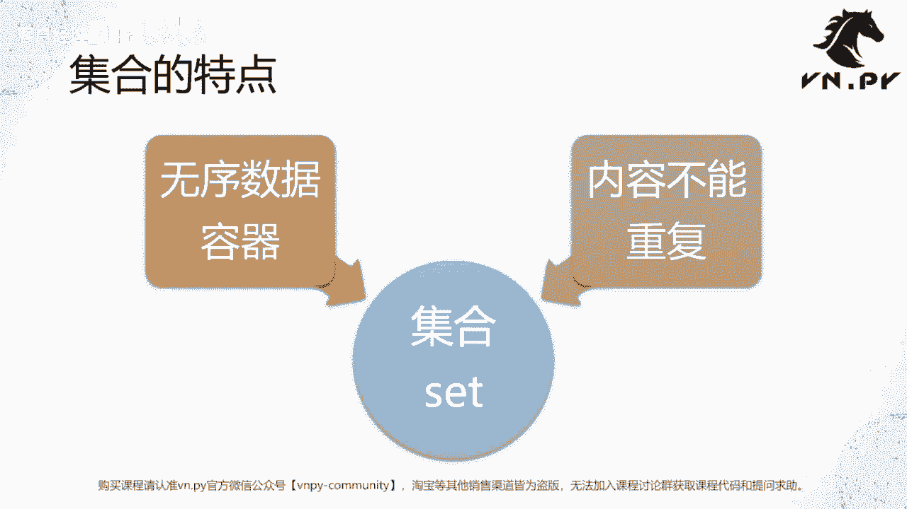
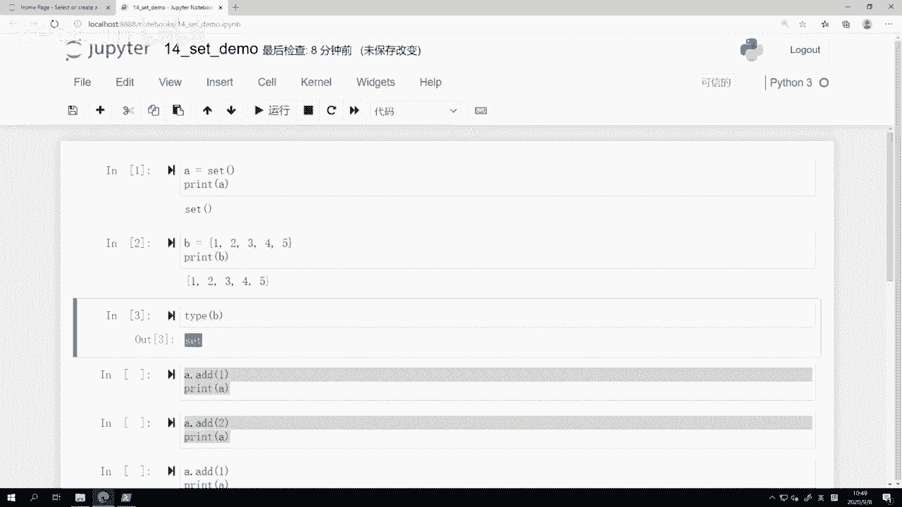
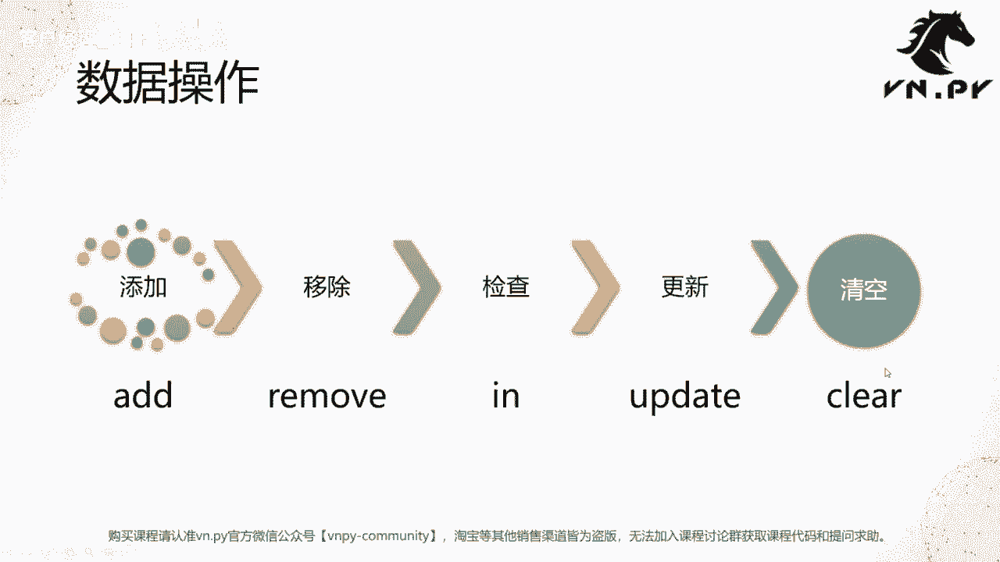
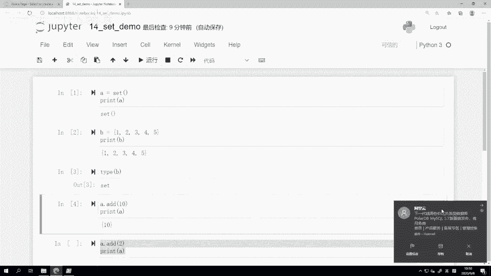
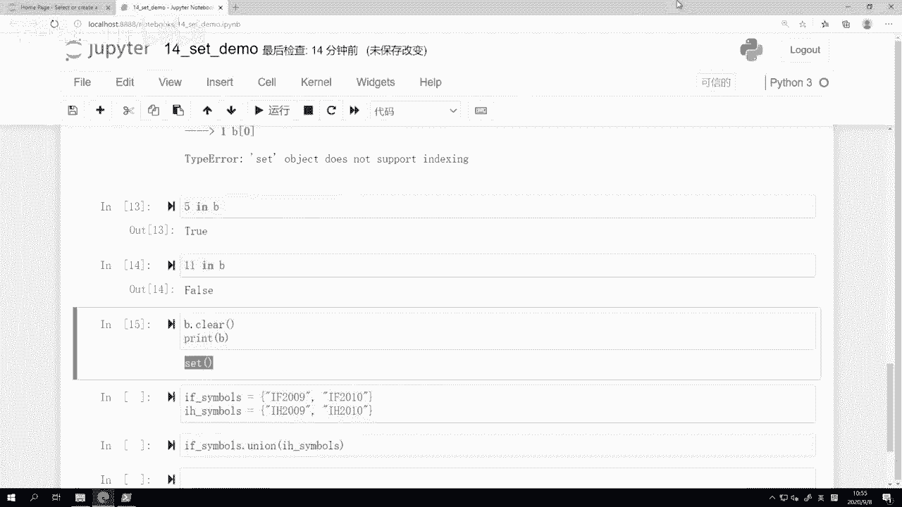
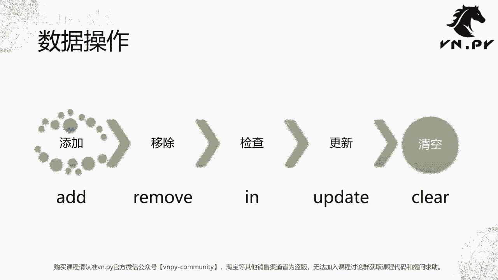
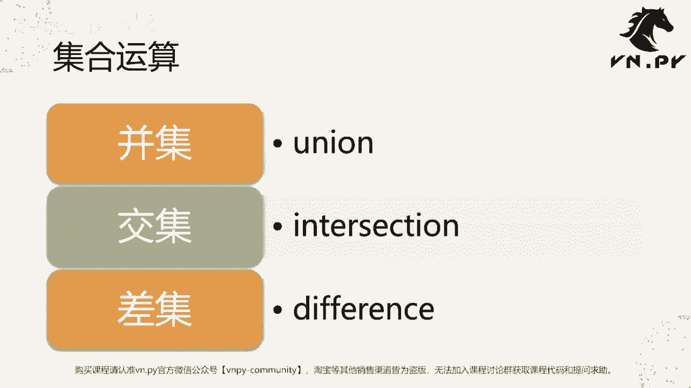
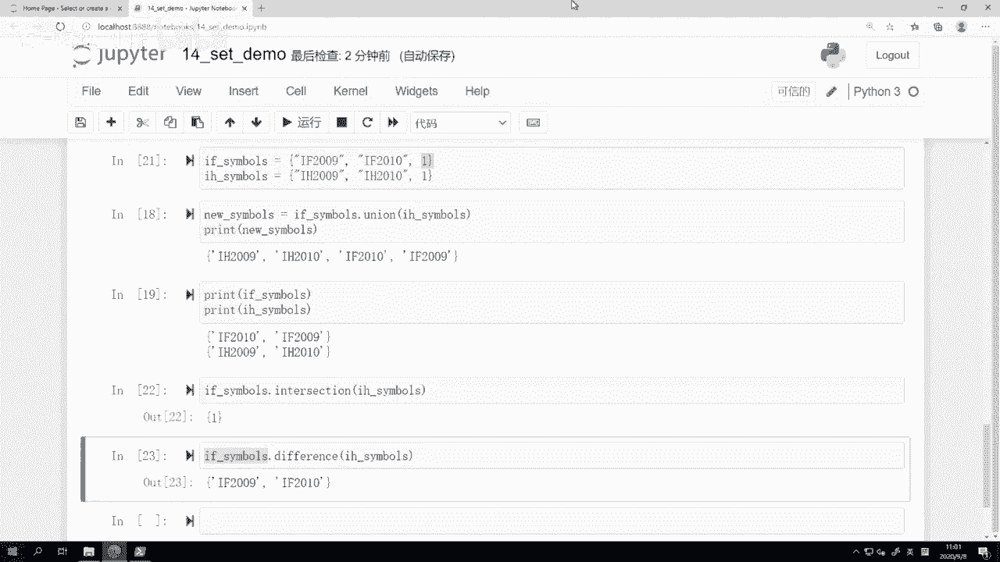

# VNPY30天解锁Python期货量化开发：课时14：无序集合

在本节课中，我们将要学习Python中一个轻量级但非常实用的数据容器——无序集合。集合在量化交易中常用于数据去重和快速成员检查。



上一节课我们学习了强大的字典，本节中我们来看看集合。集合来源于数学概念，在Python中称为`set`。它有两个核心特点：第一，集合是无序的，数据没有固定的插入和访问顺序；第二，集合内的元素是**唯一**的，不能重复。因此，集合常被用来进行去重处理。

## 创建集合

集合的创建有两种主要方法。



以下是两种创建集合的代码示例：

```python
# 方法一：使用set()函数创建空集合
a = set()
print(a)  # 输出: set()



# 方法二：使用大括号{}直接创建（注意与字典区分）
b = {1, 2, 3, 4, 5}
print(b)  # 输出: {1, 2, 3, 4, 5}
print(type(b))  # 输出: <class 'set'>
```

需要注意的是，使用大括号`{}`创建时，如果内部是`键:值`对，则创建的是字典；如果内部是逗号分隔的单个值，则创建的是集合。空集合必须用`set()`创建，因为`{}`表示空字典。



## 集合的基本操作

对集合的数据操作主要包括增、删、查、更新和清空，其顺序类似于数据库的“增删改查”。

以下是集合的五个核心操作方法：

1.  **添加元素**：使用`add()`方法。
    ```python
    a = set()
    a.add(10)
    print(a)  # 输出: {10}
    a.add(2)
    a.add(5)
    print(a)  # 输出: {10, 2, 5} 或 {2, 10, 5}，顺序不确定
    ```

2.  **移除元素**：使用`remove()`方法。如果元素不存在，会引发`KeyError`错误。
    ```python
    a.remove(10)
    print(a)  # 输出: {2, 5}
    # a.remove(10)  # 再次移除会报错：KeyError: 10
    ```

3.  **检查元素是否存在**：使用`in`关键字。
    ```python
    print(2 in a)  # 输出: True
    print(11 in a) # 输出: False
    ```

4.  **批量更新元素**：使用`update()`方法，可以合并另一个集合。
    ```python
    b = {1, 2, 3, 4, 5}
    b.update({6, 7, 8, 9, 10})
    print(b)  # 输出: {1, 2, 3, 4, 5, 6, 7, 8, 9, 10}
    ```

5.  **清空集合**：使用`clear()`方法。
    ```python
    b.clear()
    print(b)  # 输出: set()
    ```

**重要提示**：集合是**无序**的，因此**不支持**通过下标（索引）访问，例如`b[0]`会引发`TypeError`。遍历集合只能使用`for`循环。

## 集合的数学运算



除了基本操作，集合还支持数学上的并集、交集和差集运算。这在处理数据分组或筛选时非常有用。

以下是三种集合运算的示例：

*   **并集 (Union)**：合并两个集合的所有**不重复**元素。使用`union()`方法或`|`运算符。
    ```python
    f_symbols = {'IF2009', 'IC2009'}
    h_symbols = {'rb2010', 'hc2010'}
    new_symbols = f_symbols.union(h_symbols)  # 或 f_symbols | h_symbols
    print(new_symbols)  # 输出: {'IF2009', 'IC2009', 'rb2010', 'hc2010'}
    # 原集合f_symbols和h_symbols保持不变
    ```





*   **交集 (Intersection)**：返回两个集合**共有**的元素。使用`intersection()`方法或`&`运算符。
    ```python
    f_symbols.add('common')
    h_symbols.add('common')
    common = f_symbols.intersection(h_symbols)  # 或 f_symbols & h_symbols
    print(common)  # 输出: {'common'}
    ```

*   **差集 (Difference)**：返回存在于第一个集合但**不存在于**第二个集合中的元素。使用`difference()`方法或`-`运算符。
    ```python
    diff = f_symbols.difference(h_symbols)  # 或 f_symbols - h_symbols
    print(diff)  # 输出: {'IF2009', 'IC2009'} (不包含‘common’和h_symbols中的元素)
    # 注意顺序：f_symbols - h_symbols 不等于 h_symbols - f_symbols
    ```

## 集合的应用场景：去重

在量化交易中，集合的一个典型应用是委托号管理。一个委托从发出到完全成交，可能会触发多次状态推送（如委托确认、部分成交、全部成交）。如果使用列表记录委托号，同一个委托号会被重复记录，可能导致重复撤单等异常操作。

使用集合可以天然地实现去重，确保每个委托号只记录一次，从而避免操作风险。

```python
# 模拟委托号记录
order_set = set()

# 收到不同事件的推送
order_set.add('OrderID_001')  # 委托确认
order_set.add('OrderID_002')  # 另一个委托
order_set.add('OrderID_001')  # OrderID_001的部分成交推送（不会被重复添加）
order_set.add('OrderID_001')  # OrderID_001的全部成交推送（不会被重复添加）

print(order_set)  # 输出: {'OrderID_001', 'OrderID_002'}，自动去重
```



本节课中我们一起学习了Python的无序集合。我们掌握了集合的创建、基本操作（增删改查）以及并集、交集、差集三种数学运算。最重要的是，我们理解了集合**元素唯一**和**无序**的核心特性，并看到了它在量化开发中用于数据去重的实际价值。这些基础概念将为我们后续学习更复杂的v.py内部实现打下坚实基础。