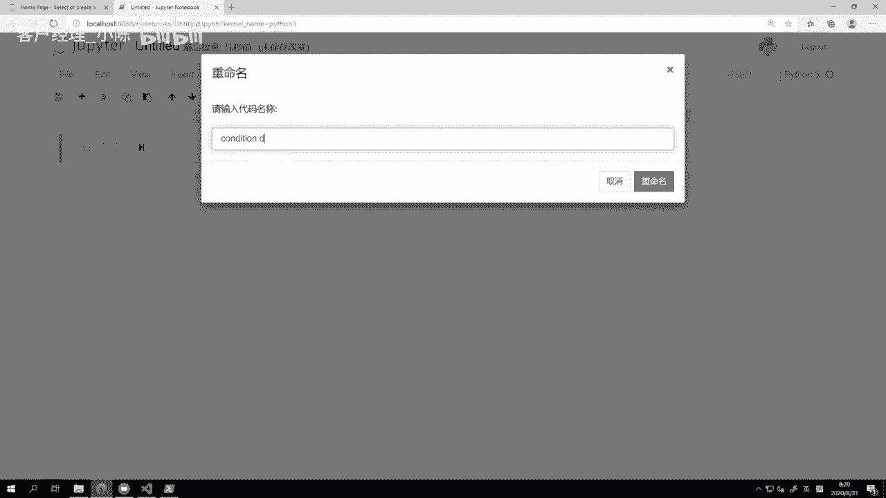
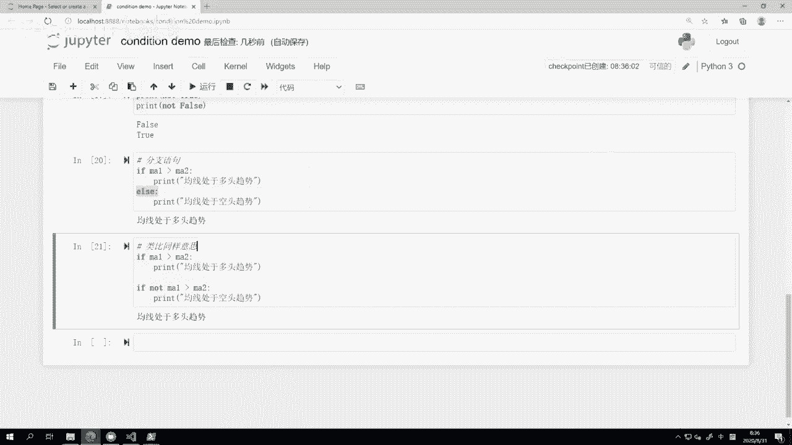
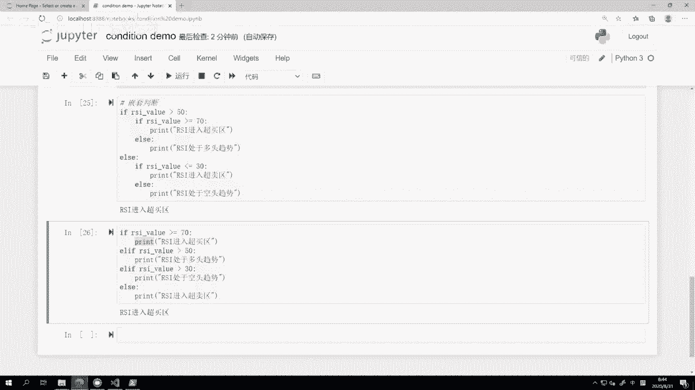

# VNPY30天解锁Python期货量化开发：课时09：条件判断


在本节课中，我们将要学习Python编程中至关重要的“条件判断”。通过条件判断，我们的程序可以根据不同的情况做出不同的决策，这是实现自动化交易逻辑的基础。




上一节我们介绍了Python中的数学运算，本节中我们来看看如何让程序根据运算结果做出选择。

## 条件判断的基本逻辑

条件判断背后的运行逻辑很简单：如果满足某个条件，就执行特定的操作；如果不满足，则什么都不做。

为了实现条件判断，我们需要掌握以下三个要点：
*   **`if`语句**：所有条件判断都以英文单词 `if`（意为“如果”）开头。
*   **代码缩进**：在 `if` 语句行末的冒号之后，需要执行的操作代码必须缩进（通常是4个空格）。
*   **冒号**：每个 `if` 语句必须以冒号 `:` 结束，这是Python语法的重要特征。

## 第一个条件判断示例

让我们想象一个简单的量化交易场景。我们定义几个变量来模拟市场数据：

```python
ma1 = 3000  # 快速均线，例如5日均线
ma2 = 2900  # 慢速均线，例如10日均线
rsi_value = 60  # RSI指标值
```


我们知道，当快速均线大于慢速均线时，通常意味着处于多头趋势。现在，我们用代码来实现这个判断：


```python
if ma1 > ma2:
    print(“均线处于多头趋势”)
```

运行这段代码，它会输出“均线处于多头趋势”。因为此时 `ma1 (3000)` 确实大于 `ma2 (2900)`。

**核心原理**：`if` 后面跟的是一个会产生布尔值（`True` 或 `False`）的表达式。如果表达式结果为 `True`，则执行下方缩进的代码块；如果为 `False`，则跳过。

如果我们把 `ma2` 的值改为 `3100` 并重新运行，则不会有任何输出，因为条件 `ma1 > ma2` 的结果变成了 `False`。

## 逻辑运算：与、或、非

在实际策略中，我们常常需要组合多个条件。这时就需要用到逻辑运算符：`and` (与)、`or` (或)、`not` (非)。

以下是逻辑运算的示例：

```python
# 使用 and (与)：两个条件必须同时为真
if ma1 > ma2 and rsi_value > 50:
    print(“均线和RSI都处于多头趋势”)

# 使用 or (或)：两个条件中至少一个为真即可
if ma1 > ma2 or rsi_value > 50:
    print(“至少有一个指标处于多头趋势”)

# 使用 not (非)：对条件结果取反
if not ma1 > ma2:
    print(“均线处于空头趋势”)
```


为了更直观地理解，我们可以直接打印逻辑运算的结果：

```python
print(True and True)   # 输出: True
print(True and False)  # 输出: False
print(False and False) # 输出: False


print(True or True)    # 输出: True
print(True or False)   # 输出: True
print(False or False)  # 输出: False

print(not True)        # 输出: False
print(not False)       # 输出: True
```

## 分支语句：if...else...

`if` 语句只处理条件满足的情况。如果我们希望条件不满足时执行另一套操作，就需要使用 `else`（否则）语句。



```python
if ma1 > ma2:
    print(“均线处于多头趋势”)
else:
    print(“均线处于空头趋势”)
```


这段代码构成了一个“二叉路口”：无论 `ma1` 和 `ma2` 的大小关系如何，总会打印出其中一种趋势判断。这比写两个互斥的 `if` 语句更加简洁和高效。

## 嵌套判断与 elif

有时我们需要进行多层次的判断。例如，根据RSI指标的值将其划分为四个区域：超买区、多头区、空头区、超卖区。

初学者可能会自然地写出嵌套的 `if` 语句：

```python
# 方法一：嵌套判断 (直观但结构较深)
if rsi_value >= 50:
    if rsi_value >= 70:
        print(“RSI进入超买区”)
    else:
        print(“RSI处于多头趋势”)
else:
    if rsi_value <= 30:
        print(“RSI进入超卖区”)
    else:
        print(“RSI处于空头趋势”)
```

另一种更扁平、高效的写法是使用 `elif`（它是 `else if` 的缩写）：

```python
# 方法二：使用 elif (扁平高效)
if rsi_value >= 70:
    print(“RSI进入超买区”)
elif rsi_value >= 50:
    print(“RSI处于多头趋势”)
elif rsi_value > 30:
    print(“RSI处于空头趋势”)
else:
    print(“RSI进入超卖区”)
```

**`elif` 的工作逻辑**：程序会按顺序检查每个 `if`/`elif` 的条件。一旦某个条件为 `True`，就执行对应的代码块，然后跳过所有后续的 `elif` 和 `else`。

**给初学者的建议**：开始时可以先用嵌套写法，因为它更符合我们的自然思维。当代码变得复杂或追求更高执行效率时，可以尝试将其重构为使用 `elif` 的扁平化结构。

## 总结

本节课中我们一起学习了Python条件判断的核心知识：
1.  **基本 `if` 语句**：使用 `if condition:` 的格式进行条件判断，依赖代码缩进来定义执行块。
2.  **逻辑运算符**：掌握了 `and`, `or`, `not` 的使用，用于组合或取反多个条件。
3.  **分支选择 `if...else...`**：让程序在条件成立与否时执行不同的代码路径。
4.  **多条件判断 `if...elif...else...`**：优雅地处理多个互斥的条件分支，使代码结构更清晰。




条件判断是编程思维的基石，也是构建任何交易策略逻辑的第一步。请务必通过练习熟练掌握它。