# VNPY30天解锁Python期货量化开发：课时20：类型声明与代码检查 🔍

在本节课中，我们将学习如何为Python函数添加类型声明，以及如何利用工具在运行前检查代码错误，从而提高代码的可读性和健壮性。

上一节我们介绍了如何测量函数的性能，本节中我们来看看如何通过类型声明和静态检查来提升代码质量。

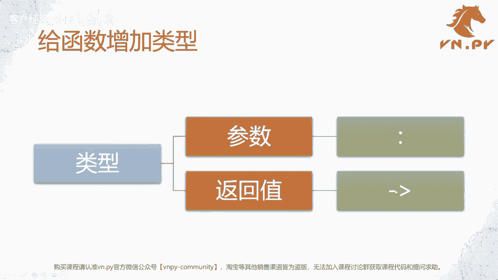

## 概述

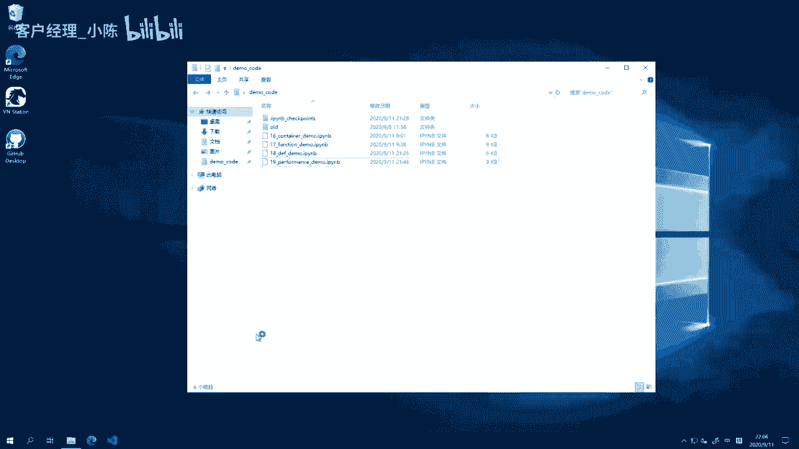

Python是一种动态类型语言，在编写代码时，并不强制要求为变量或函数声明类型。这与C++、C#、Java等静态编译型语言不同。然而，从Python 3.5开始，引入了“类型提示”（Type Hinting）的概念。为代码添加类型声明主要有两个好处：
1.  对于开发者而言，能更清晰地了解函数需要什么类型的参数，以及会返回什么类型的结果。
2.  对于代码编辑器（如VS Code）和检查工具而言，能提供更好的智能提示，并能在运行前发现一些潜在的错误。

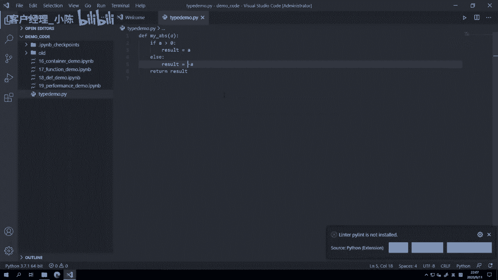

本节课，我们将重点学习如何为函数添加类型提示，并配置一个名为`flake8`的代码检查工具来辅助我们编写更规范的代码。

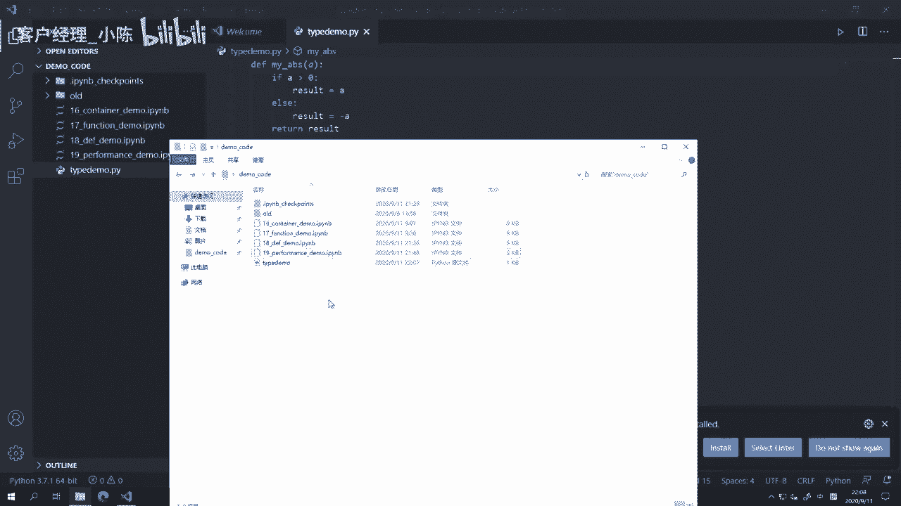

## 为函数添加类型声明

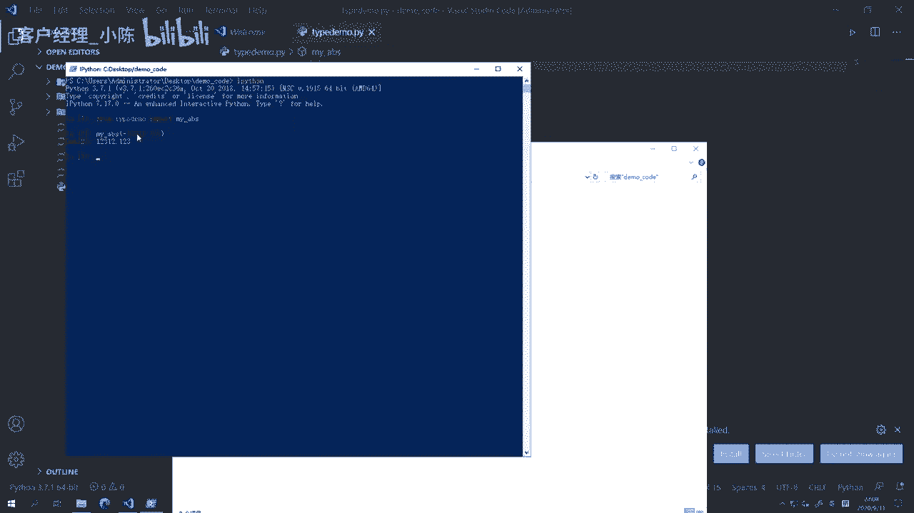

为函数添加类型声明主要涉及两部分：参数的类型和返回值的类型。

*   **参数类型**：在参数名称后加上冒号`:`，然后指定类型。例如：`a: float`。
*   **返回值类型**：在函数声明的`def`行末尾，参数括号之后、冒号之前，添加一个箭头`->`，然后指定返回类型。例如：`-> float`。

以下是具体示例：

```python
def my_abs(a: float) -> float:
    if a >= 0:
        result = a
    else:
        result = -a
    return result
```

在这个`my_abs`函数中，我们声明了参数`a`和返回值都是`float`类型。

**重要提示**：Python的类型提示只是一种“提示”，解释器在运行时并不会强制检查类型。即使传入错误类型的参数（如字符串），代码仍会尝试执行并可能在运行时抛出异常。类型提示的主要价值在于辅助开发工具进行静态分析。

## 配置VS Code与Flake8进行代码检查

虽然类型提示本身不阻止运行时错误，但结合代码检查工具，我们可以在编写阶段就发现许多常见问题，如拼写错误、未定义的变量、不符合编码规范等。

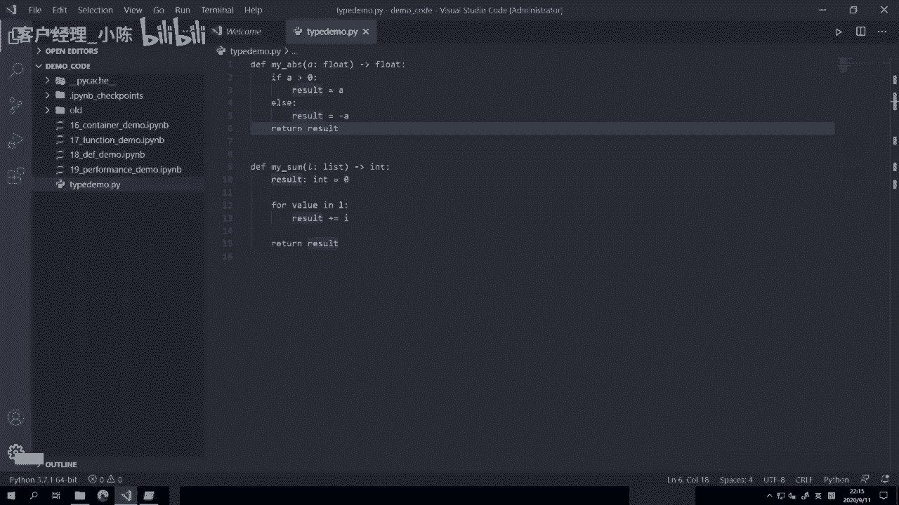

以下是配置VS Code使用`flake8`工具进行代码检查的步骤：

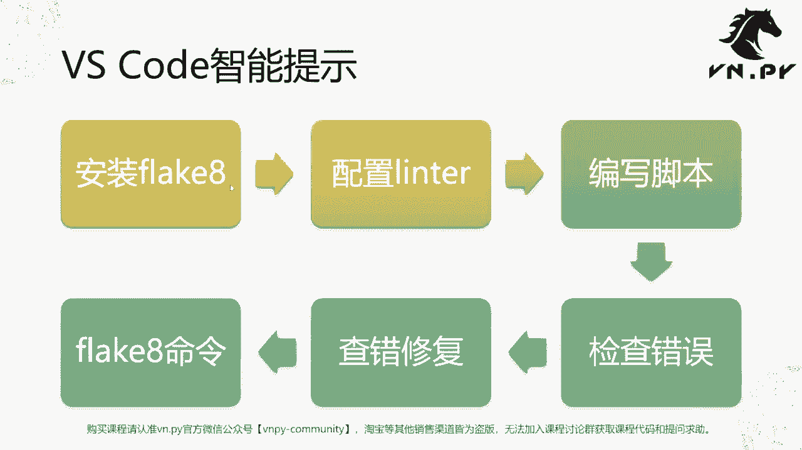

1.  **安装Flake8**
    在终端中运行以下命令来安装`flake8`库：
    ```bash
    pip install flake8
    ```

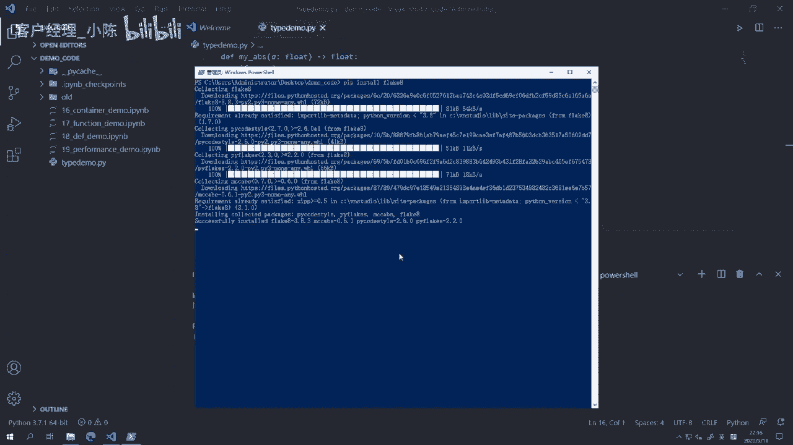

2.  **在VS Code中启用Flake8**
    *   在VS Code中，按下 `Ctrl+Shift+P` (Windows/Linux) 或 `Cmd+Shift+P` (Mac) 打开命令面板。
    *   输入并选择 `Python: Select Linter`。
    *   从列表中选择 `flake8`。

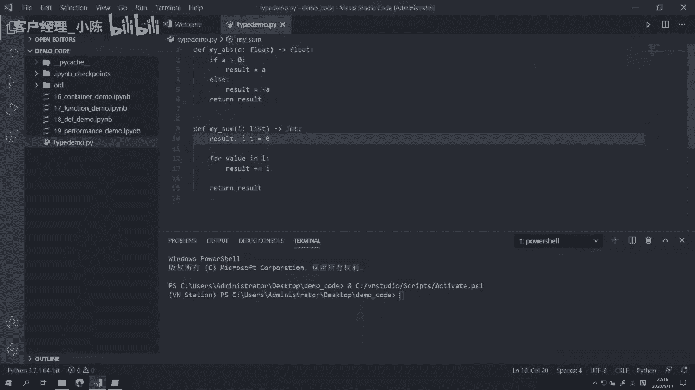

3.  **检查与修复错误**
    启用后，VS Code会实时分析代码。发现问题时，会有波浪线标出：
    *   **红色波浪线**：通常表示严重错误，如使用了未定义的变量，运行必定会失败。
    *   **黄色波浪线**：通常表示风格问题，如代码行过长、变量命名不清晰等，不影响运行但不符合PEP 8编码规范。
    将鼠标悬停在波浪线上可以查看具体问题描述。你也可以在VS Code的“问题”（Problems）面板中集中查看所有问题。

## 一个完整的示例

让我们通过一个包含错误的`my_sum`函数来演示整个流程：

```python
def my_sum(value_list: list) -> int:
    result: int = 0
    for i in value_list:  # 错误：循环变量名是`value`，但这里误写成了`i`
        result += i
    return result
```

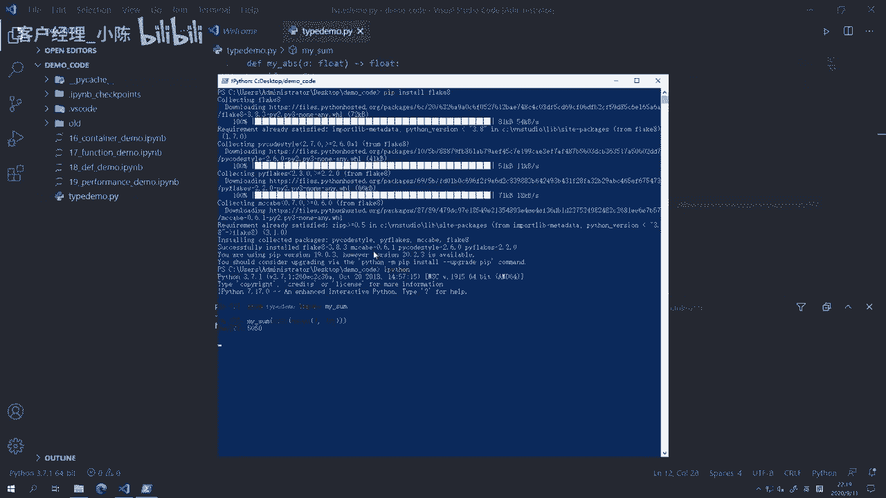

启用`flake8`后，VS Code会立即在`i`下方显示红色波浪线，提示“undefined name ‘i’”。这帮助我们及时发现了拼写错误，将其修正为`value`，避免了将错误留到运行时。

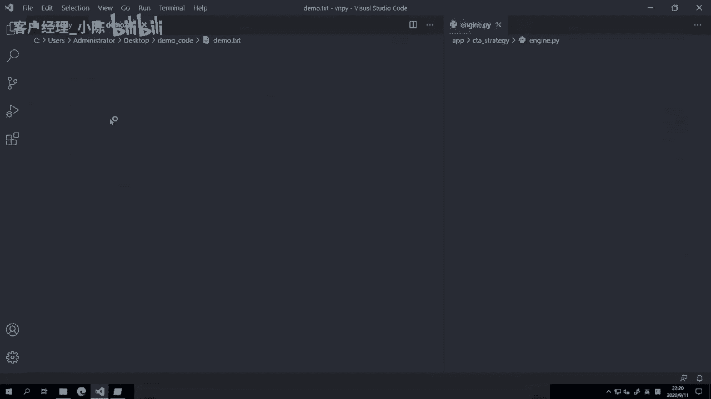

```python
def my_sum(value_list: list) -> int:
    result: int = 0
    for value in value_list:  # 已修正
        result += value
    return result
```

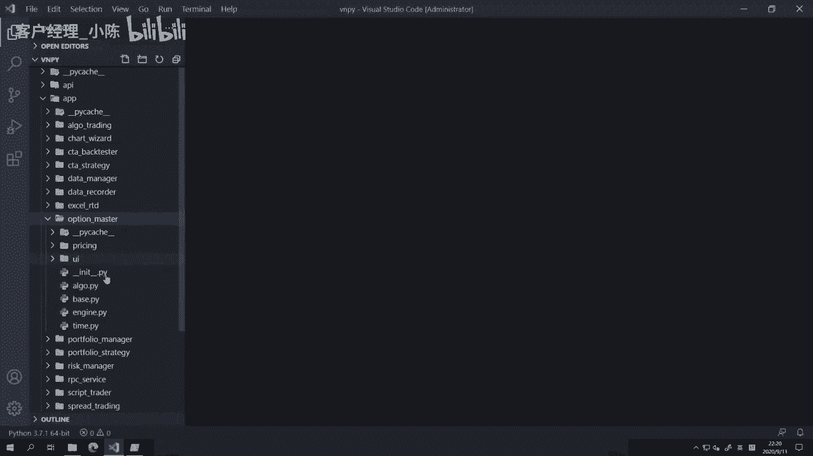

## Python与静态语言类型系统的区别

最后，我们来总结一下Python的类型提示与C++等静态语言类型系统的核心区别：

| 特性 | Python (类型提示) | C++ (类型系统) |
| :--- | :--- | :--- |
| **核心机制** | **Type Hinting**，是一种可选的**提示**。 | 严格的**类型声明**，是语法的一部分。 |
| **检查时机** | 主要由编辑器和第三方工具（如`flake8`, `mypy`）在**编写时**进行静态分析。 | 由编译器在**编译时**进行强制检查。 |
| **强制力** | **非强制**。即使类型不匹配，代码仍可运行（可能运行时出错）。 | **强制**。类型不匹配会导致编译失败，程序无法生成。 |
| **主要目的** | 提高代码可读性，辅助开发工具实现智能提示和早期错误检测。 | 保证内存安全、执行效率，并在编译阶段消除大量类型错误。 |

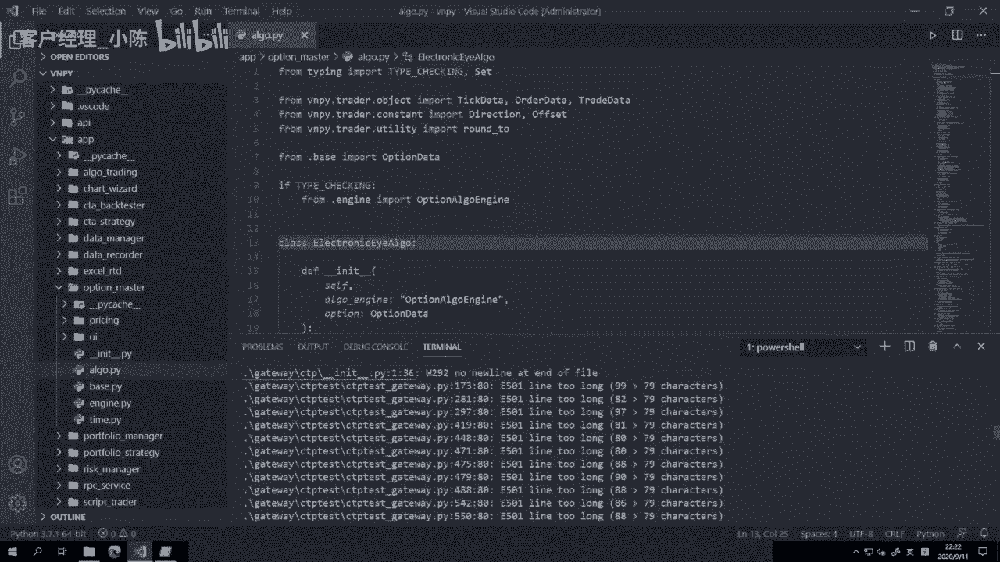

简而言之，Python的类型系统朝着提升开发体验和代码可维护性的方向发展，而C++等语言的类型系统则更侧重于保证程序的正确性和性能。

## 总结

本节课中我们一起学习了：
1.  **为何使用类型提示**：为了提升代码可读性并利用开发工具的智能提示与错误检查功能。
2.  **如何添加类型提示**：使用 `参数: 类型` 的格式声明参数类型，使用 `-> 返回类型` 的格式声明函数返回值类型。
3.  **如何配置代码检查**：通过安装和配置`flake8`工具，结合VS Code，可以在编写阶段及时发现拼写错误、规范问题等。
4.  **理解其局限性**：明确了Python的类型提示是一种辅助工具，不同于静态语言的强制类型检查。

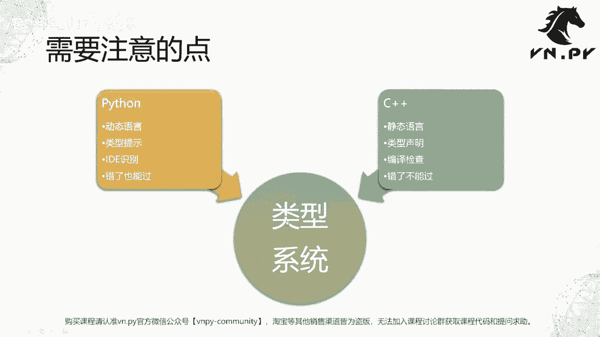

掌握类型声明和代码检查，能让你写出更清晰、更健壮、更易于维护的Python代码，是迈向专业开发的重要一步。