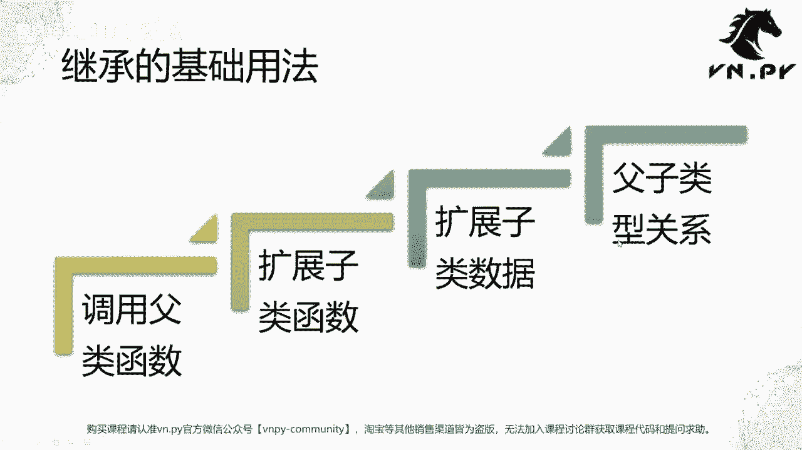
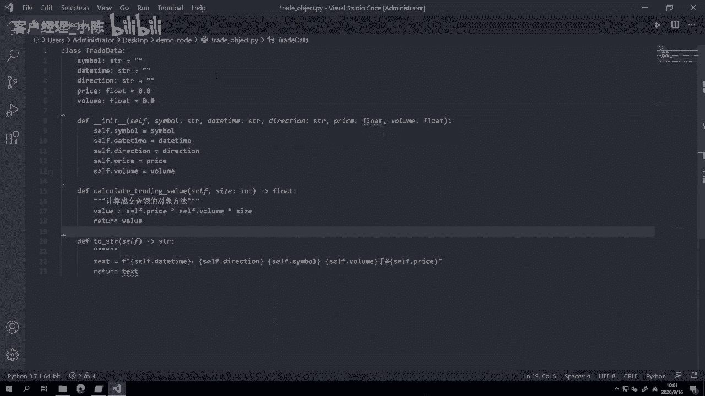
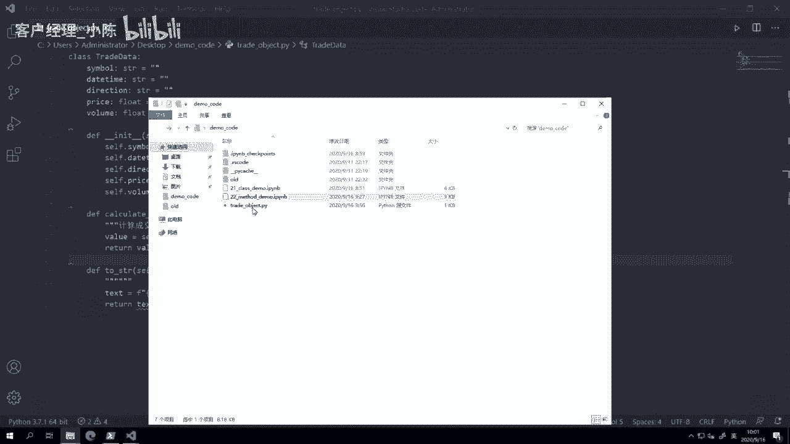
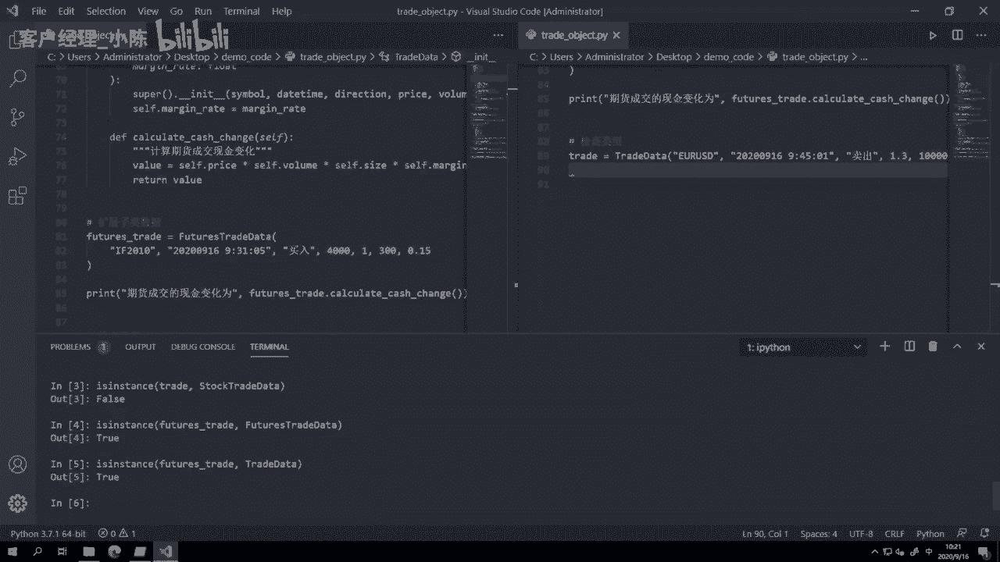
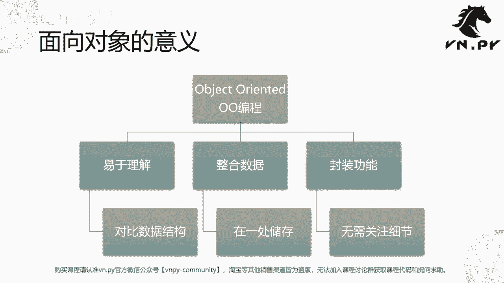

# VNPY30天解锁Python期货量化开发：课时23：类的继承

在本节课中，我们将要学习面向对象编程中一个非常重要的概念——类的继承。通过继承，我们可以创建新的类来复用和扩展现有类的功能，使代码结构更加清晰和高效。

上一节我们介绍了类的方法，将相关逻辑封装到类中。本节中我们来看看如何通过继承来构建具有层次关系的类结构。

## 情景引入



在之前的例子中，我们一直使用 `TradeData` 类来表示成交数据。我们知道，现实市场中有多种不同类型的合约，如股票、期货、外汇和数字货币等。所有类型的成交数据都有一些共同点，例如：
*   合约代码
*   成交时间
*   买卖方向
*   成交价格
*   成交数量



然而，不同类型的成交数据也有其特有的属性和逻辑。例如，计算现金变化时：
*   股票成交需要支付全部成交金额。
*   期货成交由于带有杠杆，只需支付对应成交金额的保证金。



尽管都是“成交”，但股票成交和期货成交在功能上已出现差异。接下来，我们将通过Python中类的继承来展示如何精巧且节省代码地实现这种逻辑。

整体上，我们将分四步进行：调用父类函数、扩展子类函数、扩展子类数据以及理解父子类型关系。

## 准备工作

我们首先在VS Code中创建一个新的Python文件 `trade_object.py`，并将上节课优化后的 `TradeData` 类代码复制过来。为了代码整洁，我们进行了一些格式调整，并添加了 `size` 字段。

```python
class TradeData:
    """
    基础成交数据类，包含所有成交类型的通用属性。
    """
    def __init__(self, symbol: str, datetime: str, direction: str,
                 price: float, volume: int, size: int):
        self.symbol = symbol
        self.datetime = datetime
        self.direction = direction
        self.price = price
        self.volume = volume
        self.size = size

    def __str__(self):
        return (f"合约: {self.symbol}, 时间: {self.datetime}, "
                f"方向: {self.direction}, 价格: {self.price}, "
                f"数量: {self.volume}, 乘数: {self.size}")
```

## 第一步：调用父类函数（继承基础功能）

我们创建一个 `StockTradeData` 类来专门表示股票成交。这个类通过括号 `(TradeData)` 继承了 `TradeData` 类的所有属性和方法。

```python
class StockTradeData(TradeData):
    """
    股票成交数据类，继承自TradeData。
    """
    def calculate_cash_change(self):
        """
        计算股票成交的现金变化（成交金额）。
        公式：现金变化 = 价格 * 数量 * 合约乘数
        """
        cash_change = self.price * self.volume * self.size
        return cash_change
```

现在，我们可以创建 `StockTradeData` 对象并使用其方法。

```python
# 创建一个股票成交对象
stock_trade = StockTradeData(
    symbol="600036",
    datetime="2023-09-16 09:30:05",
    direction="买入",
    price=40.0,
    volume=100,
    size=1
)

# 调用从父类继承的 __str__ 方法
print(stock_trade)
# 输出：合约: 600036, 时间: 2023-09-16 09:30:05, 方向: 买入, 价格: 40.0, 数量: 100, 乘数: 1

# 调用子类自己定义的 calculate_cash_change 方法
print(f"股票成交现金变化为: {stock_trade.calculate_cash_change()}")
# 输出：股票成交现金变化为: 4000.0
```

**关键点**：子类 `StockTradeData` 虽然没有自己实现 `__init__` 和 `__str__` 方法，但因为继承了父类 `TradeData`，所以可以直接使用这些方法。这体现了代码的复用性。

## 第二步：扩展子类函数（添加特有功能）

上一步中，我们在 `StockTradeData` 类里定义的 `calculate_cash_change` 方法，就是“扩展子类函数”的体现。这个方法只在子类中存在，父类 `TradeData` 并没有。创建子类对象后，即可调用这个子类特有的方法。

## 第三步：扩展子类数据（添加特有属性）

接下来，我们创建 `FuturesTradeData` 类来表示期货成交。期货成交除了具有通用属性外，还有一个特有的属性：保证金率 `margin_rate`。

```python
class FuturesTradeData(TradeData):
    """
    期货成交数据类，继承自TradeData。
    """
    def __init__(self, symbol: str, datetime: str, direction: str,
                 price: float, volume: int, size: int, margin_rate: float):
        # 调用父类的构造函数，初始化通用属性
        super().__init__(symbol, datetime, direction, price, volume, size)
        # 扩展子类特有的属性：保证金率
        self.margin_rate = margin_rate

    def calculate_cash_change(self):
        """
        计算期货成交的现金变化（保证金）。
        公式：现金变化 = 价格 * 数量 * 合约乘数 * 保证金率
        """
        cash_change = self.price * self.volume * self.size * self.margin_rate
        return cash_change
```

我们创建并使用 `FuturesTradeData` 对象。

```python
# 创建一个期货成交对象
future_trade = FuturesTradeData(
    symbol="IF2310",
    datetime="2023-09-16 09:31:00",
    direction="买入",
    price=4000.0,
    volume=1,
    size=300,
    margin_rate=0.15
)

print(future_trade)
# 输出：合约: IF2310, 时间: 2023-09-16 09:31:00, 方向: 买入, 价格: 4000.0, 数量: 1, 乘数: 300

print(f"期货成交现金变化为: {future_trade.calculate_cash_change()}")
# 输出：期货成交现金变化为: 180000.0
# 计算过程：4000 * 1 * 300 * 0.15 = 180000
```

**关键点**：
1.  `super().__init__(...)`：在子类的 `__init__` 方法中，使用 `super()` 函数调用父类的构造函数，以初始化那些通用的属性。这是标准做法。
2.  `self.margin_rate = margin_rate`：在调用父类构造函数后，我们再初始化子类特有的属性。
3.  子类重写了 `calculate_cash_change` 方法，根据期货的保证金规则实现了不同的计算逻辑。这体现了“多态”的雏形（同一方法在不同子类中有不同行为）。

## 第四步：父子类型关系

定义了多个类之后，我们需要理解它们之间的类型关系。Python提供了 `isinstance()` 函数来判断一个对象是否属于某个类（或其子类）。

以下是类型关系的判断：

```python
# 创建一个基础的TradeData对象
base_trade = TradeData("USD/JPY", "2023-09-16 09:45:00", "买入", 110.5, 10000, 1)

# 判断对象类型
print(isinstance(base_trade, TradeData))        # 输出: True
print(isinstance(base_trade, StockTradeData))   # 输出: False
print(isinstance(base_trade, FuturesTradeData)) # 输出: False

# 创建一个子类对象
future_trade = FuturesTradeData("IF2310", "...", "买入", 4000, 1, 300, 0.15)

print(isinstance(future_trade, FuturesTradeData)) # 输出: True
print(isinstance(future_trade, TradeData))        # 输出: True (关键！)
print(isinstance(future_trade, StockTradeData))   # 输出: False

# 同理，StockTradeData对象也是TradeData类型
stock_trade = StockTradeData("600036", "...", "买入", 40, 100, 1)
print(isinstance(stock_trade, TradeData)) # 输出: True
```

**关系总结**：
*   父类对象**仅是其自身类型**，不是任何子类的类型。
*   子类对象**同时是其自身类型和所有父类的类型**。
*   不同子类之间**没有类型关系**（例如，期货对象不是股票类型）。

这种“是一个（is-a）”的关系是继承的核心，它允许我们在编写函数时，使用父类类型作为参数，从而接受任何子类对象，提高了代码的通用性。



## 面向对象编程（OOP）总结

本节课中我们一起学习了类的继承，这是面向对象编程（Object-Oriented Programming, OOP）的支柱之一。我们来总结一下OOP带来的主要好处：

1.  **易于理解和建模**：OOP使用类和对象对现实世界进行建模，将数据和行为封装在一起，更符合人类的思维方式。相比于单纯使用字典等数据结构，它提供了更高层次的抽象。
2.  **整合数据**：将逻辑上属于同一实体的多个属性（如成交的代码、时间、价格）整合到一个类中，使数据组织更清晰、更自然。
3.  **封装功能**：将与数据相关的操作（方法）封装在类内部。使用者只需知道如何调用方法，而无需关心内部实现细节。这提高了代码的模块化、安全性和易用性。

通过继承，我们进一步实现了：
*   **代码复用**：子类可以直接获得父类的功能，无需重复编写。
*   **功能扩展**：子类可以添加新的属性和方法，或重写父类方法以实现特定行为。
*   **建立层次结构**：通过类型关系，可以构建清晰、灵活的类体系。



掌握类和继承，是构建复杂、可维护的量化交易系统的基础。在接下来的课程中，我们将继续深入Python面向对象更特性和高级用法。