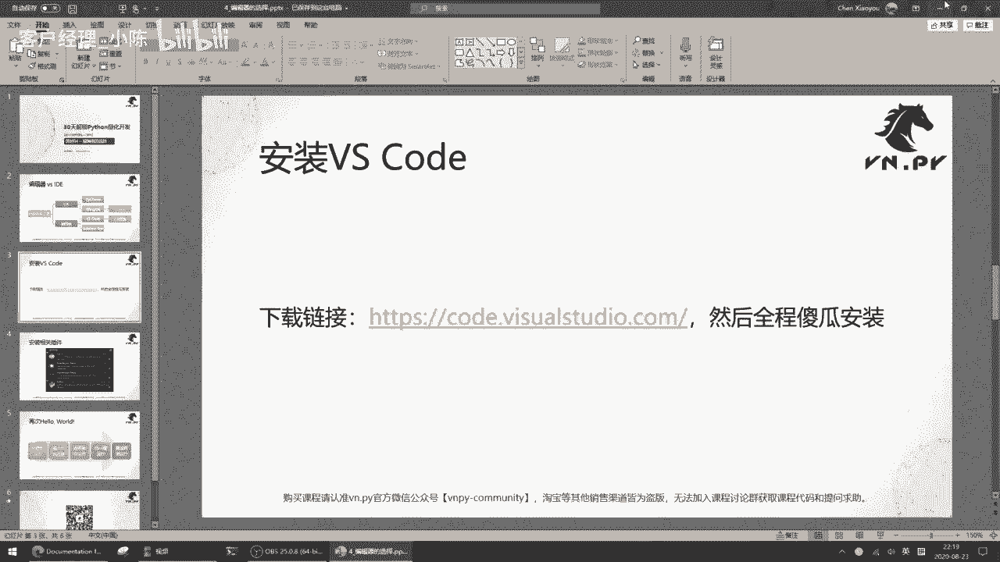
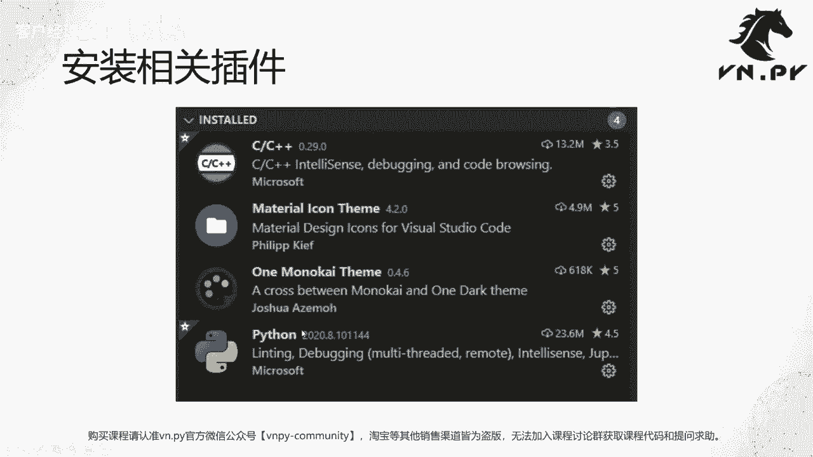
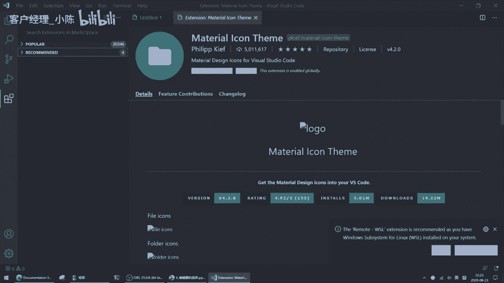
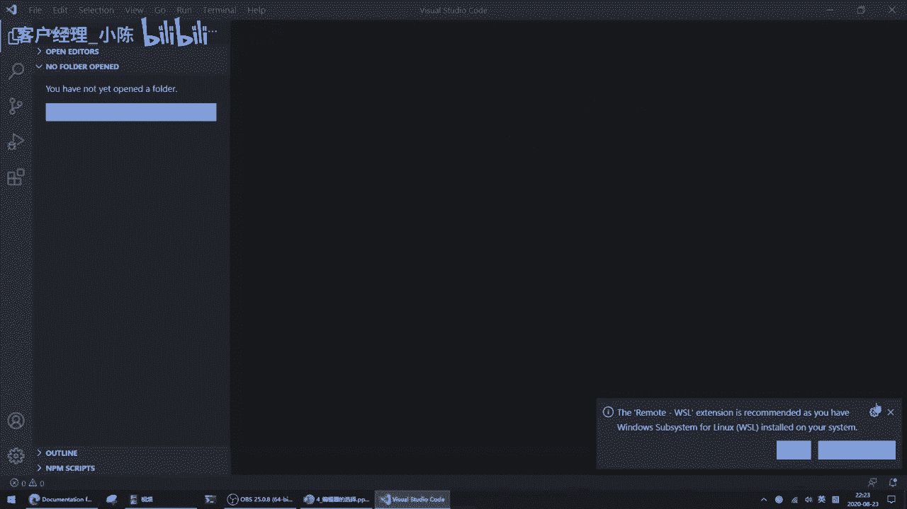
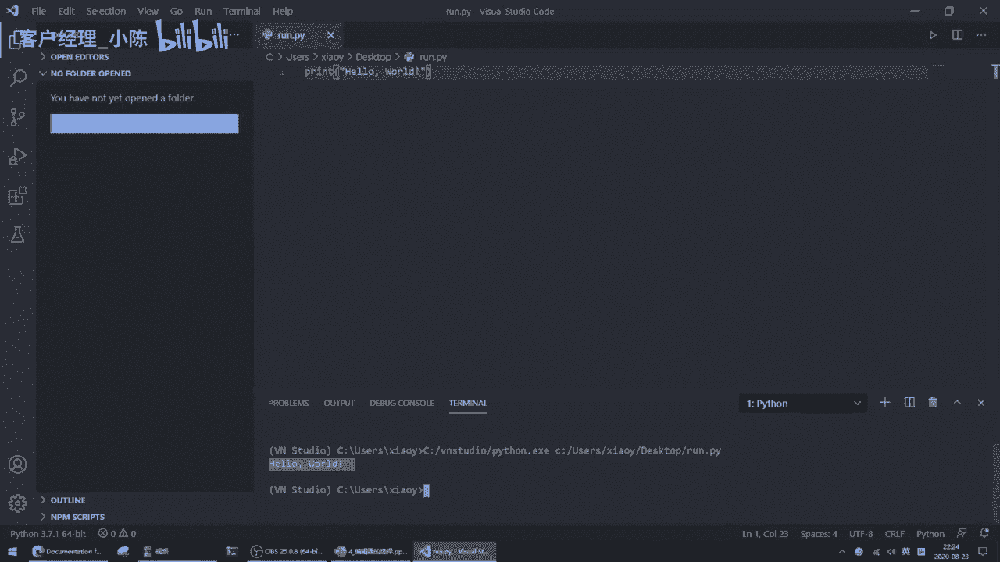
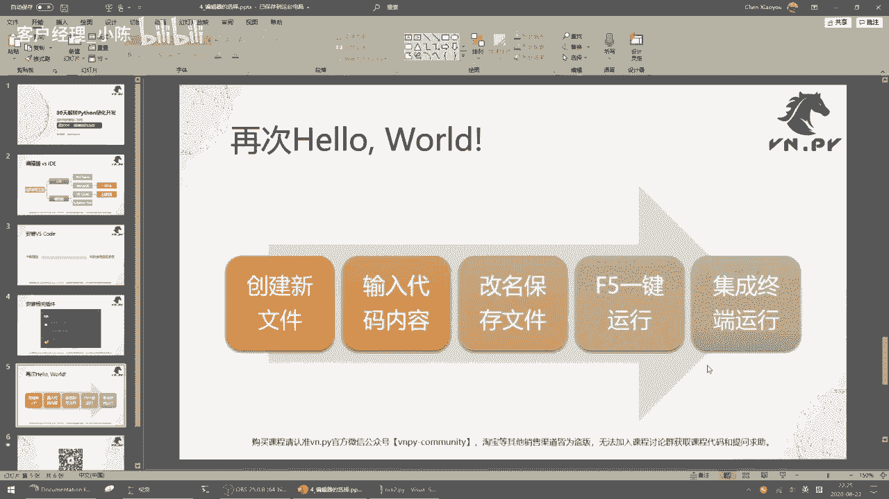
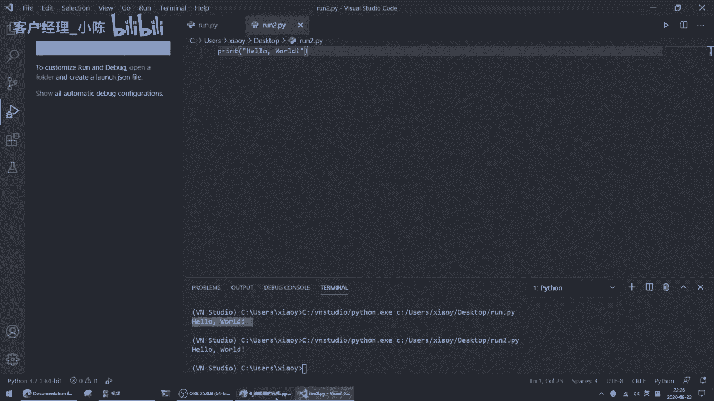

# VNPY 30天解锁Python期货量化开发：课时04：编辑器的选择 🛠️

在本节课中，我们将学习如何选择并配置一个合适的代码编辑器，这是编写Python程序的重要工具。我们将重点介绍轻量级的编辑器VS Code，并完成其安装与基本配置。

上一节我们完成了打印“Hello World”的第一步。本节中，我们来看看编写代码所需的工具——编辑器。

如果你搜索“Python用什么工具写好”，得到的信息主要分为两大派：编辑器和IDE。它们都是代码开发工具，但有所区别。IDE（Integrated Development Environment，集成开发环境）相对更重。在Python领域，知名的IDE有PyCharm和Wing IDE。Wing IDE也是VN.PY官方在编写1.0版本时使用的编辑器。

另一类工具是代码编辑器（Code Editor），或简称编辑器。编辑器相比IDE更加轻量级。轻量体现在启动快、安装文件小、需要学习的概念少。因此，从VN.PY 2.0开始，官方开发工具统一从Wing IDE转向了VS Code，主要原因是用起来更顺手。另一个有名的编辑器是Sublime Text，但它是收费软件，在此不多讨论。

在本课程中，同时也是对所有初学Python同学的建议是：不要使用PyCharm。PyCharm确实非常强大，可能是最强大的Python IDE，可以用于开发网站、大数据分析等应用。但它包含许多需要额外学习的知识，例如项目配置、环境变量设置等，这提高了初学者的学习成本。因此，我们建议初学者从最简单、最轻量级的工具开始，即使用VS Code。你只需要掌握最基本的内容，就能开始运行Python程序。未来有需要时再去学习PyCharm也会很快。在接下来的课程中，编写较长代码时，我们将统一使用VS Code。

接下来，我们来安装VS Code。

以下是安装步骤：
1.  访问VS Code官方网站。
2.  点击“Download for Windows”按钮。
3.  如果浏览器没有自动弹出下载框，请手动点击“Direct download link”链接进行下载。
4.  下载完成后，双击安装程序。
5.  同意许可协议。
6.  使用默认安装目录。
7.  勾选所有附加选项（例如创建桌面快捷方式、添加到PATH环境变量等）。
8.  点击“下一步”并完成安装。

安装完成后，启动VS Code，你将看到一个简洁的界面：中间是代码编辑区，左侧是功能按钮栏，顶部是菜单栏。

现在，我们需要安装一些插件来增强VS Code的功能，使其更适合Python开发。

以下是需要安装的四个核心插件：
1.  **Python**：提供Python语言支持，包括代码高亮、智能提示、调试等功能。
2.  **C/C++**：为后续可能涉及的C++扩展提供支持。
3.  **One Monokai Theme**：一个护眼的代码配色主题。
4.  **Material Icon Theme**：为文件资源管理器中的图标提供更美观的主题。

安装方法：点击左侧扩展图标（四个方块形状的按钮），在搜索框中分别输入上述插件名称，并点击“Install”进行安装。安装“One Monokai Theme”后，可以在设置中选择应用该主题；安装“Material Icon Theme”后，同样在设置中选择应用该图标主题。

插件安装完成后，我们来创建一个Python文件并运行它。

以下是创建并运行Python文件的步骤：
1.  按 `Ctrl+N` 新建一个文件。
2.  输入代码，例如：`print(“Hello World”)`。
3.  按 `Ctrl+S` 保存文件，并将其命名为以 `.py` 结尾的文件（例如 `run.py`）。保存后，VS Code会自动识别为Python文件并进行代码高亮。
4.  运行文件有两种方式：
    *   点击编辑器右上角的“Run Python File in Terminal”按钮。
    *   或按 `F5` 键，在弹出的选项中选择“Python File”。

运行后，结果会显示在编辑器底部的终端（Terminal）面板中。

这样，我们就拥有了一个方便、一体化、可以编写、运行和调试Python代码的轻量级开发环境，为后续编写更复杂的代码做好了准备。

本节课中，我们一起学习了代码编辑器与IDE的区别，选择VS Code作为初学工具的原因，并完成了VS Code的安装、插件配置以及创建运行Python文件的基本操作。准备好编辑器，是开启Python量化开发之旅的关键一步。