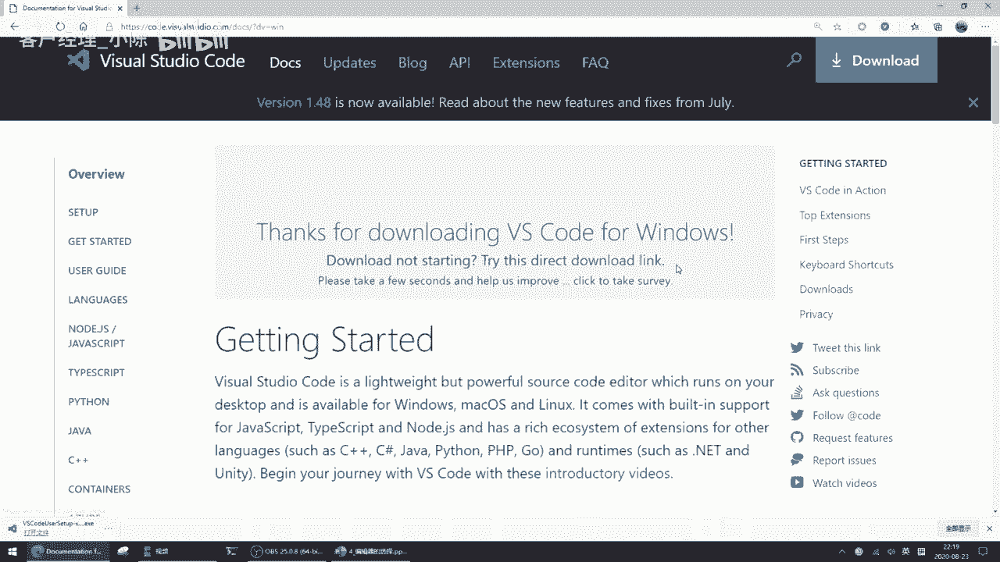
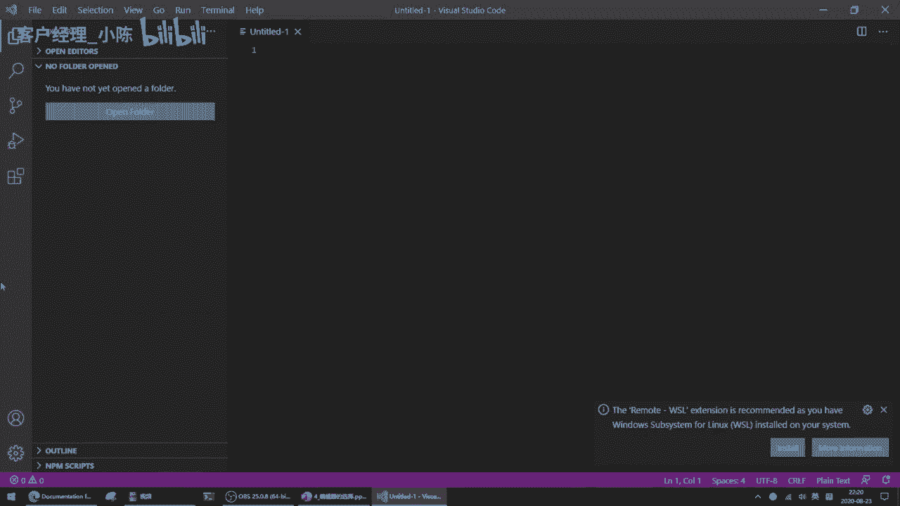
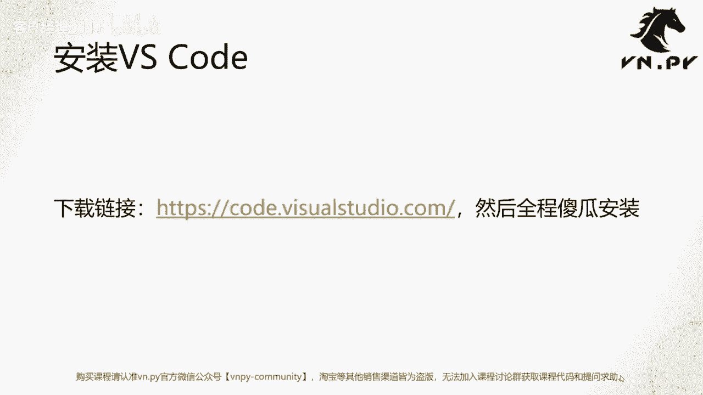
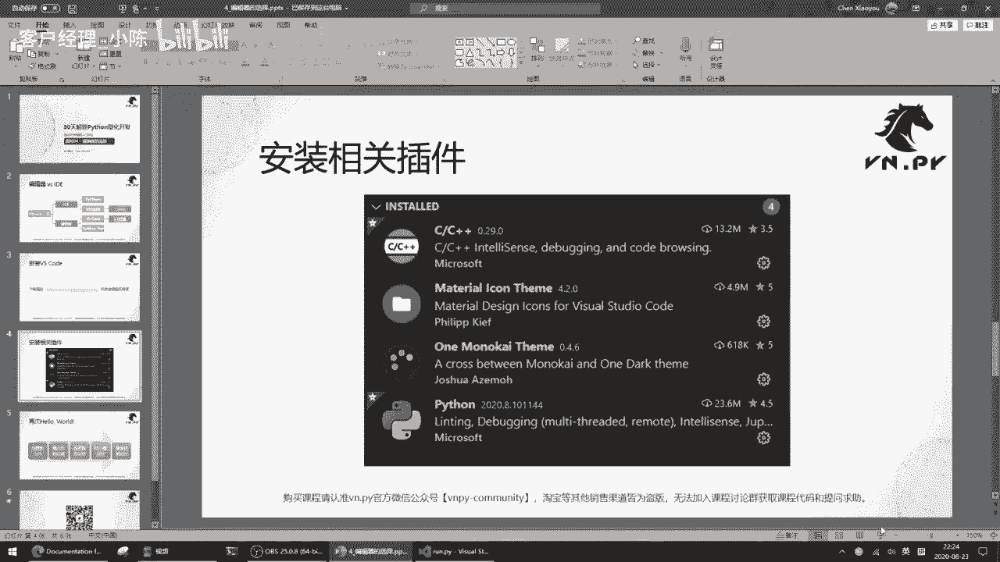
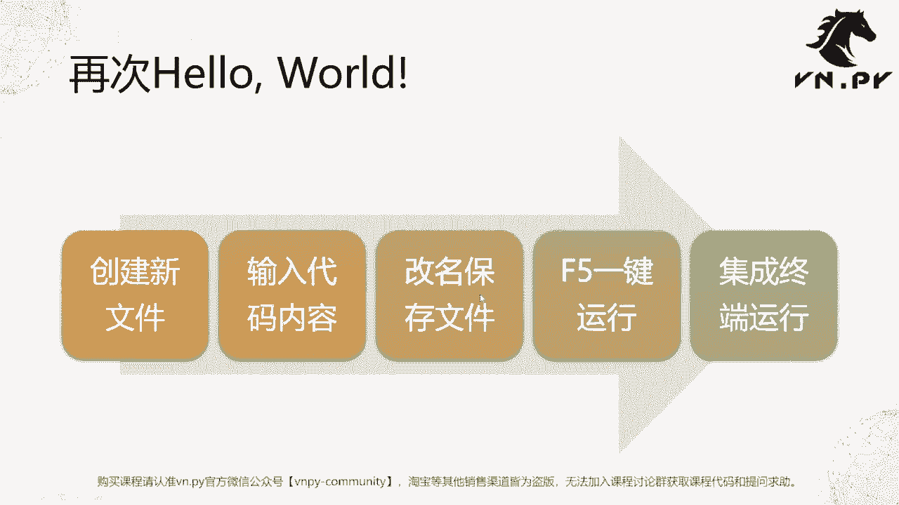
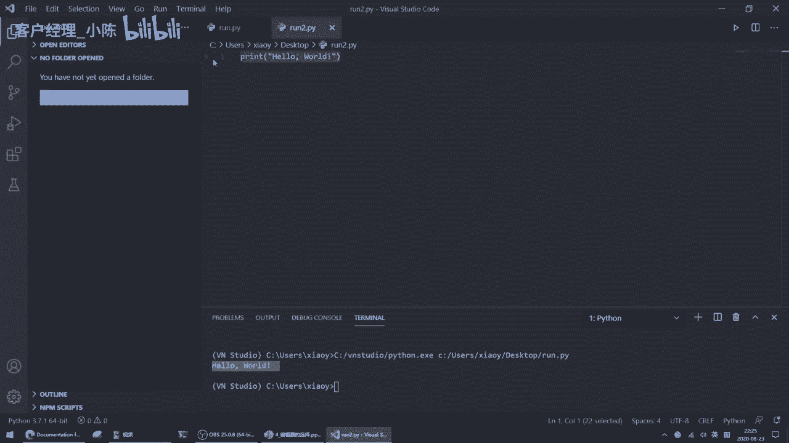
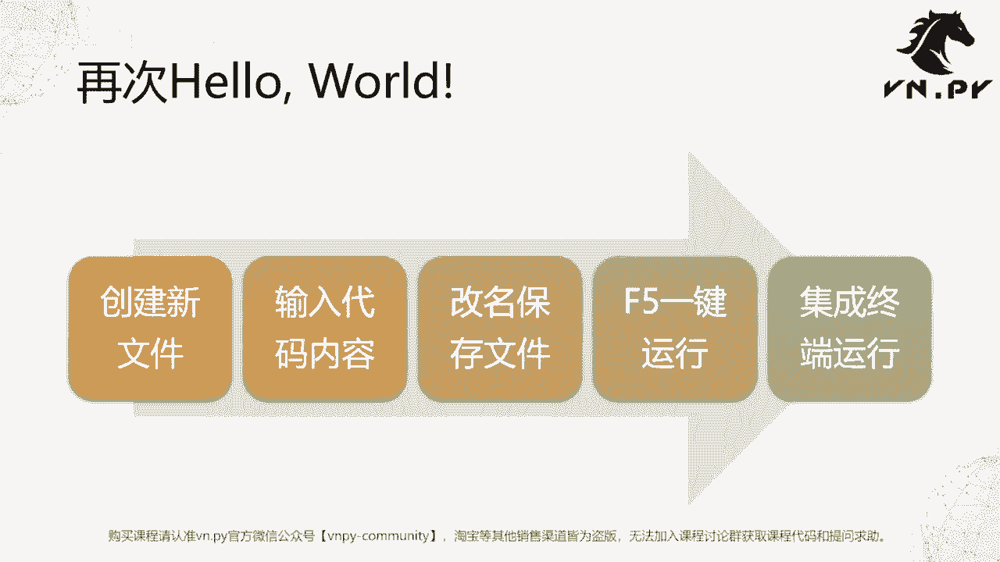

# VNPY30天解锁Python期货量化开发：课时04：编辑器的选择 🛠️

在本节课中，我们将学习如何选择和使用代码编辑器，这是编写Python程序的重要工具。我们将重点介绍轻量级的编辑器，并完成VS Code的安装与基本配置。

在上一节课中，我们完成了学习Python的第一步——打印“Hello World”。本节中，我们来看看编写代码所需的工具：代码编辑器。

如果你搜索“Python用什么工具写好”，得到的信息主要分为两大派：**编辑器**和**IDE**。它们都是代码开发工具，但有所区别。

**IDE** 是集成开发环境（Integrated Development Environment），功能全面但相对“重”。Python领域知名的IDE有PyCharm和Wing IDE（VN.PY 1.0版本曾使用）。

**编辑器** 则更加轻量级，体现在启动快、安装文件小、需要学习的概念少。从VN.PY 2.0开始，官方开发工具从Wing IDE转向了VS Code。另一个知名编辑器是Sublime Text（收费）。

在本课程中，我们建议所有Python初学者**不要使用PyCharm**。PyCharm虽然功能强大，但配置复杂，学习成本高，容易让初学者感到困惑。我们建议从最轻量级的VS Code开始，只需掌握基本操作就能运行Python程序。未来有需要时再学习PyCharm也会很快。




因此，在后续课程中编写较长代码时，我们将统一使用VS Code。

接下来，我们开始安装VS Code。



首先，访问VS Code官方网站进行下载。点击“Download for Windows”按钮，选择下载目录即可开始下载。如果浏览器没有弹出下载框，可能是启用了弹窗屏蔽功能，可以手动点击“Direct download link”链接进行下载。




下载完成后，双击安装程序。同意许可协议，使用默认安装目录，建议勾选所有附加选项（如创建桌面快捷方式、添加到PATH环境变量等），然后点击“安装”。VS Code体积较小（约200MB），安装速度很快。

安装完成后，运行VS Code，你会看到一个简洁的界面：中间是代码编辑区，左侧是活动栏（包含文件管理、搜索、插件等按钮），顶部是菜单栏。

VS Code本身非常轻量，但为了获得更好的代码编写体验（如语法高亮、自动提示），我们需要安装一些扩展插件。

以下是需要安装的四个核心插件列表：


1.  **Python**：提供Python语言支持，包括代码高亮、智能提示、调试等功能。
2.  **C/C++**：提供C/C++语言支持，未来某些底层库或扩展可能需要。
3.  **One Monokai Theme**：一个护眼的代码配色主题，让长时间编码更舒适。
4.  **Material Icon Theme**：为文件资源管理器中的图标提供更美观的主题。

安装方法：点击左侧活动栏的扩展图标（四个方块形状），在搜索框中输入插件名称，找到后点击“Install”按钮即可。安装“One Monokai Theme”后，可以在设置中选择应用该主题；安装“Material Icon Theme”后，可以选择将其设置为图标主题。

插件安装完成后，我们来体验一下编写和运行代码的基本流程。




首先，创建一个新文件。你可以通过菜单栏的“File” -> “New File”，或使用快捷键 `Ctrl + N`。



然后，在新文件中输入代码，例如：
```python
print("Hello World")
```
接着，保存文件。使用快捷键 `Ctrl + S`，将文件保存到指定位置（如桌面），并命名为 `run.py`。**注意**：保存时指定 `.py` 后缀非常重要，这能帮助VS Code识别文件类型并启用相应的语法高亮和功能。

最后，运行代码。你有两种方式：
1.  点击编辑器右上角的“Run Python File in Terminal”按钮。
2.  按下键盘上的 `F5` 键，在弹出的选项中选择“Python File”。




运行后，结果会显示在编辑器底部打开的终端（Terminal）面板中。


这样，我们就拥有了一个方便、快捷的Python轻量级开发环境，可以用于编写和运行后续更复杂的代码。



本节课中，我们一起学习了代码编辑器与IDE的区别，明确了初学者从轻量级编辑器（VS Code）入手的重要性。我们完成了VS Code的下载、安装、核心插件配置，并掌握了创建、保存和运行Python文件的基本流程。现在，我们的开发环境已经准备就绪。