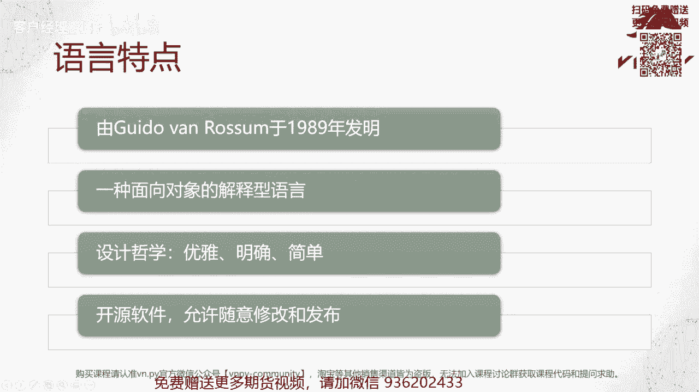
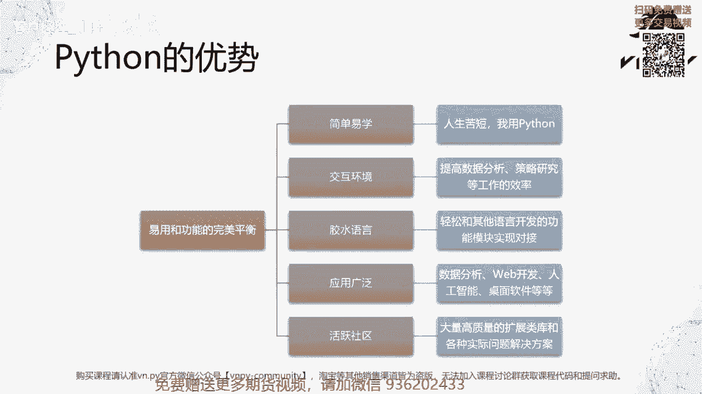
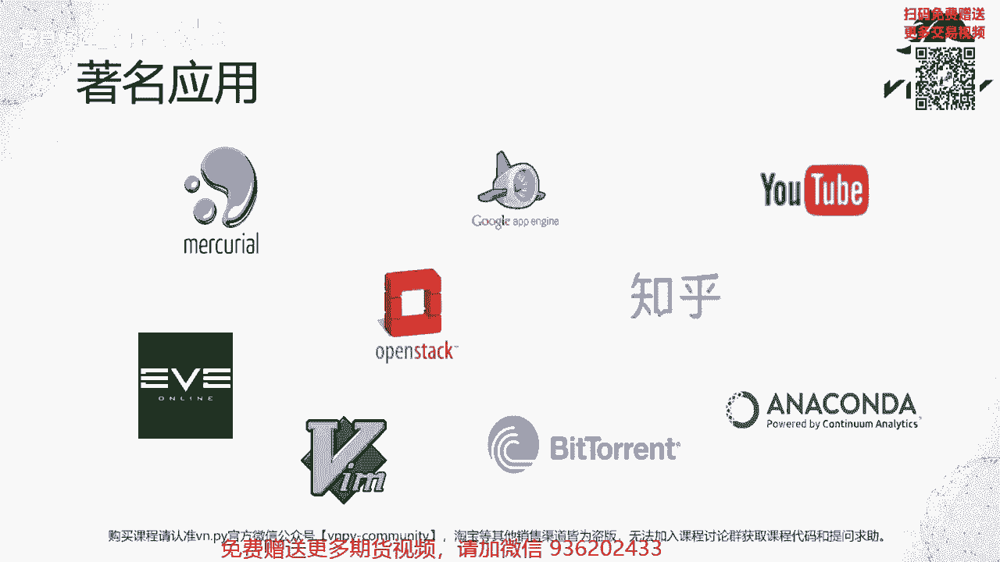
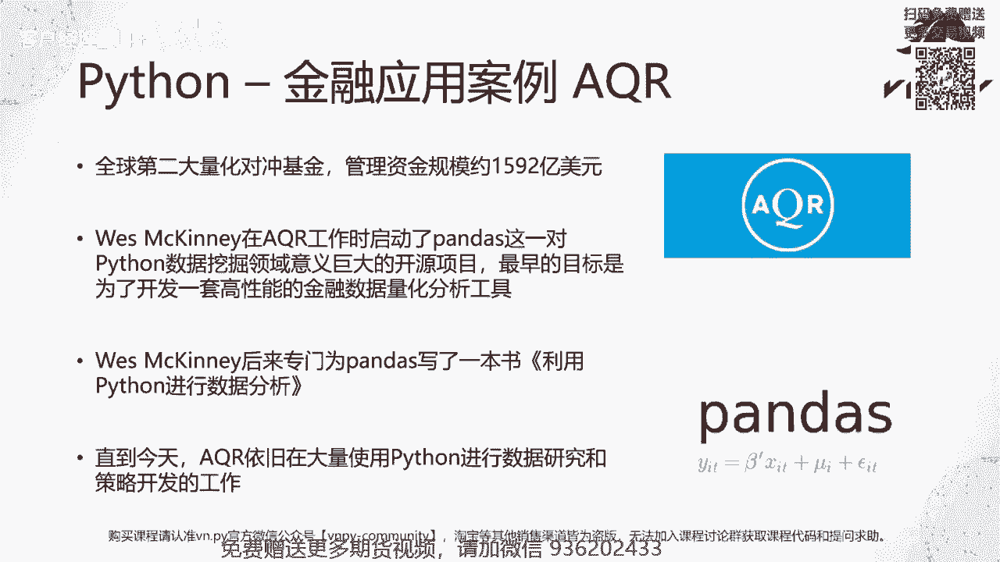
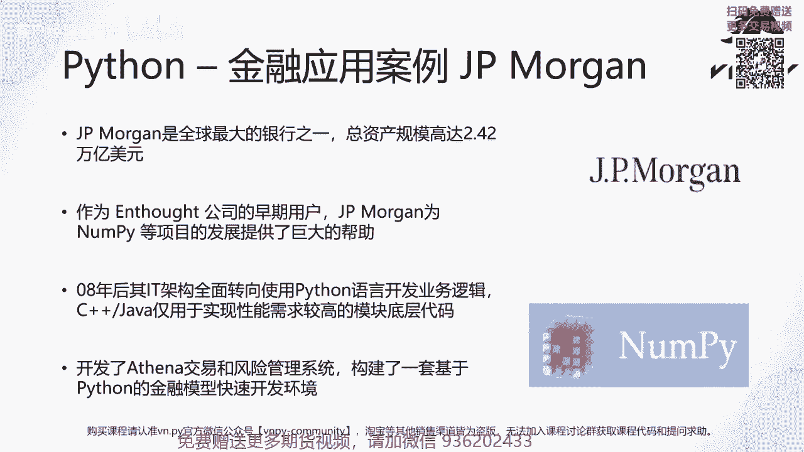

# VNPY30天解锁Python期货量化开发：课时01：认识Python语言 🐍

在本节课中，我们将要学习Python编程语言的基本概念、核心特点及其在金融量化领域的应用。无论你是否有编程经验，通过本课的学习，你将对Python有一个清晰的认识。

## Python语言概述

编程语言是人与计算机沟通的工具。常见的编程语言包括C++、Java和MATLAB等。Python是众多编程语言中的一种，由荷兰程序员Guido van Rossum于1989年发明，至今已有超过30年的历史。

## Python的核心特点

Python具有四个主要特点，使其在众多编程语言中脱颖而出。

1.  **历史与起源**：Python由Guido van Rossum发明，是一门成熟且持续发展的语言。
2.  **技术特性**：Python是一门**面向对象**的**解释型**语言。
    *   **面向对象 (Object-Oriented)**：这是一种编程范式，将数据和处理数据的方法封装成“对象”。
    *   **解释型语言 (Interpreting Language)**：代码无需预先编译成机器码，而是由解释器逐行读取并执行。
3.  **设计哲学**：Python的设计哲学强调代码的**优雅、明确、简单**。其设计更侧重于提升程序员的开发效率和体验，而非单纯追求极致的运行速度。
4.  **开源特性**：Python是开源软件，其源代码公开，允许用户自由查看、修改和分发。这与MATLAB等闭源软件形成对比。

## Python在量化交易中的优势

对于量化交易、数据分析等领域，Python的核心优势在于实现了**易用性与强大功能之间的完美平衡**。具体体现在以下五个方面：

以下是Python的五大核心优势：

1.  **简单易学**：Python语法接近自然英语，学习曲线平缓。社区有句名言：“人生苦短，我用Python (Life is short, use Python)”。全职学习约3天即可上手，业余学习2-3周也能掌握基础。
2.  **交互式环境**：Python支持交互式编程环境，允许用户输入一行代码立即看到结果，非常适合数据分析与策略的快速原型验证。
3.  **胶水语言**：Python能轻松集成其他语言（如C++）编写的模块。例如，VN.PY量化框架就是用Python编写策略逻辑，并调用底层C++交易接口，从而结合了开发效率与执行性能。
4.  **应用广泛**：Python的应用领域极其广泛，包括Web开发、桌面应用、数据分析、人工智能、机器学习等。无论是开发简单的工具还是复杂的金融交易系统，Python都能胜任。
5.  **活跃社区**：Python拥有全球最活跃的开发者社区之一。这意味着遇到问题时，可以轻松找到大量高质量的扩展库和现成的解决方案，极大提升了开发效率。

## Python的知名应用案例

Python的成功应用遍布各个领域，以下是一些著名案例：

以下是部分知名Python应用：

*   **Mercurial**：与Git齐名的分布式版本控制系统。
*   **Google App Engine**：谷歌云应用引擎的首选开发语言之一。
*   **YouTube**：全球最大的视频分享网站，其核心系统由Python构建。
*   **EVE Online**：一款支持数万玩家同时在线的MMO游戏，其服务器端使用Python开发。
*   **OpenStack**：由NASA发起并开源的大型云计算管理平台项目。
*   **知乎**：中国知名的问答社区，其主要开发语言是Python。
*   **Vim**：经典文本编辑器，其插件系统支持Python开发。
*   **BitTorrent**：著名的BT协议，其首个图形客户端由Python编写。
*   **Anaconda**：数据科学领域最流行的Python发行版，集成了大量科学计算库。

## Python在金融行业的应用

上一节我们看到了Python在各行各业的广泛应用，本节中我们来看看它在金融量化领域的两个具体案例。

### 案例一：买方机构 - AQR资本管理

AQR是全球第二大量化对冲基金，管理资产规模超千亿美元。该公司的前员工Wes McKinney在任职期间，为处理金融数据分析的痛点，开发了**Pandas**库。

**Pandas**已成为Python数据科学领域的基石库，广泛应用于数据分析、人工智能和机器学习。Wes McKinney撰写的《利用Python进行数据分析》是入门经典。至今，AQR仍大量使用Python进行数据研究与策略开发。

### 案例二：卖方机构 - 摩根大通

摩根大通是全球最大的银行之一。2008年次贷危机后，华尔街投行开始大规模采用Python重构其IT架构。高盛因其内部开发的、类似Python的“面向对象解释型语言”SECDB，得以快速对衍生品进行定价和风险分析，从而在危机中减少了损失。

这一成功案例促使包括摩根大通在内的多家投行转向Python。Python的易学性使得不仅是IT和量化部门，连前台的交易员和销售也能编写小程序来辅助业务。摩根大通基于此开发了名为“雅典娜”的交易与风险管理系统，构建了高效的Python金融模型开发环境。

## 总结

本节课中我们一起学习了Python编程语言。我们了解了它的历史、面向对象和解释型的技术特点，以及优雅明确的设计哲学。更重要的是，我们探讨了Python在易用性、交互性、扩展性、应用广泛性和社区活跃度方面的五大优势，并通过多个行业案例，特别是金融量化领域在AQR和摩根大通的应用，看到了Python的强大实用价值。Python是进入量化交易领域的一把利器。