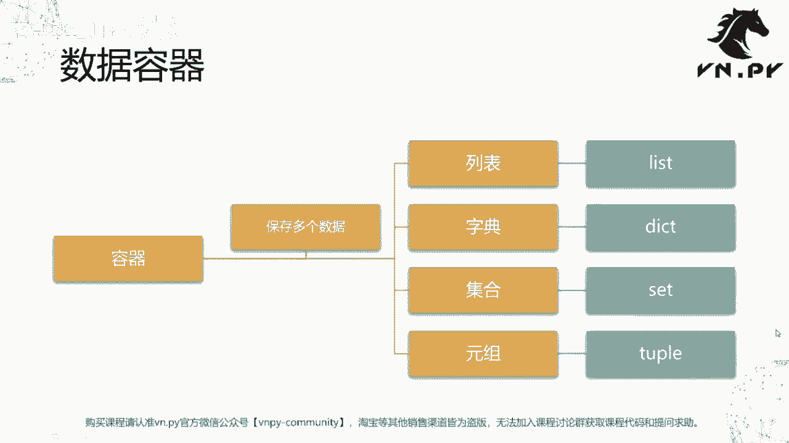
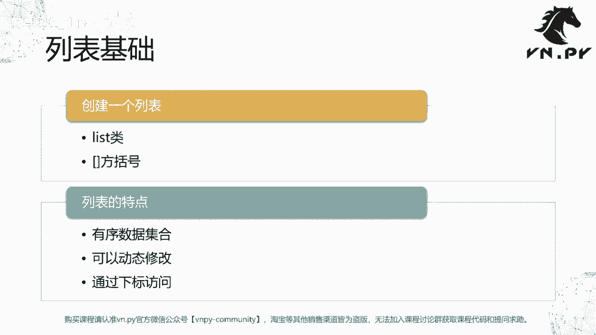
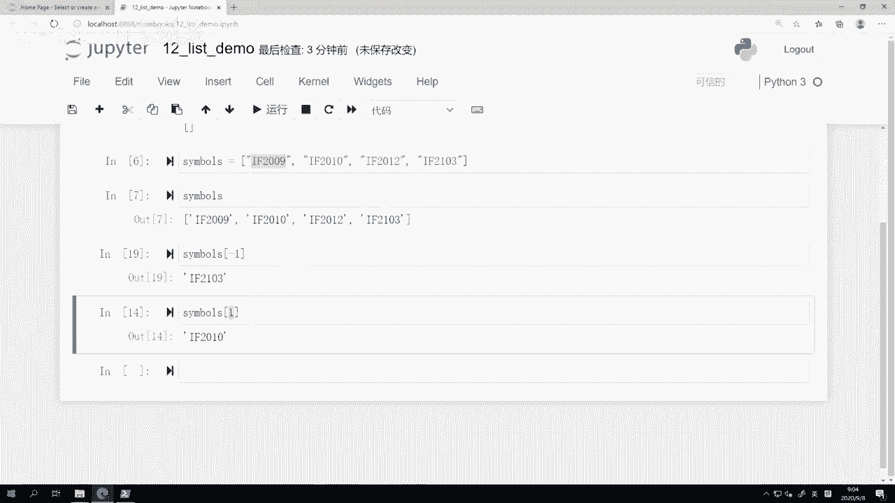
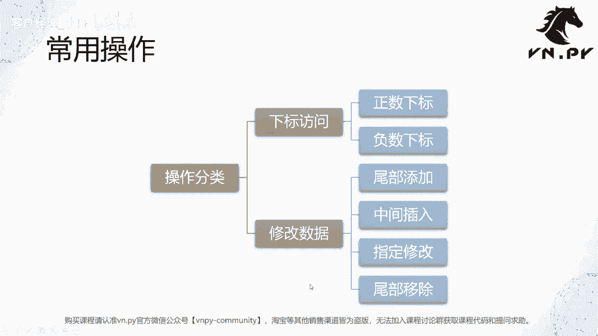
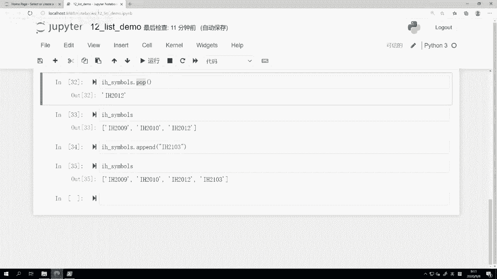
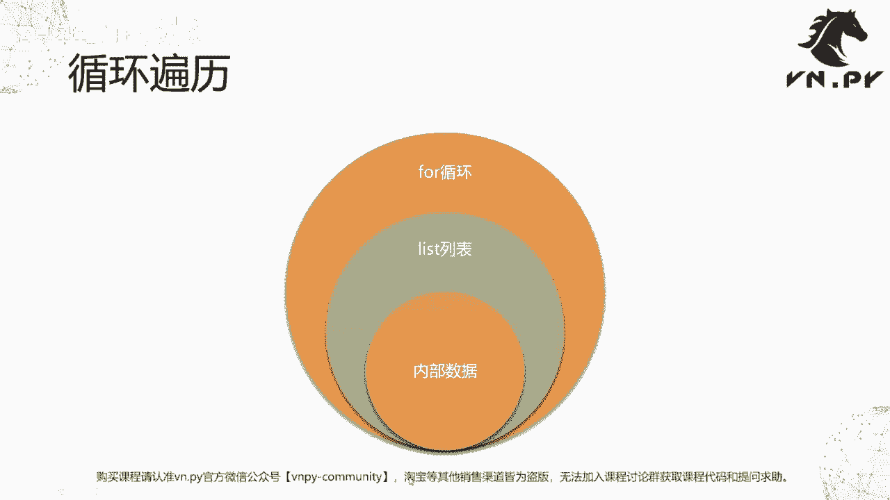
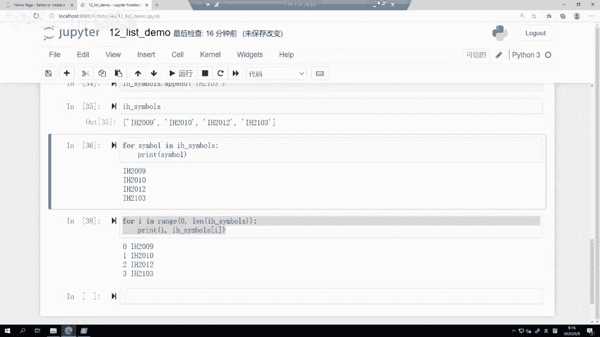

# VNPY30天解锁Python期货量化开发：课时12：顺序列表 📚

在本节课中，我们将要学习Python中一个非常重要的概念——数据容器。我们将从最基础、最常用的列表开始，了解它的创建、访问、修改以及如何遍历其中的数据。

在上一节课里，我们学习了字符串的一些深入操作。本节中，我们来看看Python中用于组织和管理多个数据的数据容器。

数据容器，英文通常称为`data structure`（数据结构）或`data container`。我们之前学过的`int`、`string`、`float`、`bool`等基础数据类型，都只能表示单一数据。但在实际编程中，数据之间往往存在关联。例如，一组合约的最新价格，或一个合约的五档盘口数据，这些数据之间是有关联的。为了在代码中表示这种关系，编程语言引入了数据容器的概念。它的主要作用是保存多个数据，并且这些数据之间通常存在某种联系。



Python中主要提供了四种基础的数据容器：
*   **列表**：英文为`list`。
*   **字典**：英文为`dict`（全称`dictionary`）。
*   **集合**：英文为`set`，是一个数学上的概念。
*   **元组**：英文为`tuple`。

本节课，我们先来学习其中最基础的**列表**。



## 创建列表 🆕

创建一个列表主要有两种方法：
1.  使用`list()`类。
2.  使用方括号`[]`。

列表主要有三个特点：
1.  它是一个**有序**的数据集合。
2.  它可以**动态修改**（随时增加或删除数据）。
3.  可以通过**下标**来访问其中的元素。

下面，我们通过代码来实践一下。

```python
# 方法一：使用list()类创建一个空列表
symbols_list = list()
print(symbols_list)  # 输出: []

# 方法二：使用方括号[]创建一个空列表
symbols_bracket = []
print(symbols_bracket)  # 输出: []

# 创建一个包含初始数据的列表
# 列表元素之间用逗号分隔，建议逗号后跟一个空格，使代码更清晰
symbols = ['IF2009', 'IF2010', 'IF2012', 'IF2103']
print(symbols)  # 输出: ['IF2009', 'IF2010', 'IF2012', 'IF2103']
```

## 访问列表元素 🔍

与字符串类似，列表可以通过下标（索引）来访问特定位置的元素。下标从`0`开始。

```python
symbols = ['IF2009', 'IF2010', 'IF2012', 'IF2103']



# 使用正数下标访问（从前往后数，从0开始）
print(symbols[0])  # 输出: IF2009
print(symbols[1])  # 输出: IF2010
print(symbols[3])  # 输出: IF2103
# print(symbols[4])  # 会报错：IndexError: list index out of range

# 使用负数下标访问（从后往前数，从-1开始）
print(symbols[-1])  # 输出: IF2103 (最后一个元素)
print(symbols[-2])  # 输出: IF2012 (倒数第二个元素)
print(symbols[-4])  # 输出: IF2009 (第一个元素)
# print(symbols[-5])  # 会报错：IndexError: list index out of range
```

## 修改列表数据 ✏️



列表是动态的，允许我们添加、插入、修改或删除元素。以下是四种常用操作。

```python
# 初始化一个空列表
h_symbols = []
print(h_symbols)  # 输出: []

# 1. 尾部添加元素：使用 append() 方法
h_symbols.append('IH2009')
print(h_symbols)  # 输出: ['IH2009']

h_symbols.append('IH2012')
print(h_symbols)  # 输出: ['IH2009', 'IH2012']

# 2. 中间插入元素：使用 insert(位置下标, 值) 方法
# 在索引为1的位置（即'IH2012'之前）插入'IH2010'
h_symbols.insert(1, 'IH2010')
print(h_symbols)  # 输出: ['IH2009', 'IH2010', 'IH2012']

# 3. 修改指定位置的元素：直接通过下标赋值
# 将索引为2的元素（当前是'IH2012'）修改为正确的'IH2012'
h_symbols[2] = 'IH2012' # 这里仅为演示，值本身没变
print(h_symbols)  # 输出: ['IH2009', 'IH2010', 'IH2012']

# 假设我们错误地多添加了一个元素，现在要删除它
h_symbols.append('IH2103')
print(h_symbols)  # 输出: ['IH2009', 'IH2010', 'IH2012', 'IH2103']

# 4. 尾部移除元素：使用 pop() 方法，它会返回被移除的值
removed_item = h_symbols.pop()
print(f"被移除的元素是: {removed_item}")  # 输出: 被移除的元素是: IH2103
print(h_symbols)  # 输出: ['IH2009', 'IH2010', 'IH2012']

# 现在我们再正确地添加'IH2103'
h_symbols.append('IH2103')
print(h_symbols)  # 输出: ['IH2009', 'IH2010', 'IH2012', 'IH2103']
```

## 遍历列表 🔄



我们经常需要对列表中的每一个元素执行相同的操作，这时就需要遍历列表。Python的`for`循环让这变得非常简单。

以下是遍历列表的两种方法：



```python
h_symbols = ['IH2009', 'IH2010', 'IH2012', 'IH2103']

# 方法一：直接遍历列表元素（推荐，更简洁直观）
print("直接遍历元素:")
for symbol in h_symbols:
    print(symbol)
# 输出:
# IH2009
# IH2010
# IH2012
# IH2103

# 方法二：通过下标遍历（类似其他编程语言的风格）
print("\n通过下标遍历:")
for i in range(len(h_symbols)): # len()函数用于获取列表长度
    print(f"下标 {i} 对应的合约是: {h_symbols[i]}")
# 输出:
# 下标 0 对应的合约是: IH2009
# 下标 1 对应的合约是: IH2010
# 下标 2 对应的合约是: IH2012
# 下标 3 对应的合约是: IH2103
```

显然，第一种`for symbol in list`的写法更加简洁和“Pythonic”，是我们推荐的方式。

## 总结 📝

本节课中我们一起学习了Python数据容器的基础——**列表**。



我们掌握了：
1.  **创建列表**的两种方式：`list()`和`[]`。
2.  列表的核心特性：**有序**、**可动态修改**、支持**下标访问**。
3.  如何使用**正数下标**和**负数下标**访问列表元素。
4.  对列表进行**动态修改**的四种常用操作：`append()`尾部添加、`insert()`中间插入、直接赋值修改、`pop()`尾部移除。
5.  如何优雅地使用`for`循环**遍历列表**中的每一个元素。

列表的原理非常简单，但它是构建更复杂程序的基础。在后续课程中，我们将结合vn.py的实际代码案例，看到列表在量化交易开发中的更多实用场景。