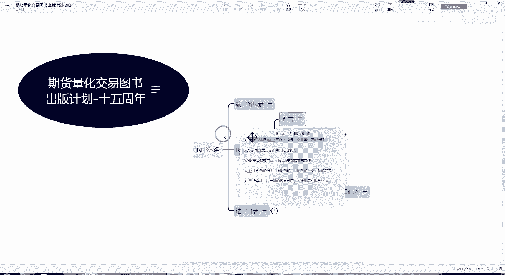
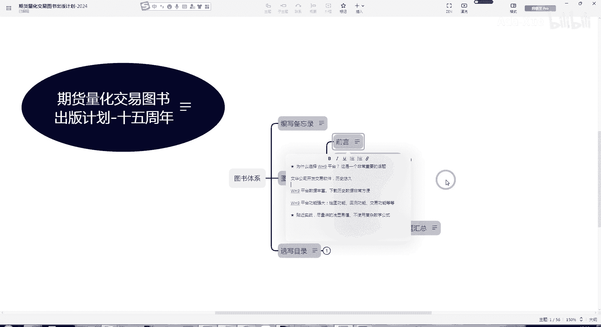

# 量化交易入门：P1：WH9与Python对比

在本节课中，我们将要学习WH9量化交易平台与通用Python编程语言在开发交易模型时的核心差异。我们将重点探讨WH9平台为交易者提供的便利性，以及为何在某些场景下，使用专用平台比通用编程语言更高效。

## 通用语言的复杂性

上一节我们提到了学习量化交易的不同路径。本节中我们来看看使用通用编程语言（如Python）开发交易模型的特点。

目前，市面上大多数量化交易相关的书籍和资料普遍采用Python作为教学和实现工具。Python作为一种通用编程语言，功能强大且灵活，这本身是一个巨大的优势。

然而，对于交易模型开发这一特定领域，使用Python也存在一些挑战。主要问题在于其相对复杂性。开发者需要从零开始构建或集成许多与交易相关的基础功能，例如行情数据获取、订单管理、回测引擎和风险控制模块。这个过程通常比较繁琐，需要投入大量时间在基础设施的搭建上，而非核心交易逻辑的研发。

## 专用平台的高效性

既然使用通用语言存在复杂度问题，那么是否有更高效的替代方案呢？本节我们将介绍利用成熟专用平台的优势。

如果我们能够使用一个比较成熟的、专为交易设计的平台，开发效率会显著提高。WH9正是这样一个平台。

WH9平台从设计之初就专注于交易领域。这意味着它的架构、功能和API都是围绕金融交易的需求而构建的。因此，平台内部已经预先准备好了许多基础且关键的交易功能。

以下是WH9平台内置的一些核心功能示例：
*   **行情数据接口**：无缝接入实时与历史市场数据。
*   **订单管理系统**：简化下单、撤单、查询持仓等操作。
*   **回测框架**：提供完整的策略历史模拟环境，支持绩效分析。
*   **风险控制模块**：内置常用的风控规则和指标。

这些预制组件使得开发者无需重复造轮子，可以直接将精力集中于策略逻辑的构思与实现上，从而大大降低了入门门槛并提升了开发速度。

## 总结

本节课中我们一起学习了WH9平台与Python在量化交易模型开发中的主要区别。我们了解到，虽然Python作为通用语言非常强大，但在交易领域直接使用会面临较高的复杂性和开发成本。相比之下，WH9作为专为交易设计的平台，集成了大量基础交易功能，能够帮助交易者更快速、更高效地构建和测试策略，特别适合初学者和希望提升研发效率的开发者。在后续课程中，我们将进一步探索如何在WH9平台上具体实现交易想法。