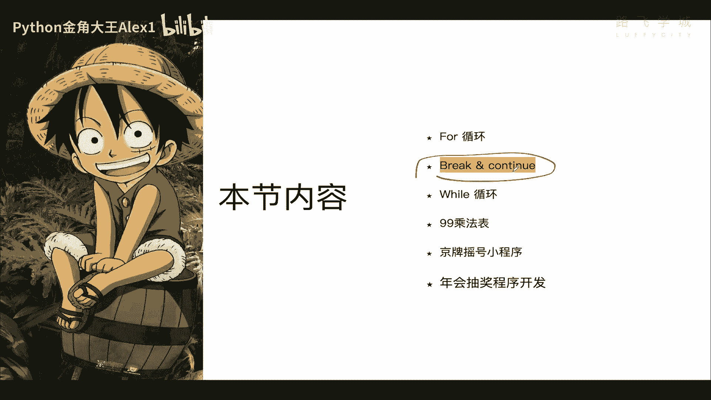
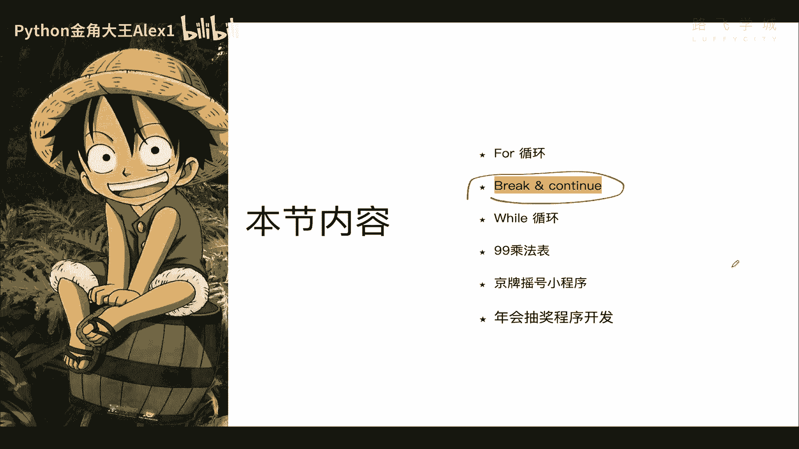
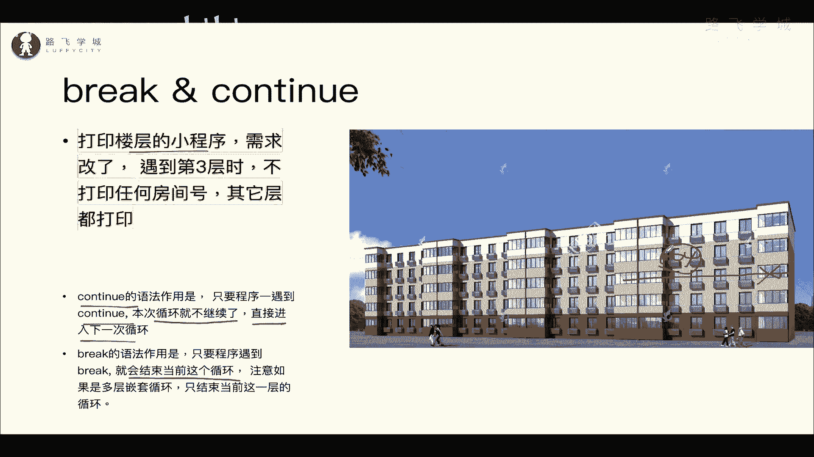
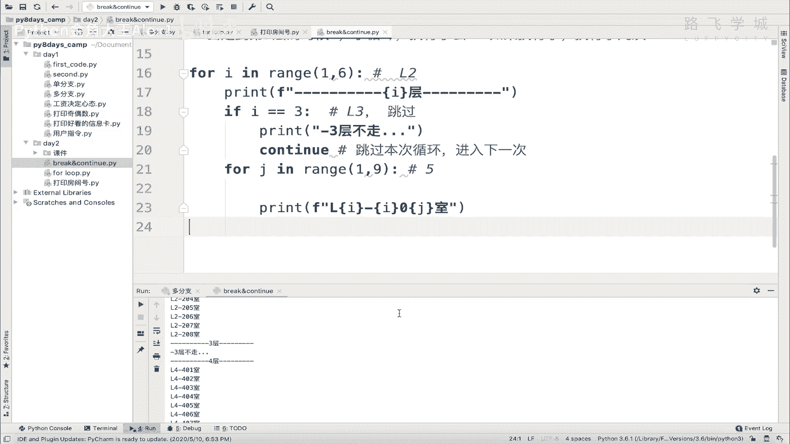
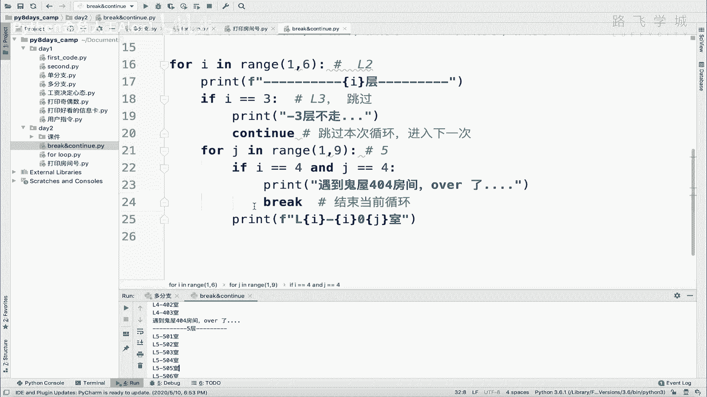
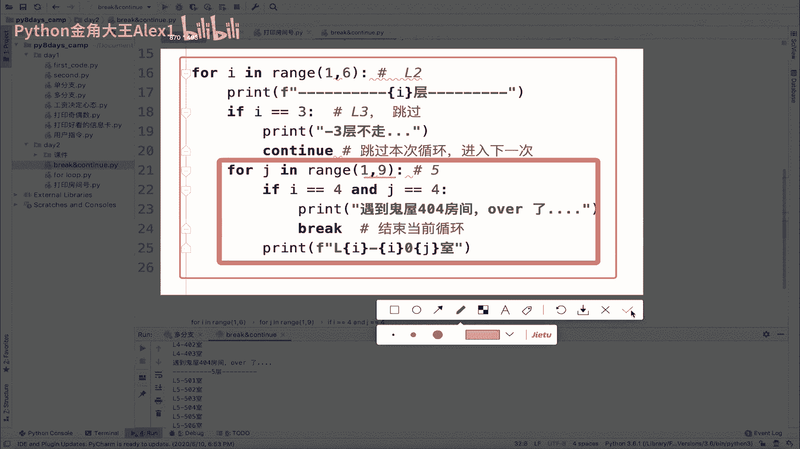
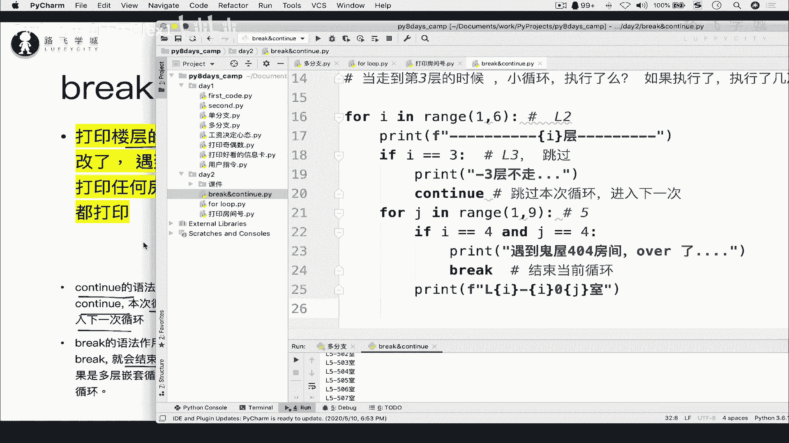
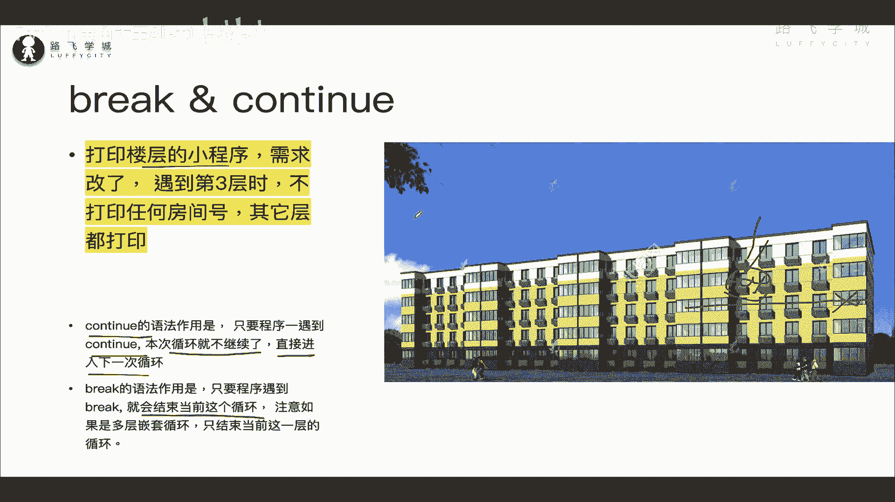
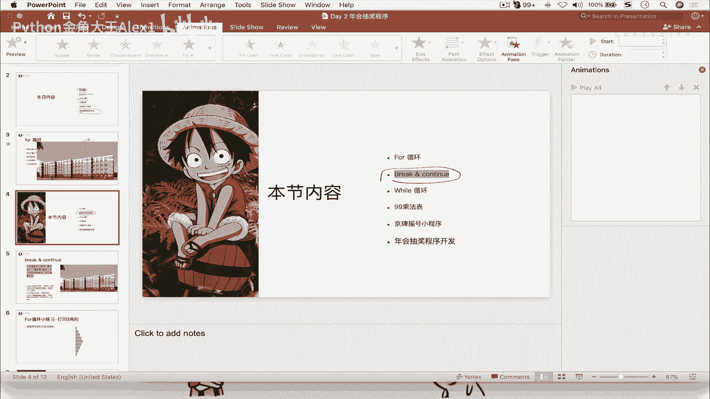

# Python数据分析实战：P22：03：break与continue逃出鬼屋 🏚️



在本节课中，我们将学习Python循环控制中的两个重要关键字：`break`和`continue`。它们专门用于在循环内部改变程序的执行流程，帮助我们处理一些特殊的逻辑需求。

## 概述

`break`和`continue`是只能在循环（如`for`循环或`while`循环）内部使用的关键字。它们的作用是控制循环的执行过程，但两者有本质区别。我们将通过一个“打印楼层房间号”的示例程序，来具体理解它们的功能和应用场景。


## break与continue的作用



上一节我们介绍了循环的基本结构，本节中我们来看看如何更精细地控制循环。



*   **`continue`**：意为“继续”。当程序在循环中遇到`continue`时，会**立即跳过本次循环中剩余的代码**，直接进入下一次循环。
*   **`break`**：意为“中断”。当程序在循环中遇到`break`时，会**立即终止整个当前所在的循环**，跳出循环体。

为了更直观地理解，我们引入一个具体的需求场景。

## 需求场景：打印楼层与房间号

假设我们有一个程序，用于打印一栋5层楼、每层8个房间的号码。其核心代码如下：

```python
for i in range(1, 6):  # i代表楼层，1到5层
    print(f"------第{i}层------")
    for j in range(1, 9):  # j代表房间号，1到8号
        print(f"L{i}{j:02d}", end=' ')  # 格式化输出，如L101
    print()  # 每层打印完换行
```

现在，我们有两个新的需求需要实现。

### 需求一：使用continue跳过第三层

新需求：大楼的第三层正在装修，不允许进入。因此，当程序运行到第三层时，不打印任何房间号，但其他楼层正常打印。

以下是实现此需求的关键步骤：

1.  在循环内部判断当前是否为第三层（`i == 3`）。
2.  如果是第三层，则使用`continue`跳过该次外层循环，直接开始第四层的循环。

```python
for i in range(1, 6):
    if i == 3:  # 判断是否为第三层
        print(f"------第{i}层（装修中，跳过）------")
        continue  # 跳过本次循环（第三层），直接进入下一次循环（第四层）
    print(f"------第{i}层------")
    for j in range(1, 9):
        print(f"L{i}{j:02d}", end=' ')
    print()
```

**代码解析**：当`i`等于3时，程序执行`continue`，它跳过了`continue`之后所有属于本次外层循环的代码（即打印房间号的内部循环），直接让`i`变为4，开始下一次外层循环。这样就从逻辑和效率上完全跳过了第三层。



### 需求二：使用break在404房间终止当前楼层循环

新需求：第四层的404号房间是一个“鬼屋”，程序一旦访问到它就会“终止”。这意味着，在第四层，打印到404房间后，该层剩余的房間不再打印，但程序应继续正常打印第五层。


以下是实现此需求的关键步骤：

1.  在内部循环中，判断是否同时满足“第四层”（`i == 4`）和“404房间”（`j == 4`）。
2.  如果条件满足，先打印提示信息，然后使用`break`终止当前的内层循环。

```python
for i in range(1, 6):
    print(f"------第{i}层------")
    for j in range(1, 9):
        # 判断是否到达第四层的404房间
        if i == 4 and j == 4:
            print(f"\n遇到鬼屋 L{i}{j:02d}，本层探索终止！")
            break  # 终止当前的内层循环（第四层的房间循环）
        print(f"L{i}{j:02d}", end=' ')
    print()  # 注意：这个print()属于外层循环，break后依然会执行
```

**代码解析**：当在第四层（`i==4`）遇到404房间（`j==4`）时，`break`被执行。它**立即结束了当前所在的`for j in range(1, 9)`这个内层循环**。由于`break`只影响它所在的那一层循环，外层`for i in range(1, 6)`的循环不受影响，因此程序会继续执行第五层的打印。



## 核心概念对比与总结

本节课中我们一起学习了`break`和`continue`的用法。以下是它们的核心区别总结：



*   **作用对象**：`break`结束**整个**当前循环；`continue`跳过**本次**当前循环的剩余部分，进入下一次循环。
*   **在嵌套循环中的表现**：在多层嵌套循环中，`break`和`continue`只对**它们所在的那一层循环**起作用。例如，内层循环的`break`不会影响外层循环的执行。
*   **常用场景**：
    *   使用`continue`过滤掉循环中不需要处理的特定项。
    *   使用`break`在满足某个条件（如找到目标、发生错误）时提前退出循环。







请务必亲自动手练习并理解示例代码，这是掌握这两个控制流关键字的最佳方式。