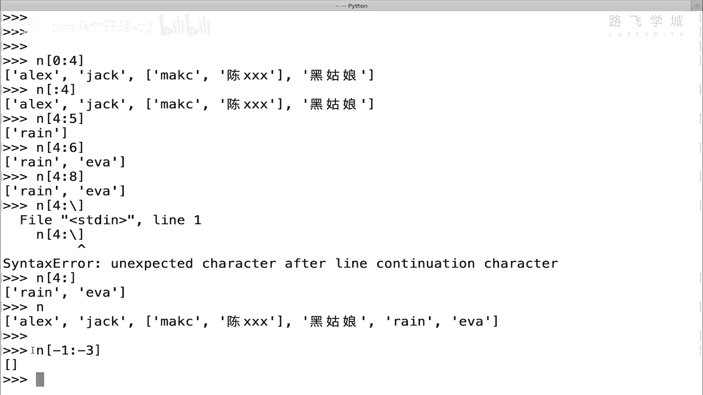
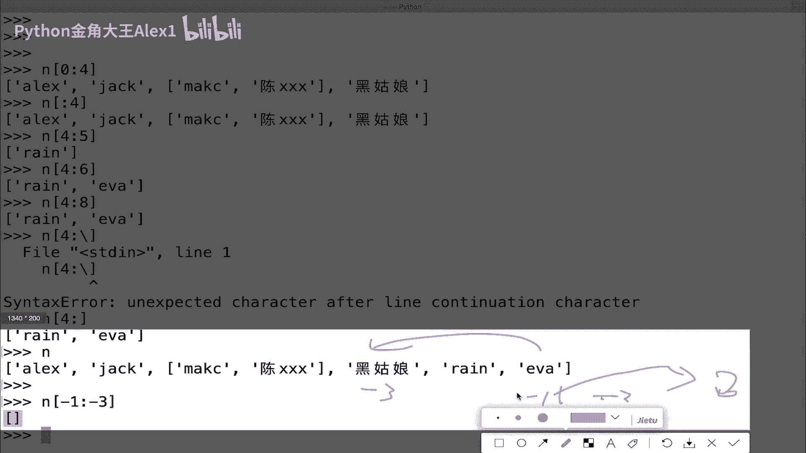
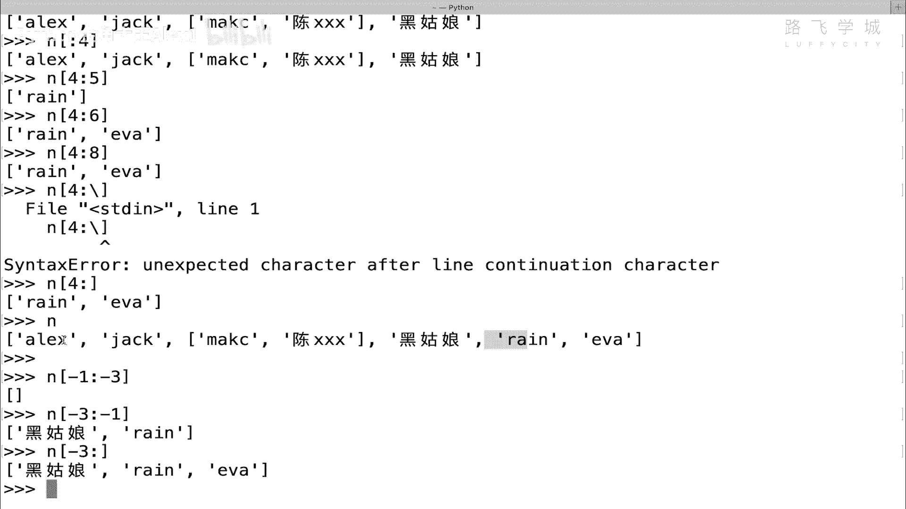
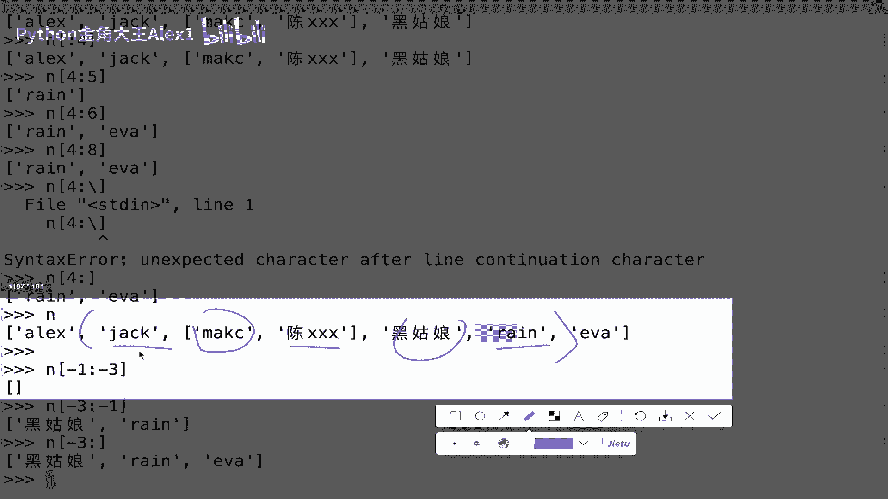
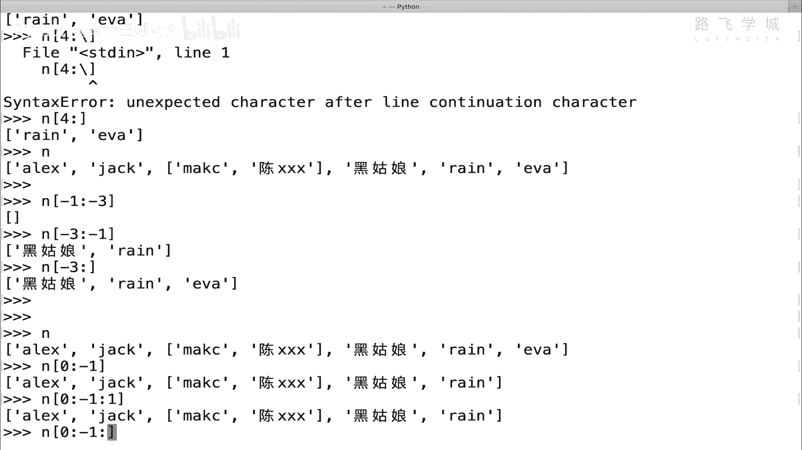
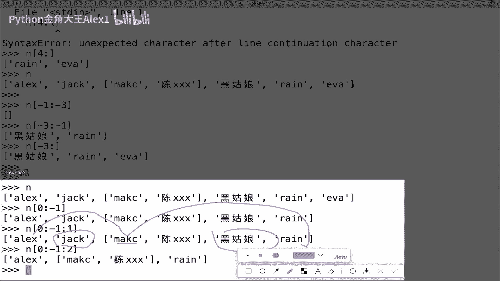
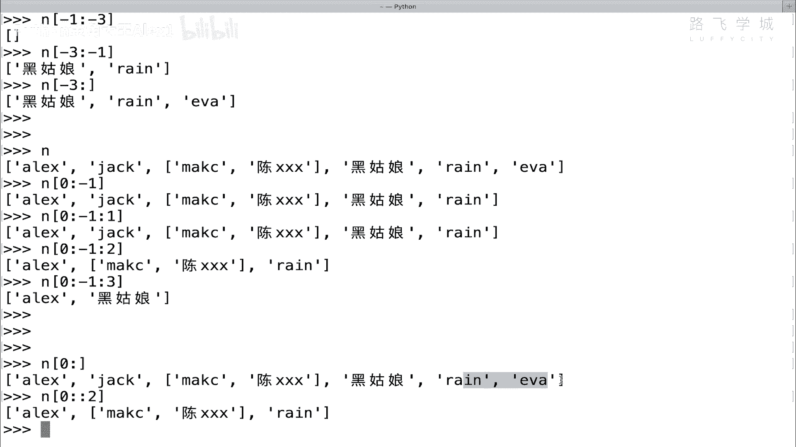
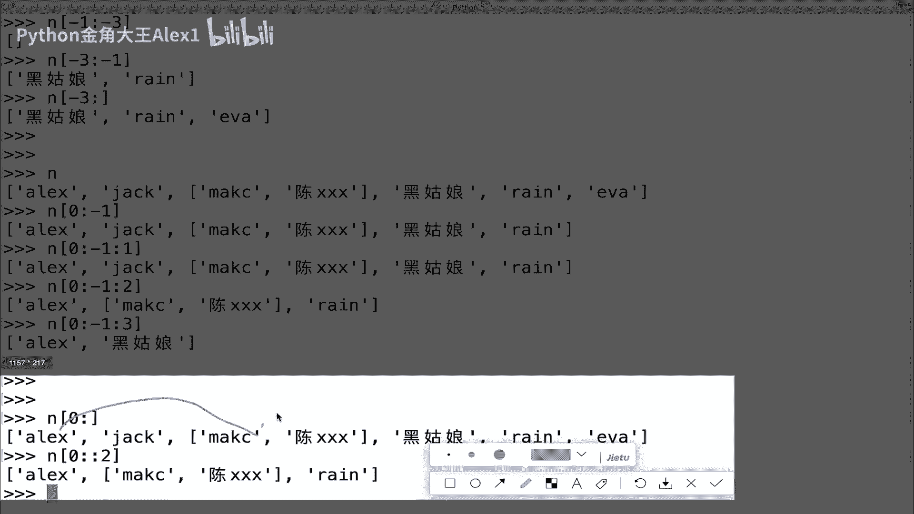
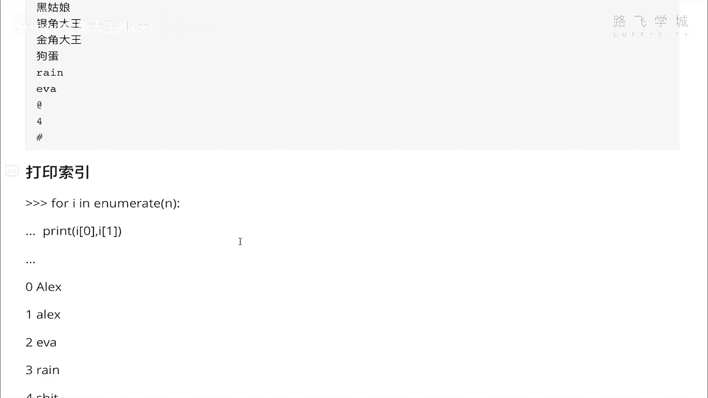

# Python数据分析入门：P31：03 数据类型-列表切片&排序&反转&循环

在本节课中，我们将要学习Python列表的几个核心操作：切片、排序、反转和循环。这些操作是处理和操作数据集合的基础，对于后续的数据分析工作至关重要。

## 列表切片

上一节我们介绍了列表的基本概念和索引。本节中我们来看看如何从列表中提取一部分元素，这个操作称为“切片”。

列表切片与字符串切片原理完全相同。其基本语法是 `list[start:end]`，表示从索引 `start` 开始，到索引 `end` 结束（但不包含 `end` 位置的元素），即“顾头不顾尾”。

以下是列表切片的一些常用方法：



**基本切片**
```python
n = ['Alex', 'Jack', 'Rain', '黑姑娘', 'Eva']
print(n[1:4])  # 输出：['Jack', 'Rain', '黑姑娘']
```



**省略起始索引**
当起始索引为0时，可以省略。
```python
print(n[:4])  # 输出：['Alex', 'Jack', 'Rain', '黑姑娘']
```

**省略结束索引**
当结束索引为列表长度时，可以省略，表示取到列表末尾。
```python
print(n[3:])  # 输出：['黑姑娘', 'Eva']
```



**取最后两个元素**
可以通过“超过下标”的写法来取最后几个元素。
```python
print(n[4:6])  # 输出：['Eva']
```



**倒序切片**
使用负数索引可以从列表末尾开始计数。
```python
print(n[-3:-1])  # 输出：['Rain', '黑姑娘']
```
注意，切片方向始终是从左向右。因此，`n[-1:-3]` 会得到一个空列表，因为从左向右找不到从索引-1到-3的区间。





**设置步长**
步长（step）参数允许我们间隔取值。语法为 `list[start:end:step]`，默认步长为1。
```python
print(n[::2])  # 输出：['Alex', 'Rain', 'Eva']
```
上面的代码每隔一个元素取一个值。

## 列表排序与反转





列表是有序的数据结构，我们可以对其进行排序和反转操作。

**排序**
使用 `.sort()` 方法可以对列表进行原地排序（修改原列表）。
```python
n2 = [3, 1, 4, 1, 5, 9]
n2.sort()
print(n2)  # 输出：[1, 1, 3, 4, 5, 9]
```
对于字符串列表，排序规则基于字符编码，通常是：大写字母、小写字母、中文。

**反转**
使用 `.reverse()` 方法可以将列表中的元素顺序完全反转。
```python
n2.reverse()
print(n2)  # 输出：[9, 5, 4, 3, 1, 1]
```
结合排序和反转，可以实现从大到小的排序：先 `.sort()`，再 `.reverse()`。

## 列表循环

遍历列表中的每一个元素是常见的操作，我们可以使用 `for` 循环来实现。

**基本循环**
```python
for name in n:
    print(name)
```
这段代码会依次打印出列表 `n` 中的每一个名字。

**同时获取索引和值**
有时我们需要在循环中同时获得元素的索引和值，可以使用 `enumerate()` 函数。
```python
for index, value in enumerate(n):
    print(f"索引 {index} 的值是 {value}")
```
`enumerate()` 函数返回一个可迭代对象，每次迭代产生一个元组 `(索引, 值)`。元组是一种类似列表但不可修改的数据类型。



本节课中我们一起学习了列表的切片、排序、反转和循环操作。切片让我们能灵活地获取子集；排序和反转帮助我们整理数据顺序；循环则是处理集合中每个元素的基础。掌握这些操作，是进行有效数据处理的第一步。