# Python数据分析实战：P43：02：GBK文字在Mac上的正常显示方法 🖥️➡️🍎

在本节课中，我们将学习如何解决一个常见的编码问题：如何让在Windows系统上用GBK编码保存的中文文本（例如“路飞学城”），在默认使用UTF-8编码的Mac系统上正常显示。我们将探讨两种核心解决方案，并通过代码示例帮助你理解编码转换的原理。

## 概述

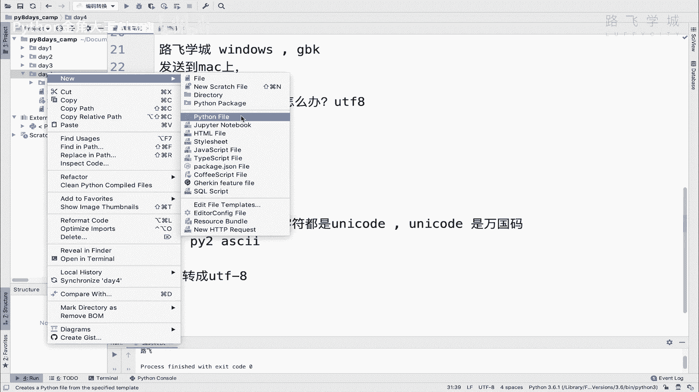

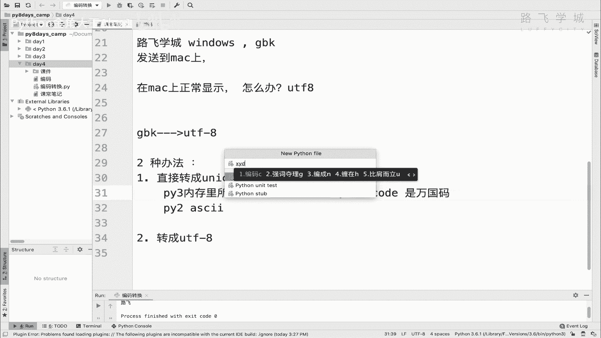

当文本文件在不同编码标准的系统间传递时，常会出现乱码。核心矛盾在于：Windows常用GBK编码保存中文，而Mac默认使用UTF-8编码。Python，特别是Python 3，在内存中使用**Unicode**作为统一的字符表示，这为我们解决编码问题提供了桥梁。

上一节我们介绍了编码问题的背景，本节中我们来看看具体的两种解决方案。

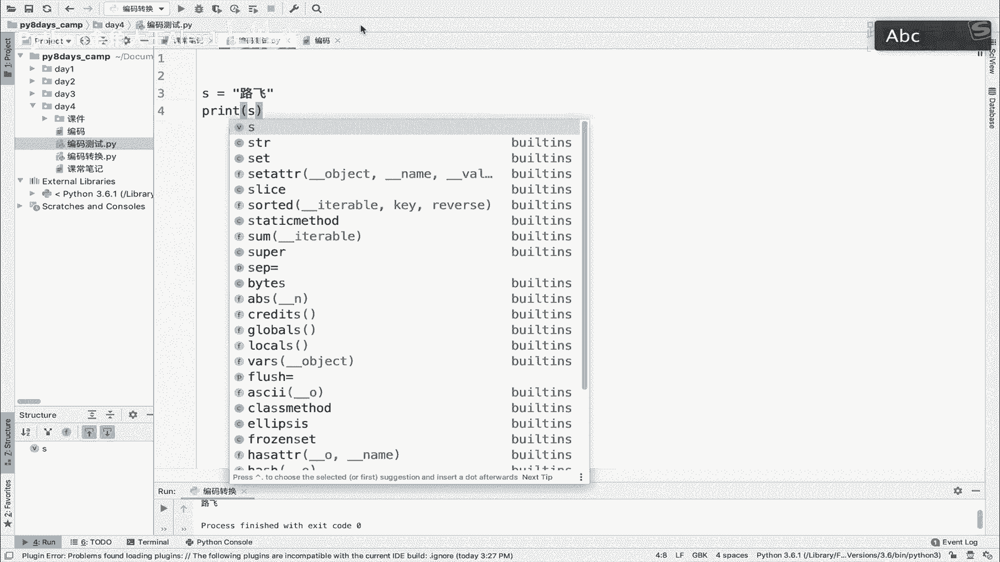

## 解决方案一：将GBK解码为Unicode 🔄

这是最根本的解决方法。Unicode是一种“万国码”，旨在包含世界上所有字符。Python 3在内存中默认使用Unicode存储所有字符串。因此，只要将GBK编码的字节序列正确解码（Decode）为Unicode字符串，就可以在任何系统上正常处理和显示。

**核心概念公式：**
`GBK编码的字节数据` --（解码 `decode(‘gbk’)`）--> `Unicode字符串`

为了演示这个过程，我们需要创建一个GBK编码的源文件。但在Python 3中，这个过程通常是自动的。为了清晰理解，我们将在Python 2环境中进行手动操作演示。

以下是创建和测试GBK文件的步骤：

1.  创建一个新的Python文件，并将其文件编码从默认的UTF-8改为GBK。
2.  在文件开头添加编码声明：`# -*- coding: gbk -*-`，告诉解释器此文件使用GBK编码。
3.  写入中文字符并尝试打印。

在Python 2中直接打印GBK字符串会产生乱码，因为Python 2默认不自动转换为Unicode。此时，我们需要手动解码。

以下是手动解码的示例代码：
```python
# 假设 s 是GBK编码的字节字符串（在Python 2中）
s = ‘路飞学城‘ # 这是一个GBK编码的字符串
# 将其解码为Unicode字符串
unicode_str = s.decode(‘gbk‘)
print(unicode_str) # 现在可以正常显示
```
执行上述代码后，`unicode_str` 就是一个Unicode字符串，可以在Mac上正常显示。在Python 3中，当你用正确的编码打开文件时，类似的解码过程由解释器自动完成。

## 解决方案二：将GBK转换为UTF-8 🔀

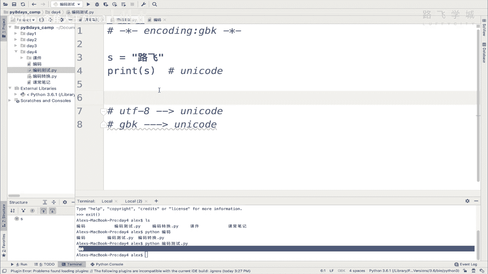

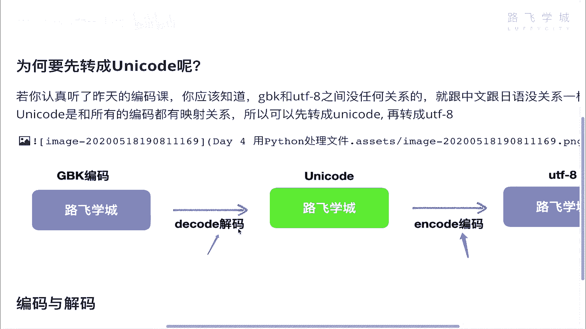

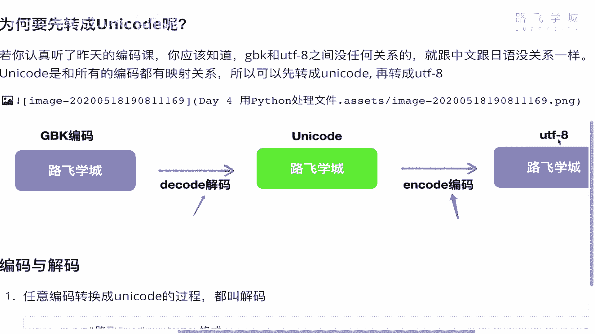

第二种方法是直接将GBK编码的文本转换为目标系统（Mac）所使用的UTF-8编码。这相当于一个“转码”过程。

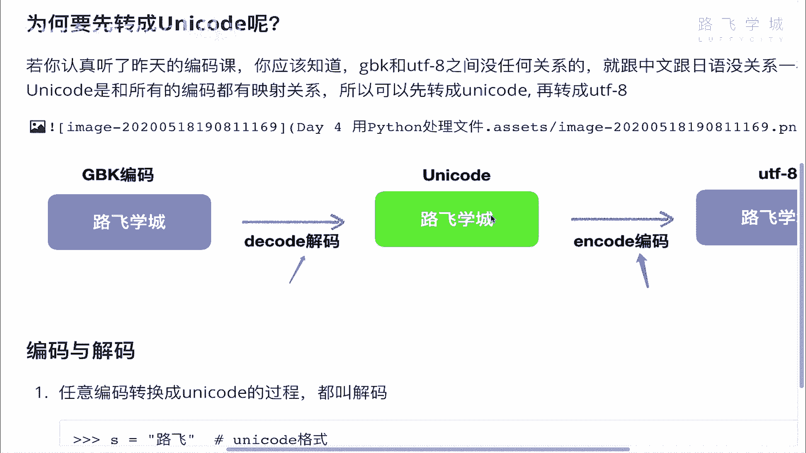

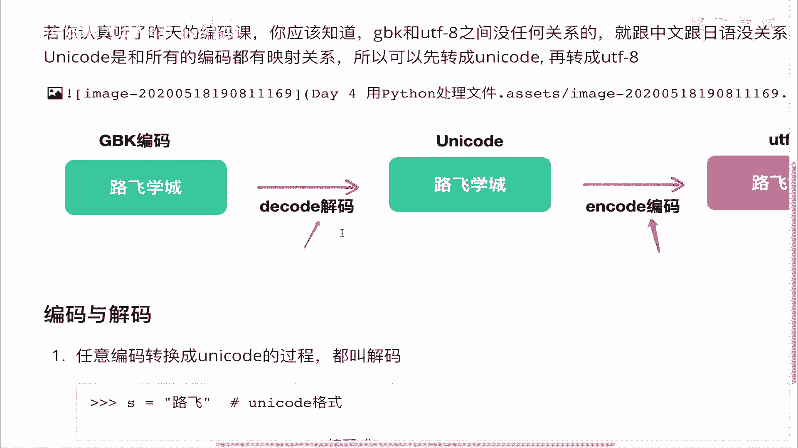

**核心概念公式：**
`GBK编码的字节数据` --（解码为Unicode）--> `Unicode字符串` --（编码为 `encode(‘utf-8’)`）--> `UTF-8编码的字节数据`


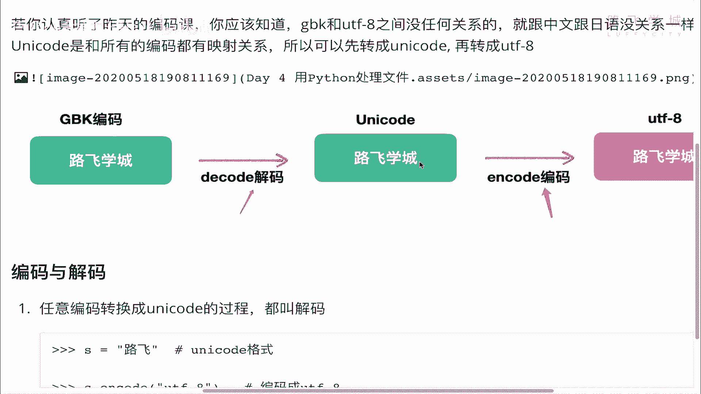

这个过程分为两步：首先将GBK解码为Unicode（中间桥梁），然后再将这个Unicode字符串编码为UTF-8。

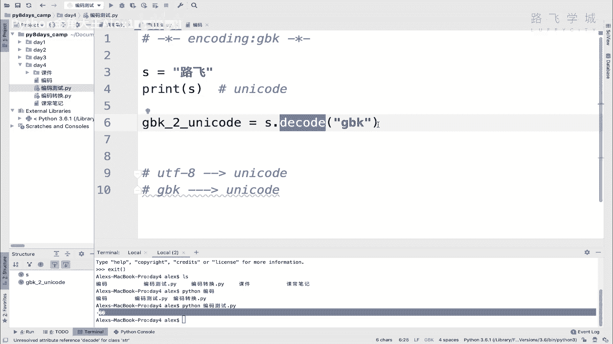

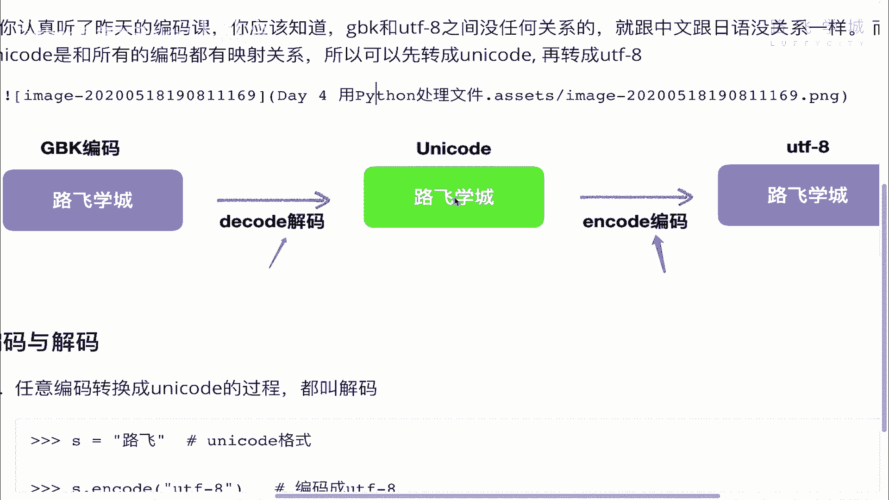

以下是转换步骤的代码实现：
```python
# 在Python 3中演示
# 模拟一个GBK编码的字节序列 (b‘ 开头的为bytes类型)
gbk_bytes = b‘\xc2\xb7\xb7\xc9\xd1\xa7\xb3\xc7‘ # “路飞学城”的GBK编码
# 第一步：解码为Unicode字符串
unicode_str = gbk_bytes.decode(‘gbk‘)
# 第二步：将Unicode字符串编码为UTF-8
utf8_bytes = unicode_str.encode(‘utf-8‘)
# 现在 utf8_bytes 可以在UTF-8系统上正确写入文件或输出
print(utf8_bytes.decode(‘utf-8‘)) # 解码回字符串用于显示
```
对于从GBK编码文件读取文本的场景，在Python 3中，你可以指定编码直接读取为Unicode字符串：
```python
with open(‘gbk_file.txt‘, ‘r‘, encoding=‘gbk‘) as f:
    content = f.read() # content 已经是Unicode字符串
# 之后可以按需处理或存储为UTF-8
with open(‘utf8_file.txt‘, ‘w‘, encoding=‘utf-8‘) as f:
    f.write(content)
```

## 总结

本节课中我们一起学习了解决跨平台中文乱码的两种核心方法：
1.  **解码为Unicode**：利用 `decode(‘gbk‘)` 方法将GBK字节数据转换为Python内部统一的Unicode字符串，这是最推荐的方式，尤其在Python 3中已成为默认行为的基础。
2.  **转码为UTF-8**：通过“解码为Unicode -> 编码为UTF-8”两步，将文本转换为目标系统支持的编码格式。

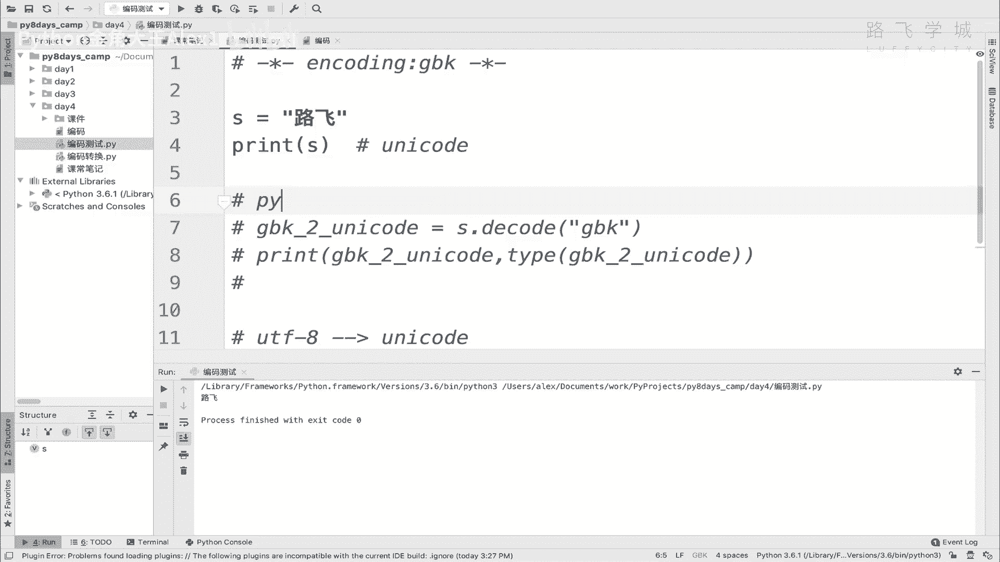

理解 **解码（Decode）** 与 **编码（Encode）** 的区别是关键：**其他编码 -> Unicode 称为解码；Unicode -> 其他编码 称为编码**。掌握这一点，你就能从容应对大多数文本编码问题。