# Python数据分析与处理：P44：03：GBK编码在Mac系统上的显示与转换方案 🖥️

在本节课中，我们将学习如何处理GBK编码的文本在Mac系统上显示乱码的问题。我们将探讨两种解决方案，并重点讲解通过Python 3进行编码转换的完整流程，特别是从GBK到UTF-8的转换过程及其实际意义。

## 解决方案回顾

上一节我们介绍了Python 3原生支持Unicode，因此将GBK文本转换为Unicode即可正常显示。本节中我们来看看第二种方案：转换为UTF-8编码。

Mac系统的默认编码是UTF-8。将GBK文本转换为UTF-8同样可以使其正常显示。但这里存在一个关键问题：GBK编码与UTF-8编码之间没有直接的映射关系。

## 转换原理与步骤

所有编码到Unicode的过程称为**解码**（decode），而Unicode到其他编码的过程称为**编码**（encode）。因此，要将GBK转换为UTF-8，必须经过一个中间步骤：**先将GBK解码为Unicode，再将Unicode编码为UTF-8**。

这个过程可以用以下公式表示：
**GBK --[解码]--> Unicode --[编码]--> UTF-8**

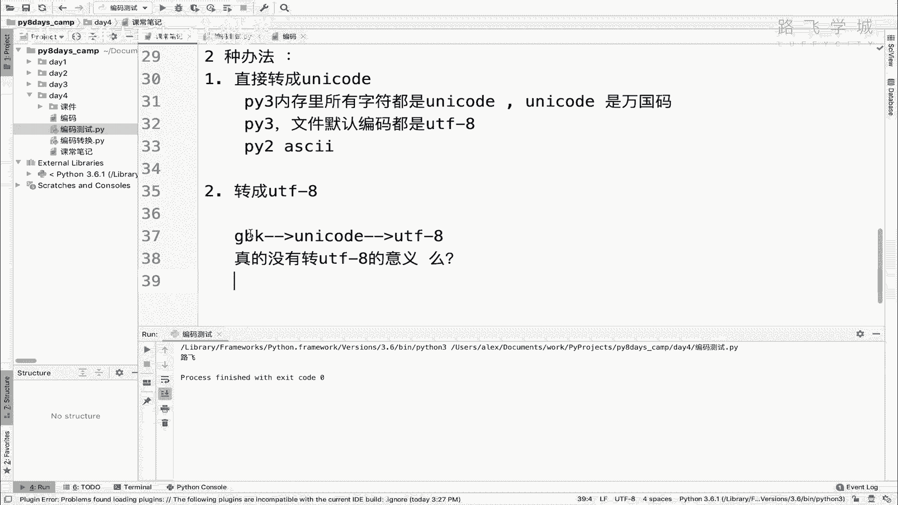

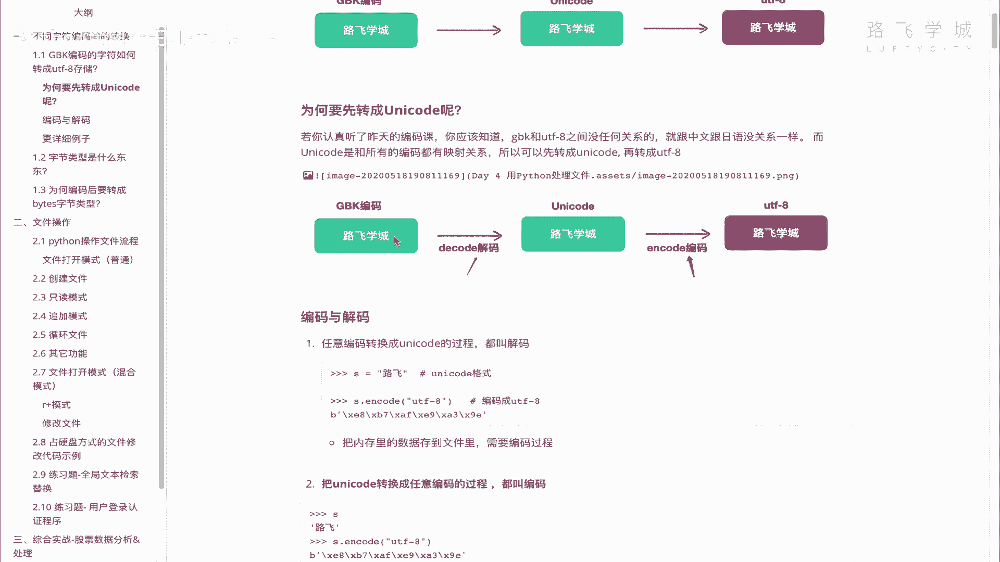

有同学可能会问：既然转换为Unicode已经可以正常显示中文，为什么还要多此一举转换为UTF-8？这在实际应用中有其特定意义。UTF-8编码的主要优势在于**节省存储和网络传输空间**。更重要的是，在Mac系统上，如果将文件保存为GBK编码，其他默认使用UTF-8的软件（不仅是Python）打开时依然会出现乱码。因此，在Mac上统一将文件保存为UTF-8编码，可以确保跨软件、跨平台的兼容性。

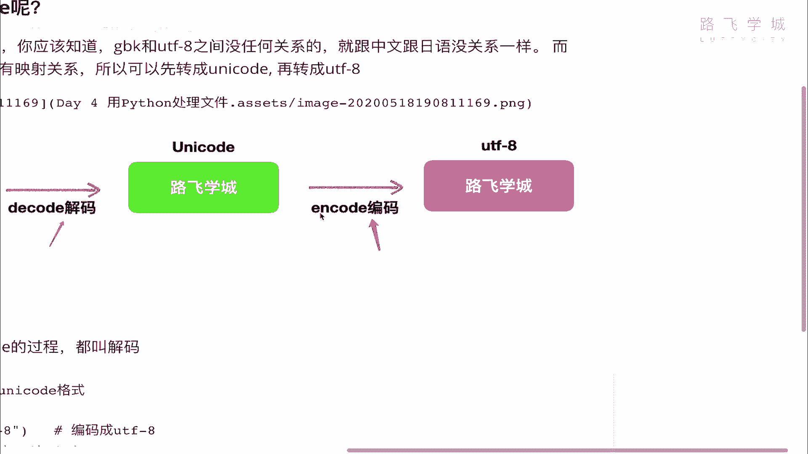


## Python 3 实战演示

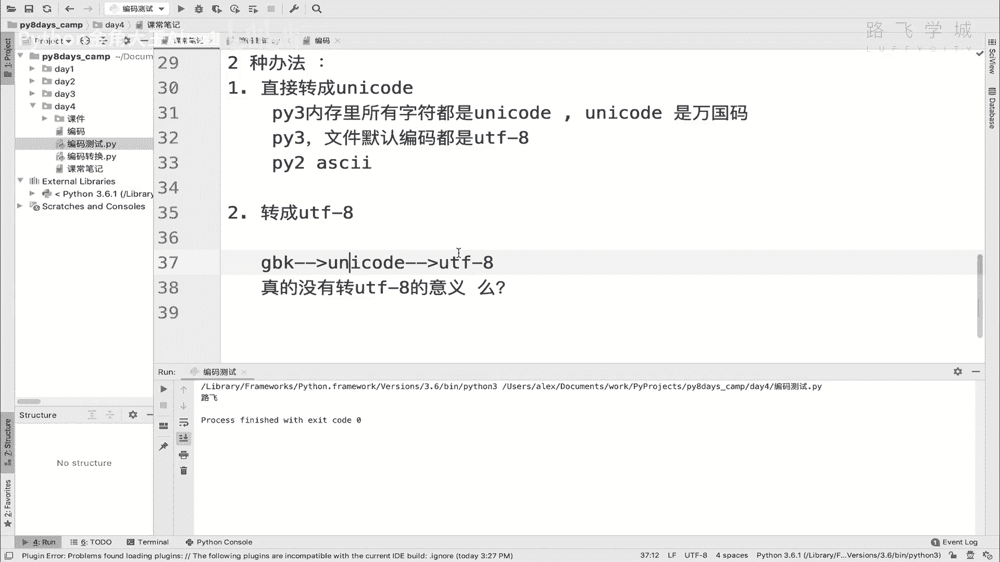

下面，我们通过Python 3代码来演示完整的转换过程。为了让演示更清晰，我们会从一个Unicode字符串开始，模拟它被编码为GBK，再将其转换回UTF-8的流程。

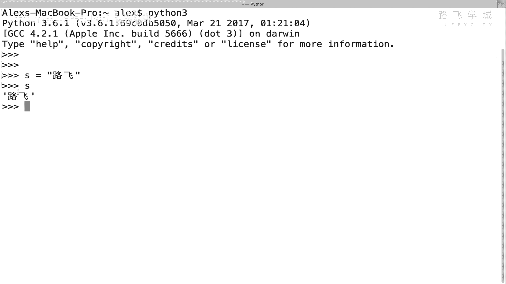

首先，我们在Python 3中创建一个Unicode字符串。在Python 3中，所有字符串在内存中默认都是Unicode格式。


```python
# 创建一个Unicode字符串
s_unicode = "路飞"
print(f"原始Unicode字符串: {s_unicode}")
```

接下来，为了模拟GBK编码的源数据，我们先将这个Unicode字符串编码为GBK。这里会引入一个新的数据类型：**字节类型（bytes）**。

```python
# 将Unicode编码为GBK，得到字节类型数据
s_gbk_bytes = s_unicode.encode('gbk')
print(f"编码为GBK后的字节数据: {s_gbk_bytes}")
```

运行上述代码，你会看到类似 `b'\xc2\xb7\xb7\xc9'` 的输出。开头的 `b` 表示这是一个字节对象。后面的 `\xc2\xb7\xb7\xc9` 是十六进制表示，每个 `\x` 后跟两个十六进制数代表一个字节。GBK编码中，一个中文字符通常占两个字节，所以“路飞”共四个字节。

现在，我们得到了一个“模拟”的GBK字节数据。我们的目标是将它转换为UTF-8。根据原理，第一步是将其**解码**为Unicode。

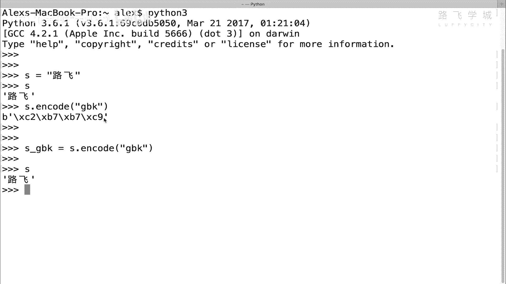

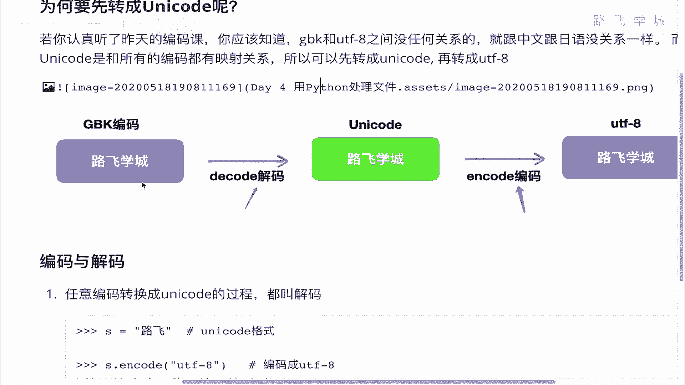

以下是关键步骤的代码：


```python
# 关键步骤1：将GBK字节数据解码为Unicode字符串
# 必须指定编码为'gbk'，否则Python会默认用'utf-8'去解码，导致错误
s_back_to_unicode = s_gbk_bytes.decode('gbk')
print(f"解码回Unicode字符串: {s_back_to_unicode}")


# 关键步骤2：将Unicode字符串编码为UTF-8字节数据
s_utf8_bytes = s_back_to_unicode.encode('utf-8')
print(f"编码为UTF-8后的字节数据: {s_utf8_bytes}")
```

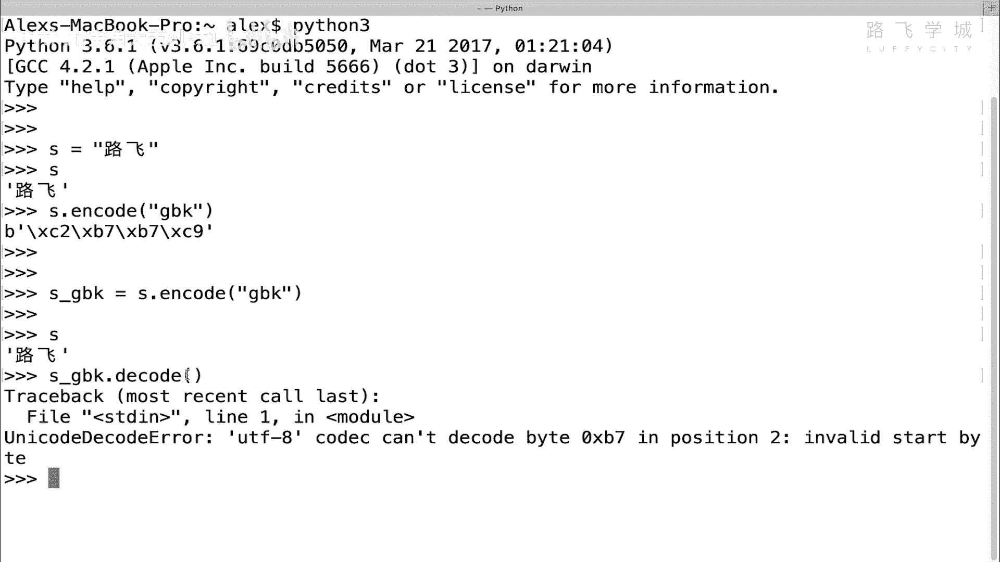


在解码时，必须通过参数 `'gbk'` 明确告诉Python当前数据的编码格式。如果不指定，Python 3会默认使用 `'utf-8'` 去尝试解码，由于字节数据实质是GBK编码，这会导致解码失败并报错。

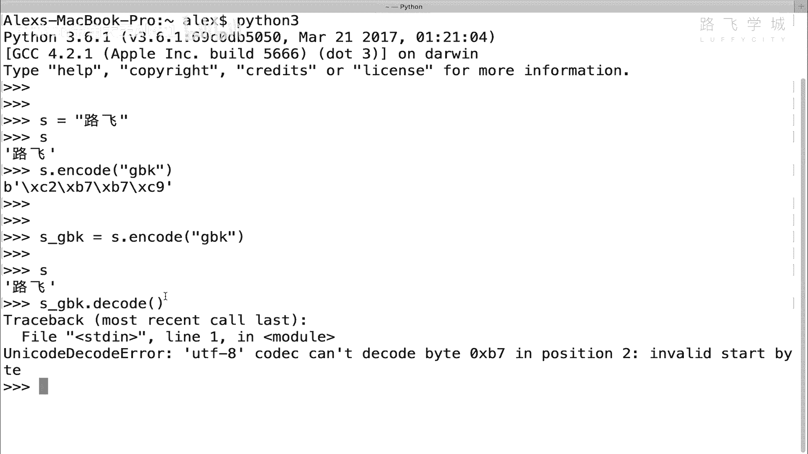

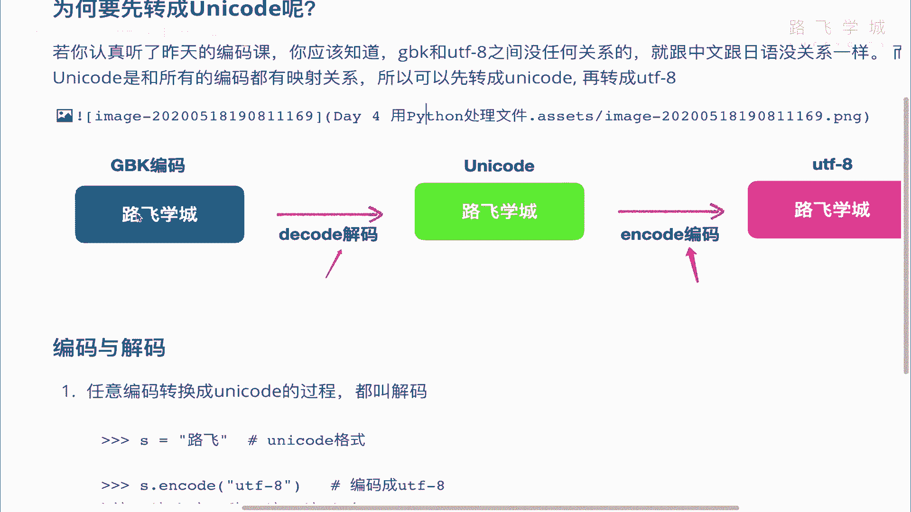

编码为UTF-8时，`encode()` 方法如果不指定参数，默认就是编码为 `'utf-8'`。为了代码清晰，建议显式写明 `encode('utf-8')`。

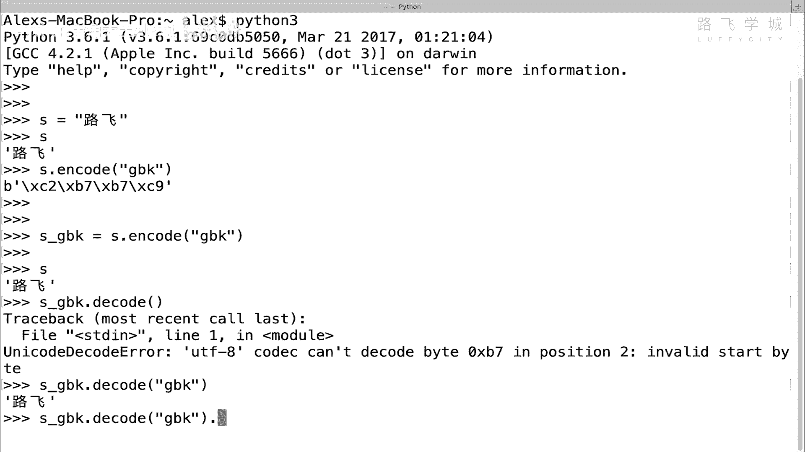

观察最终输出的UTF-8字节数据，例如 `b'\xe8\xb7\xaf\xe9\xa3\x9e'`。可以看到，它变成了6个字节。这是因为在UTF-8编码中，一个常用的中文字符通常占3个字节，“路飞”两个字正好对应6个字节。

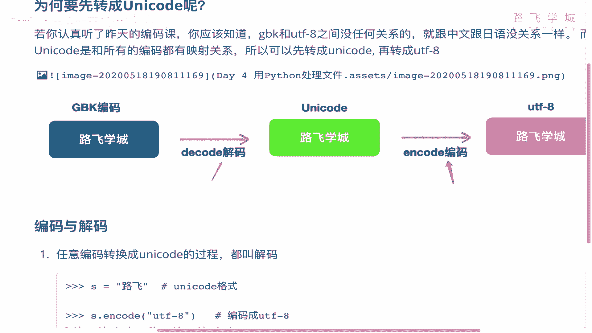

## 核心概念总结

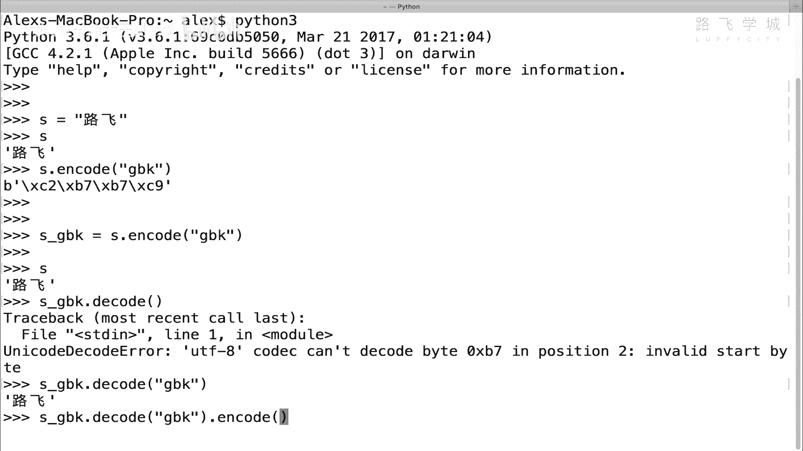

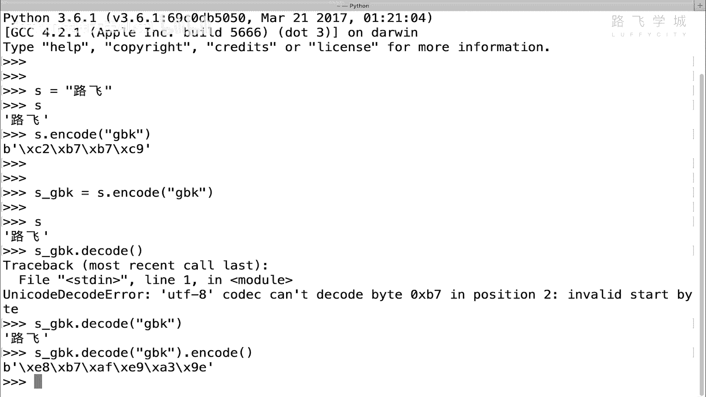

本节课中我们一起学习了GBK编码在Mac系统上的处理方案，核心要点如下：

1.  **转换路径**：GBK文本无法直接转为UTF-8，必须通过Unicode桥接，路径为 **GBK -> Unicode -> UTF-8**。
2.  **操作对应**：
    *   `字节数据.decode(‘源编码’)` -> 得到Unicode字符串。
    *   `Unicode字符串.encode(‘目标编码’)` -> 得到目标编码的字节数据。
3.  **实际意义**：在Mac或Linux等默认使用UTF-8的系统上，将文件最终保存为UTF-8格式，可以最大程度保证文件在不同软件间的兼容性，避免乱码。
4.  **数据类型**：编码和解码操作主要涉及两种类型：
    *   `str`：字符串类型，在Python 3中内存表示为Unicode。
    *   `bytes`：字节类型，用于表示二进制编码数据（如GBK, UTF-8）。

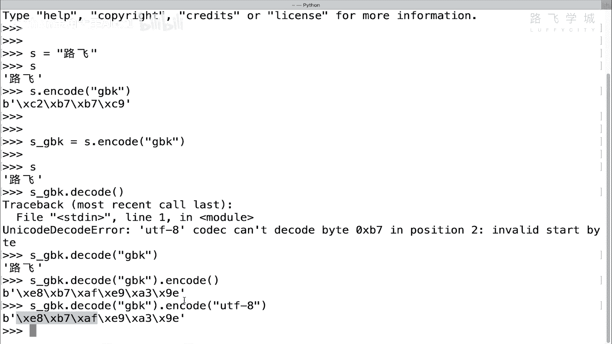

通过掌握这套编码转换流程，你就能从容地处理来自不同环境、不同编码的文本数据，为后续的数据清洗和分析工作打下坚实基础。