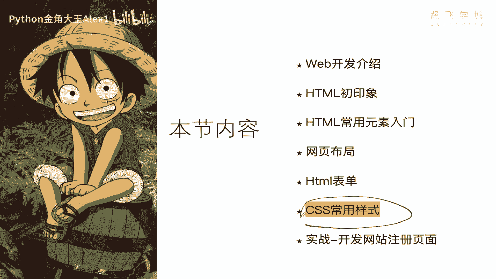
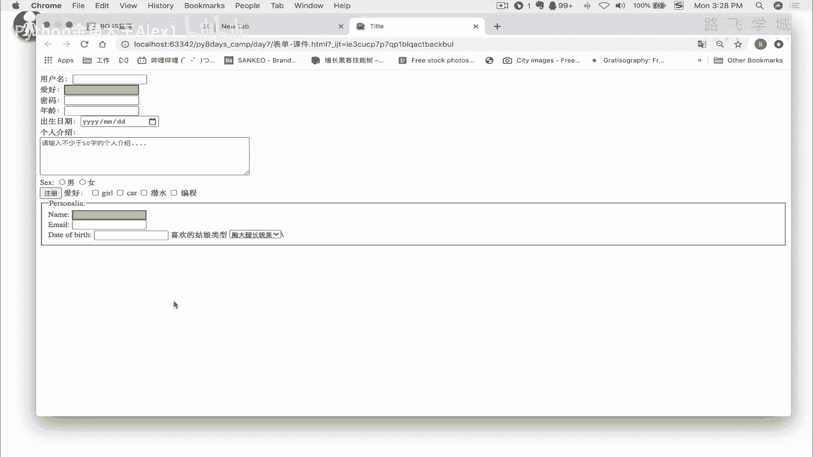
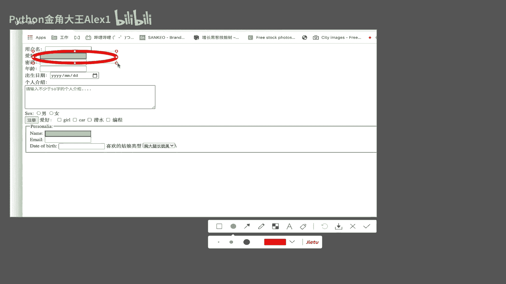
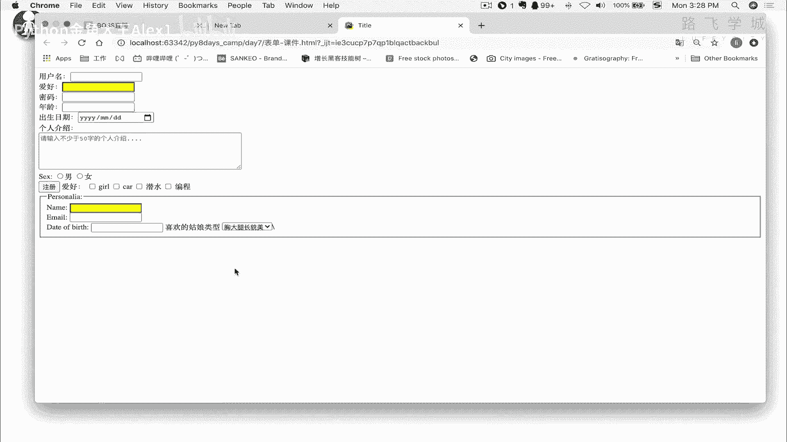
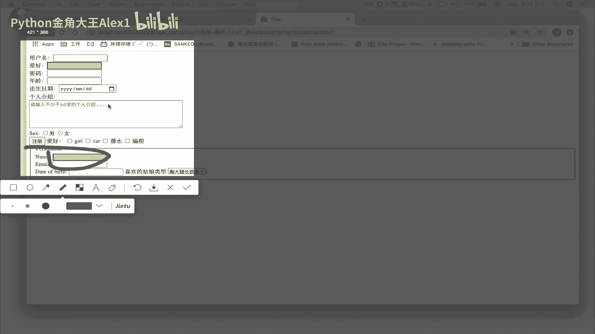
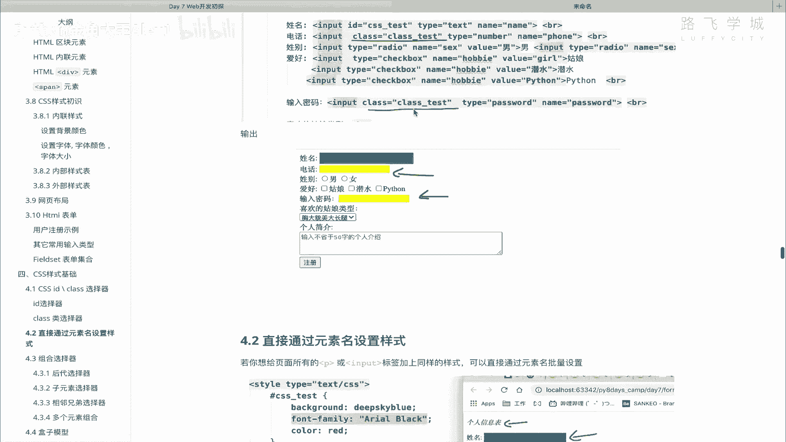

# Python数据分析与Web开发初探：P90：08 CSS id & class 选择器 🎯

在本节课中，我们将要学习CSS的核心概念之一——选择器。选择器是用于定位HTML元素并为其添加样式的工具。我们将重点介绍三种基本选择器：id选择器、class选择器和元素选择器，并通过实例演示它们的使用方法和区别。



---

## 概述

上一节我们介绍了HTML的常用标签，如表单、段落、标题、表格和图片等。这些标签构成了网页的基本结构，可以比作一个“毛坯平房”。本节中，我们来看看如何为这个“平坯房”进行“装修”，即学习CSS样式。我们将从最基础的选择器开始，学习如何精准地找到页面上的元素并为其添加样式。

## 什么是选择器？

选择器就是用来“找到”HTML标签的方法。你需要先找到目标标签，然后才能修改它的样式，例如背景、颜色等。找到标签的方式有多种，我们把这些方式统称为“选择器”。

## id选择器

id选择器用于选取页面中**唯一**的一个元素。每个HTML标签都可以拥有一个`id`属性，其值在整个页面中应该是独一无二的，类似于身份证号。

**语法格式如下：**
```html
<!-- 在HTML标签中定义id -->
<标签名 id="唯一标识名"></标签名>

<!-- 在CSS中通过id选择器应用样式 -->
<style>
    #唯一标识名 {
        样式属性: 值;
    }
</style>
```

以下是具体操作步骤：
1.  在HTML标签中，通过`id`属性为其指定一个唯一的名称。
2.  在CSS样式表中，使用井号`#`加上该id名称来定位这个标签，并为其编写样式规则。





**示例：**
我们给一个“爱好”输入框添加id并设置黄色背景。
```html
<input type="text" id="hobby">
<style>
    #hobby {
        background-color: yellow;
    }
</style>
```
执行后，该输入框的背景会变为黄色。



**重要提示：**
虽然某些浏览器在遇到重复id时可能不会报错，甚至两个元素都生效，但这不符合HTML规范。重复的id会导致JavaScript等脚本语言操作元素时出现问题。因此，务必保证页面内`id`值的唯一性。



## class选择器

当你需要为**多个**元素应用相同的样式时，使用id选择器效率低下。这时可以使用class选择器。class选择器允许你为一组元素定义相同的样式。

**语法格式如下：**
```html
<!-- 在HTML标签中定义class -->
<标签名 class="类名"></标签名>

<!-- 在CSS中通过class选择器应用样式 -->
<style>
    .类名 {
        样式属性: 值;
    }
</style>
```

以下是具体操作步骤：
1.  在需要相同样式的HTML标签中，通过`class`属性指定相同的类名。
2.  在CSS样式表中，使用点`.`加上该类名来定位所有拥有该类的标签，并统一设置样式。

**示例：**
我们为“用户名”、“年龄”和“邮箱”三个输入框添加同一个class，并设置橙色背景和虚线边框。
```html
<input type="text" class="form-field">
<input type="number" class="form-field">
<input type="email" class="form-field">

<style>
    .form-field {
        background-color: orange;
        border: 2px dashed #333;
    }
</style>
```
执行后，这三个输入框都会应用相同的样式。后续若要修改样式，只需在`.form-field`规则中更改一次，所有相关元素都会同步更新，效率极高。

## 元素选择器

元素选择器是最直接的选择器，它通过HTML标签名来选取页面中**所有**该类型的元素。

**语法格式如下：**
```css
<style>
    标签名 {
        样式属性: 值;
    }
</style>
```

**示例：**
我们为页面中所有的`<input>`标签设置蓝色背景。
```html
<style>
    input {
        background-color: blue;
    }
</style>
```
执行后，页面上所有的输入框（`<input>`）背景都会变为蓝色。

## 选择器的优先级

当多个选择器为同一个元素设置了不同的样式时，就会产生优先级问题。CSS样式的优先级规则是：**id选择器 > class选择器 > 元素选择器**。

**示例分析：**
假设一个元素同时被元素选择器和class选择器定义了背景色。
```html
<input type="text" class="special-input">

<style>
    /* 元素选择器 */
    input {
        background-color: blue;
    }
    /* class选择器 */
    .special-input {
        background-color: red;
    }
</style>
```
最终，该输入框的背景色将是红色，因为class选择器的优先级高于元素选择器。如果该元素还拥有一个id选择器样式，那么id选择器的样式将具有最高优先级。

---

## 总结

本节课中我们一起学习了CSS的三种基础选择器：
1.  **id选择器 (`#id名`)**：用于选取页面中唯一的单个元素。
2.  **class选择器 (`.类名`)**：用于选取具有相同类名的一组元素，实现批量样式管理。
3.  **元素选择器 (`标签名`)**：用于选取页面中所有指定类型的元素。



理解并掌握这些选择器是精确控制网页样式的基础。下一节，我们将深入探讨“盒子模型”，这是理解元素尺寸、边距和布局的核心概念。