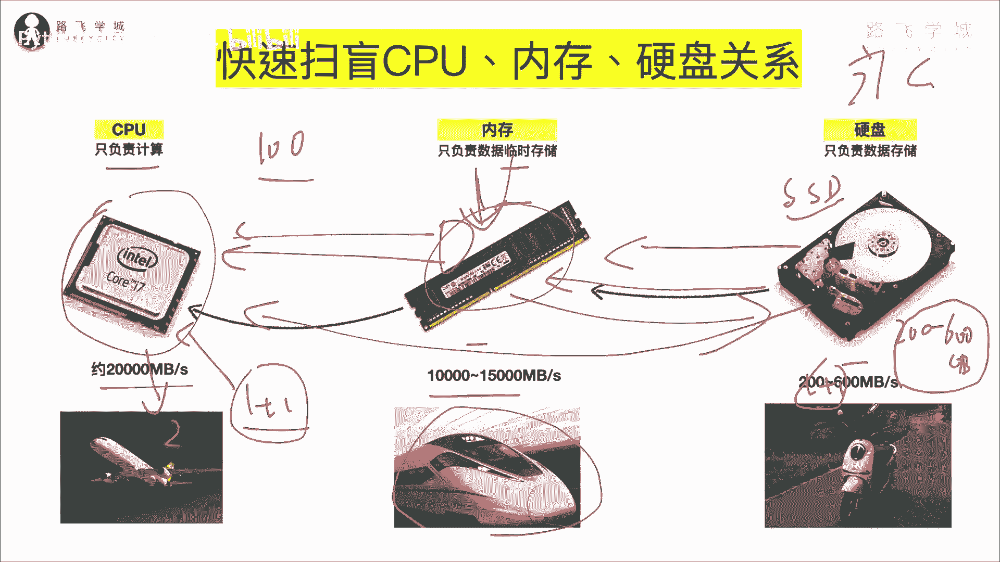

# Python编程基础：P6：CPU、内存与硬盘三大硬件的作用与关系 💻

在本节课中，我们将要学习计算机三大核心硬件——CPU、内存和硬盘——的基本作用与它们之间的协作关系。理解这些基础知识，将帮助我们更好地理解后续编程中变量、数据存储等概念。

上一节我们写出了第一行Python代码，接下来我们将学习变量这个知识。在学习变量之前，我们先来扫一下盲。

扫盲的内容是CPU、内存和硬盘这三大硬件的关系。这是计算机的核心硬件，以避免有些纯小白真的不知道内存是干嘛的。例如，我其中一个女朋友就不知道内存是干嘛的，所以我要快速扫一下盲。

## CPU：只负责计算的大脑 🧠

首先说CPU。毋庸置疑，大家都知道CPU是整个计算机里最核心的电子元器件。它的功能**只负责计算**。它就相当于人的大脑。

但CPU又跟人的大脑不完全一样。人的大脑其实负责两部分功能：一个是运算（即思考），另一个是记忆（即存储东西）。但是CPU只有单一的一个功能，它只负责计算，不负责存储。

## 内存与硬盘：数据的存储仓库 📦

那么，数据存储在哪里呢？存储在后面这两个硬件中：一个是内存，一个是硬盘。

内存负责**临时存储**数据。例如，我们买手机或电脑时会关注内存是8G还是16G。为什么是临时存储？这与它的硬件原理有关，因为内存依靠电流工作，通电时就有数据，断电后数据就会丢失。

硬盘则负责**永久存储**数据。硬盘内部有类似光盘的盘片和磁头等结构，用于长期保存数据。

## 硬件间的协作：为何需要内存？⚙️

现在我们知道，CPU只负责运算。例如，要计算 `1 + 1 = 2`，就需要把数据源（即 `1` 和 `1`）交给CPU，CPU运算后返回结果 `2`。

数据源从哪里来？从内存或硬盘中来。我们先假设没有内存，只有CPU和硬盘。数据源存储在硬盘的一个文件里，直接给到CPU，当然可以。运算完后返回结果。

既然可以直接从硬盘取数据，为什么还需要内存呢？关键在于速度。

硬盘的存取速度非常慢，而CPU的运算速度非常快。它们之间的速度对比就像雅迪电动车和飞机。CPU运算极快，但如果数据要从速度很慢的硬盘中读取，CPU就需要等待很长时间，这造成了不可调和的矛盾。

以下是速度的具体对比：
*   **硬盘速度**：即便是较快的SSD固态硬盘，存取速度大约在 **200到600兆每秒**。旧的机械硬盘速度更慢。
*   **CPU速度**：CPU的存取速度可达 **20G每秒（即20000兆每秒）**。
*   **速度差**：两者速度相差约 **100倍**。

因此，如果高配CPU搭配慢速硬盘，电脑整体性能会非常低下。为了解决这个矛盾，中间引入了内存。

## 内存：协调速度差异的高速缓存 🚄

内存的关键作用，就是为了解决CPU和硬盘之间速度不匹配的矛盾。

内存依靠电流实现数据存取，电的速度接近光速，因此非常快。我们可以把内存比作高铁。

内存的存取速度一般在 **10G到15G每秒（即10000到15000兆每秒）**。这个速度虽然比CPU（飞机）慢一些，但比硬盘（电动车）快得多，与CPU的速度差距不再悬殊。

因此，硬件间的协作流程优化为：
1.  程序运行时，先将需要处理的数据从**硬盘**读取到**内存**中。
2.  CPU只与速度接近的**内存**进行数据交换和计算。
3.  计算完成后，如果需要永久保存结果，再将数据从**内存**写回**硬盘**。

这个流程解释了生活中的一个常见现象：当你打开一个特别大的Word文档（比如100兆）时，刚开始会特别慢，需要等十几秒。这是因为“打开”的过程正是将数据从硬盘读取到内存的过程，受限于硬盘速度，所以慢。一旦数据进入内存，你再进行编辑操作就会非常流畅，因为这时是内存与CPU在高速交互。而当你点击“保存”时，又会感觉卡顿一下，这是因为系统正将修改后的数据从内存写回速度较慢的硬盘。

本节课中，我们一起学习了计算机三大核心硬件的作用与关系。我们了解到**CPU是负责计算的“大脑”**，**硬盘是永久存储数据的“仓库”**，而**内存则是为了解决前两者速度矛盾而存在的“高速临时中转站”**。理解这些基础，将为后续学习Python中变量的存储与调用打下坚实的基础。